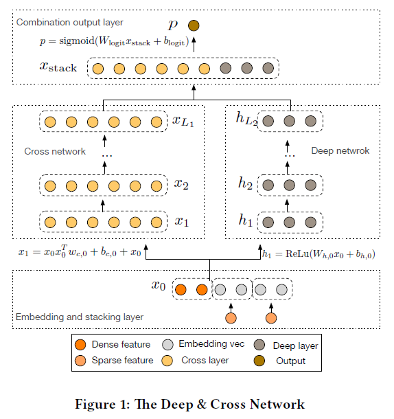
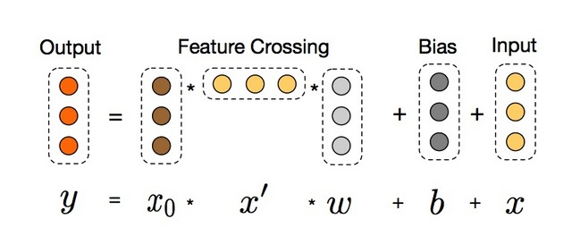
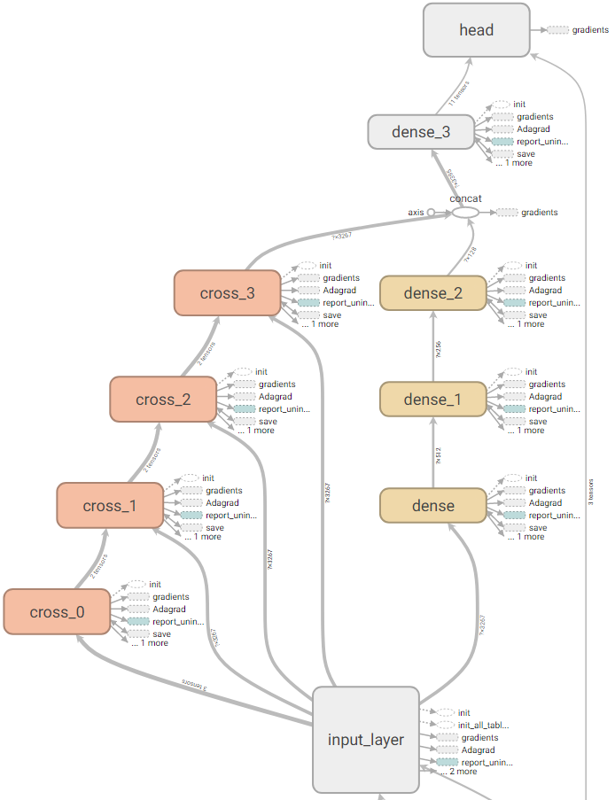

Deep & Cross Network(DCN)在 2017 年由 google 和 Stanford 共同发表的一篇论文中被提出，类似于Wide & Deep Network(WDL)，是用负杂网络预估CTR的一种方法。

特征工程一直是许多预测模型成功的关键。许多有效的特征都来自于原始特征的交叉组合。在WDL中，wide侧的交叉组合特征依然需要依靠hand-craft来完成。而DCN能对sparse和dense的输入自动学习特征交叉，可以有效地捕获有限阶（bounded degrees）上的有效特征交叉，无需人工特征工程或暴力搜索（exhaustive searching），并且计算代价较低。

本文在详细介绍Deep & Cross Network网络结构的基础上，给出了高效实现DCN模型的tensorflow代码，主要点出了网络上一些主流实现中常犯的错误，让你真正能够在企业级的生产环境中玩转DCN模型。
<!--more-->
## DCN网络结构

DCN模型以一个嵌入和堆叠层(embedding and stacking layer)开始，接着并列连一个cross network和一个deep network，接着通过一个combination layer将两个network的输出进行组合。



### 嵌入和堆叠层

考虑具有稀疏和稠密特征的输入数据。在网络规模推荐系统的CTR预测任务中，输入主要是分类特征，如“country=usa”。这些特征通常是编码为独热向量如`[0,1,0]`；然而，这通常会产生超高维度的特征空间。

为了减少维数，我们采用嵌入过程将这些二进制特征转换成实数值的稠密向量（通常称为嵌入向量）：
$$x_{embed,i} =W_{embed,i}x_i$$

其中$x_{embed,i}$是embedding vector，$x_i$是第$i$个category的二元输入，$W_{embed,i} \in R^{n_e \times n_v}$是对应的embedding matrix，会与网络中的其它参数一起进行优化，$n_e$,$n_v$分别是embedding size和vocabulary size。

最后，我们将嵌入向量与归一化稠密特征xdense叠加起来形成一个向量：$$x_0 = [ x_{embed,1}^T, ..., X_{embed,k}^T, X_{dense}^T]。$$

这一部分在tensorflow中，使用`tf.feature_column`API可以很容易实现，大致代码结构如下：
```python
embed0 = tf.feature_column.embedding_column(...)
...
dense0 = tf.feature_column.indicator_column(...)
dense1 = tf.feature_column.numeric_column(...)
...
columns = [embed0, ..., dense0, dense1, ...]
x0 = tf.feature_column.input_layer(features, feature_columns)
```

## 交叉网络

交叉网络的核心思想是以有效的方式应用显式特征交叉。交叉网络由交叉层组成，每个层具有以下公式：
$$x_{l+1} = x_0 x_l^T w_l + b_l + x_l = f(x_l, w_l, b_l) + x_l$$

其中:

- $x_l,x_{l+1}$是列向量（column vectors），分别表示来自第$l$层和第($l+1$)层cross layers的输出；
- $w_l, b_l \in R^d$是第$l$层layer的weight和bias参数。

在完成一个特征交叉f后，每个cross layer会将它的输入加回去，对应的mapping function $f：R^d \rightarrow R^d$，刚好等于残差$x_{l+1} - x_l$，这里借鉴了残差网络的思想。



**特征的高阶交叉（high-degree interaction）**：cross network的独特结构使得交叉特征的阶（the degress of cross features）随着layer的深度而增长。对于第$l$层layer，它的最高多项式阶（在输入$x_0$上）是$l+1$。 实际上，cross network由这些交叉项$x_1^{\alpha_1} x_2^{\alpha_2} ... x_d^{\alpha_d}$组成，对应的阶从$1$到$l+1$。

**复杂度分析**：假设$L_c$表示cross layers的数目，$d$表示输入$x_0$的维度。那么，在该cross network中涉及的参数数目为：$d \times L_c \times 2$。

一个cross network的时间和空间复杂度对于输入维度是线性关系。因而，比起它的deep部分，一个cross network引入的复杂度微不足道，DCN的整体复杂度与传统的DNN在同一水平线上。如此高效（efficiency）是受益于$x_0 x_l^T$的rank-one特性(两个向量的叉积)，它可以使我们生成所有的交叉项，无需计算或存储整个matrix。

搜索了网上主流的实现cross layer的方法，代码如下:
```python
def cross_layer(x0, x, name):
  with tf.variable_scope(name):
    input_dim = x0.get_shape().as_list()[1]
    w = tf.get_variable("weight", [input_dim], initializer=tf.truncated_normal_initializer(stddev=0.01))
    b = tf.get_variable("bias", [input_dim], initializer=tf.truncated_normal_initializer(stddev=0.01))
    xx0 = tf.expand_dims(x0, -1)  # shape <?, d, 1>
    xx = tf.expand_dims(x, -1)  # shape <?, d, 1>
    mat = tf.matmul(xx0, xx, transpose_b=True)  # shape <?, d, d>
    return tf.tensordot(mat, w, 1) + b + x  # shape <?, d>
```
这种方法在逻辑上没有什么问题，但实际上却是**非常消耗计算和存储资源**的，原因在于显式地计算$x_0 x_l^T$需要非常大的内存空间来存储临时计算结果。我们来计算一下，一个cross layer仅仅是计算$x_0 x_l^T$这一个操作就需要消耗 $batch\\_size \times d \times d \times 4$ 字节的内存（一个浮点数占4个字节）。在企业级的模型中，$d$通常是几千甚至几万的量级，假设$d=1k$，则需要$batch\\_size \times 4M$的存储空间，这通常情况下已经是G级别的大小了，何况我们仅仅计算了一个Layer，别忘了我们总共有$L_c$个cross layer。另外，该操作的结果（一个矩阵）再和$w$向量相乘时也是非常消耗计算资源的。即使你在离线训练时通过减少cross layer的个数，减小batch_size等手段完成了模型的训练，在模型部署中线上之后，线性的打分系统依然要面临Out of Memory的风险，因为线上预测我们总是希望一次请求尽可能返回多条记录的预测分数，否则要么是影响全局的效果，要么是需要更多的请求次数，从而面临巨大的性能压力。

正确的实现方式不是先计算$x_0 x_l^T$，而是先计算$x_l^T w$，因为$x_l^T w$的计算结果是一个标量，几乎不占用存储空间。这两种方法的计算结果是一致的，因为矩阵乘法是满足结合律的： `(AB)C=A(BC)`。高效的实现代码如下：
```python
def cross_layer2(x0, x, name):
  with tf.variable_scope(name):
    input_dim = x0.get_shape().as_list()[1]
    w = tf.get_variable("weight", [input_dim], initializer=tf.truncated_normal_initializer(stddev=0.01))
    b = tf.get_variable("bias", [input_dim], initializer=tf.truncated_normal_initializer(stddev=0.01))
    xb = tf.tensordot(tf.reshape(x, [-1, 1, input_dim]), w, 1)
    return x0 * xb + b + x
```

在上面的实现中，我们使用了`tf.reshape`操作实现了$x_l$的转置，因为$x_l$实际上是一个向量，并不是一个矩阵，因此这种方法是可行的。下面给出构建整个交叉网络的tensorflow代码：
```python
def build_cross_layers(x0, params):
  num_layers = params['num_cross_layers']
  x = x0
  for i in range(num_layers):
    x = cross_layer2(x0, x, 'cross_{}'.format(i))
  return x
```

对于cross layer可以换一种理解方式。假设$\tilde{x} \in R^d$是一个cross layer的输入，cross layer首先构建$d^2$个关于$x_i \tilde{x}_j$的pairwise交叉，接着以一种内存高效的方式将它们投影到维度$d$上。如果采用全连接Layer那样直接投影的方式会带来3次方的开销。Cross layer提供了一种有效的解决方式，将开销减小到维度$d$的量级上：考虑到$x_p = x_0 \tilde{x}^T w$等价于：
$$ x_p^T = [x_1\tilde{x}_1 ... x_1\tilde{x}_d ... x_d\tilde{x}_1 ... x_d\tilde{x}_d] \left[
\begin{array}{ccc}
  w&0&...&0\\
  0&w&...&0\\
  \vdots&\vdots&\ddots&\vdots\\
  0&0&...&w
\end{array}
\right] $$

其中，行向量包含了所有$d^2$个关于$x_i \tilde{x}_j$的pairwise交叉，投影矩阵具有一个块对角化结构，其中$w \in R^d$是一个列向量。

## 深度网络

交叉网络的参数数目少，从而限制了模型的能力（capacity）。为了捕获高阶非线性交叉，我们平行引入了一个深度网络。

深度网络就是一个全连接的前馈神经网络，每个深度层具有如下公式：$$h_{l+1} = f(W_l h_l + b_l)$$
其中：

- $h_l \in R^{n_l}, h_{l+1} \in R^{n_{l+1}}$别是第$l$层和第($l+1$)层hidden layer；
- $W_l \in R^{n_{l+1} \times n_l}, b_l \in R^{n_{l+1}}$第$l$个deep layer的参数；
- $f(⋅)$是ReLU function。

**复杂度分析**：出于简洁性，我们假设所有的deep layers具有相同的size。假设$L_d$表示deep layers的数目，m表示deep layer的size。那么，在该deep network中的参数的数目为：
$$d×m+m+(m2+m)×(L_d−1)$$

```python
def build_deep_layers(x0, params):
  # Build the hidden layers, sized according to the 'hidden_units' param.
  net = x0
  for units in params['hidden_units']:
    net = tf.layers.dense(net, units=units, activation=tf.nn.relu)
  return net
```

##  Combination Layer

最后，将两个network的输出进行拼接（concatenate），然后将该拼接向量（concatenated vector）喂给一个标准的逻辑回归模型。$$p = \sigma ( [x_{L_1}^T, h_{L_2}^T] w_{logits})$$

类似于WDL模型，我们对两个network进行jointly train，在训练期间，每个独立的network会察觉到另一个。下面给出整个模型的实现代码：

```python
def dcn_model_fn(features, labels, mode, params):
  x0 = tf.feature_column.input_layer(features, params['feature_columns'])
  last_deep_layer = build_deep_layers(x0, params)
  last_cross_layer = build_cross_layers(x0, params)
  last_layer = tf.concat([last_cross_layer, last_deep_layer], 1)
  my_head = tf.contrib.estimator.binary_classification_head(thresholds=[0.5])
  logits = tf.layers.dense(last_layer, units=my_head.logits_dimension)
  optimizer = tf.train.AdagradOptimizer(learning_rate=params['learning_rate'])
  return my_head.create_estimator_spec(
    features=features,
    mode=mode,
    labels=labels,
    logits=logits,
    train_op_fn=lambda loss: optimizer.minimize(loss, global_step=tf.train.get_global_step())
  )
```


## 总结

DCN主要有以下几点贡献：

- 提出一种新型的交叉网络结构，可以用来提取交叉组合特征，并不需要人为设计的特征工程；
- 这种网络结构足够简单同时也很有效，可以获得随网络层数增加而增加的多项式阶（polynomial degree）交叉特征；
- 十分节约内存（依赖于正确地实现），并且易于使用；
- 实验结果表明，DCN相比于其他模型有更出色的效果，与DNN模型相比，较少的参数却取得了较好的效果。

[源代码Github](https://github.com/yangxudong/deeplearning/tree/master/DCN)

## 论文阅读

[Deep & Cross Network for Ad Click Prediction](https://arxiv.org/pdf/1708.05123.pdf)

## 推荐阅读

- [主流CTR预估模型的演化及对比](https://zhuanlan.zhihu.com/p/35465875)
- [CVR预估的新思路：完整空间多任务模型](https://zhuanlan.zhihu.com/p/37562283)
- [个人博客](https://yangxudong.github.io)
