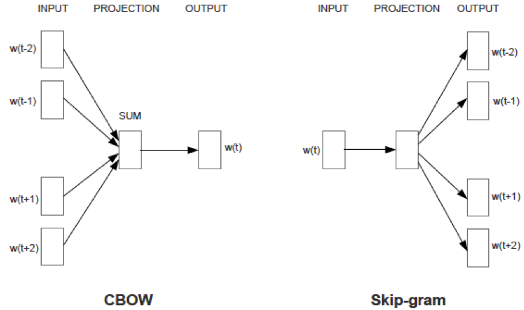
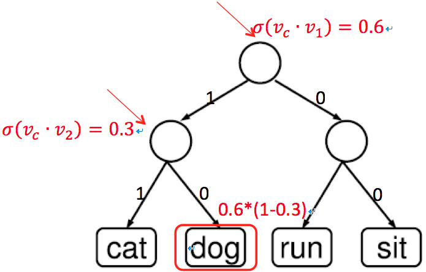

近几年，深度学习在图像、语音和NLP等领域取得了巨大的成功。学术界和工业界都争相在该领域进行着探索和研究。在所有大举深度学习大旗的公司中，Google公司无疑是举得最高的，口号喊得最响亮的那一个。2013年末，Google发布了基于深度学习方法打造的word2vec工具，引起了一帮人的热捧。

Word2vec是一个基于神经网络的语言模型，设计目标是用来计算概率$P(w|context)$，即词$w$在其上下文$context$下的条件概率。这里的$context$是一个句子中词$w$周围紧连着的n个词。有了$P(w|context)$，就可以用类似n-gram模型的方法计算出一个句子的概率。语言模型在NLP领域有着广泛的应用，比如智能拼音输入法、语音识别和机器翻译等领域都需要使用语言模型。尽管如此，word2vec模型真正强大的地方在于其不仅仅是一个比n-gram等传统语言模型精准度更高的工具，而在于其训练过程所产生的附属品（词向量）有着更加广泛的应用。
<!--more-->
那究竟什么是词向量呢？在NLP任务中，我们将自然语言交给机器学习算法来处理，但机器无法直接理解人类的语言。因此，首先要做的事情就是将语言数学化，词向量就是对自然语言数学化的一种很好的方式。

一种最简单的词向量是one-hot representation，就是用一个很长的向量来表示一个词，向量的长度是词典D的大小N，向量的分量只有一个为1，其他全为0，1的位置对应该词在词典中的索引。这种词向量表示有一些缺点：容易受维数灾难的困扰，尤其是应用于Deep Learning场景时；同时，也不能很好地刻画词与词之间的相似性。

另一种词向量是Distributed Representation，它最早是Hinton于1986年提出来的，可以克服one-hot representation的上述缺点。其基本想法是：通过训练将某种语言中的每个词映射成一个固定长度的短向量。所有这些向量构成一个词向量空间，每个向量是该空间中的一个点，在这个空间上引入“距离”，就可以根据词之间的距离来判断它们之间的（词法、语义上的）相似性了。Word2vec模型所产生的副产品就是这种Distributed Representation的词向量。

如何获取Distributed Representation的词向量呢？有很多不同的模型可以用来估计词向量，包括有名的LSA和LDA。此外，利用神经网络算法也是一种常用的方法，word2vec就是很好的一个例子。

词向量在信息检索中有着广泛的应用，比如可以基于词向量做相关词挖掘。注意，词向量只是针对“词”来提的，事实上，我们也可以针对更细粒度或更粗粒度来进行推广，如字向量，句子向量和文档向量，它们能够为字、句子、文档等单元提供更好的表示。大粒度的文本向量表示有着更加实际和广泛的应用。

本文主要关注在O2O垂直领域的搜索系统里，如何用向量空间来表示query和document，并用两者的向量相似度作为衡量query和document语义相关程度的指标。基于向量空间的匹配特征是搜索相关性模块的一个重要特性。该方法从主题模型的视图解读可参考我的另一篇博文：《》，这篇文章中也更加详细的描述了搜索引擎面临的问题和挑战。另外，《》描述了一些搜索引擎中常用的算法。

# 利用word2vec学习词向量

Word2vec[3,4]总共有两种模型——CBOW模型(Continuous Bag-of-Words Model)和Skip-gram模型(Continuous Skip-gram Model)。每个模型都可以使用两种学习策略——Hierarchical Softmax策略和Negative Sampling策略。

CBOW和Skip-gram模型的示意图如下，由图可见，两个模型都是一个三层的神经网络，包括输入层、投影层和输出层。前者是在已知当前词$w_t$的上下文$w_{t-2},w_{t-1},w_{t+1},w_{t+2}$的前提下预测当前词$w_t$；而后者恰恰相反，是在已知当前词$w_t$的前提下，预测其上下文中的每个词$w_{t-2},w_{t-1},w_{t+1},w_{t+2}$。当然当前词的上下文中的词的个数是可以配置的，这里设为4个，作为示意。

在给定上下文的输入条件下，模型需要预测词汇表中每个词的生成概率。生成概率用针对词汇表中每个词的softmax函数计算。由于自然语言的词汇表一般很大，用softmax函数为每个词计算生成概率的开销非常大，导致模型的学习效率非常低。针对这个问题，Word2vec对于每个模型都给出了两套优化策略，他们分别基于Hierarchical Softmax和Negative Sampling来进行设计，目的是简化计算每个词的生成概率。两种学习策略的区别在于对目标函数中的条件概率$p(w|context(w))$或$p(context(w)|w)$的构造方法的不同。

基于神经网络的语言模型的目标函数通常取为如下的对数似然函数：
$$L=\sum_w{log⁡p(w|context(w)})$$
对于word2vec中的CBOW模型，优化的目标函数也形如上式；而对于Skip-gram模型，优化的目标函数则形如
$$L=\sum_w{log⁡p(context(w)|w})$$

## Hierarchical Softmax

传统的神经网络语言模型的输出层对应一个长度为N的向量$y_w=(y_{w,1},y_{w,2},⋯,y_{w,N} )^T$，其每个分量对应训练语料的词典D中的一个词，词典的长度为N。由于各个分量的值不能直接表示为概率，如果想要$y_w$的分量$y_{w,i}$表示上下文为$context(w)$时下一个词恰为词典D中第$i$个词的概率，则还需做一个softmax归一化：
$$p(w|context(w))=\frac{e^{y_{w,i_w}}}{\sum_{i=1}^N{e^{y_{w,i_w}}}}$$
其中$i_w$表示词$w$在词典D中的索引。不难发现，归一化操作需要遍历$y_w$的每个分量，计算量大，因而整个模型的大部分计算都集中在输出层的归一化运算上，模型训练将会非常耗时。

Hierarchical Softmax方法就是为了简化Softmax归一化的计算过程，其基本思想是不直接计算$P(Y|X)$，而是先对$Y$聚类，再根据$Y$的类别这个中间变量来计算$P(Y|X)$。假设函数$c(\cdot)$把$Y$映射到唯一的一个类$C$，则$P(Y|X)$可按照如下的等式计算。
$$P(Y=y|X=x)=P(Y=y|C=c(y),X)P(C=c(y)|X=x)$$
上述等式总是成立的，因为根据全概率公式有：
$$\begin{aligned}
P(Y|X) &= \sum_iP(Y,C=i|X) \\
&= \sum_i{P(Y|C=i,X)P(C=i|X)} \\
&= P(Y|C=c(y),X)P(C=c(y)|X=x)
\end{aligned}$$

类似于EM算法，通过引入隐变量$C$可以大大简化$P(Y|X)$的计算复杂度。能否进一步简化计算呢？答案是肯定的。上述等式右边的第一项$P(Y=y|C=c(y),X)$的计算还可以通过引入隐变量来简化计算，即把第一步聚类的结果簇$C$里的词进一步聚成更小的类，从而递归地使用上述等式来简化计算量。具体的聚类方法在这里其实并不重要。上述思想依次类推，则原始$P(Y|X)$可以通过一个层次的树形结构来计算。

一种简单有效的方法就是用二叉树结构来表示层次化计算的过程，即每次只把候选集中的词聚成两类。二叉树的叶子节点对应词典D中的词，每个非叶子节点都有一个长度和词向量相同的语义向量，用来决定把当前词$w$分到左边的类还是右边的类。这样每个词都对应着一条从根节点到叶子节点的路径，假设$n(w,j)$是词$w$对应的路径上的第$j$个节点，$L(w)$是词$w$对应的路径的长度，则$n(w,1)=root$，$n(w,L(w))=w$。对于任意一个非叶子节点$n$, 用$ch(n)$表示节点$n$的任意一个固定的孩子节点。定义$x$为一个指示函数，当$x$为真时，函数值为1，否则为-1；$σ(x)=1/(1+exp⁡(-x)$)是sigmoid函数。假设模型Project层的输出记为$v_c$，则有
$$p(w│context(w))=\prod_{j=1}^{L(w)}σ\left(n(w,j+1)=ch(n(w,j)) \cdot v_{n(w,j)} v_c \right)，$$
其中，$\sum_{w=1}^W p(w│c)=1$。下图所示的例子展示了在一个简单的词典D上计算词“dog”在其上下文下的条件概率的过程。

在word2vec中，上述层次二叉树被构建成Huffman树，这样词频高的词对应更短的路径，词频低的词对应更长的路径。相应地，词频高的词对应的条件概率的计算复杂度较小；词频低的词对应条件概率的计算复杂度较大。这也是word2vec优化计算性能的一项关键技术。

## Negative Sampling

上面对Hierarchical Softmax学习策略进行了简单介绍，下面将继续介绍Negative Sampling（简称NEG）学习策略。NEG是Tomas Nikiolov等人提出的，它是NCE(Noise Contrastive Estimation)的一个简化版本，目的是用来提高训练速度并改善所得词向量的质量。

与Hierarchical Softmax方法相比，NEG不再使用复杂的Huffman树，而是利用相对简单的随机负采样。NCE的细节有点复杂，其本质上是利用已知的概率密度函数来估计未知的概率密度函数。简单来说，假设未知的概率密度函数为X，已知的概率密度函数为Y，如果得到了X和Y的关系，那么X也就可以求出来了。具体可参考文献[1]。

在CBOW模型中，已知词$w$的上下文$context(w)$，要预测$w$，因此，对于给定的$context(w)$，词$w$就是一个正样本，其他的词就是负样本了。正样本对应标签1，负样本对应标签0。一般而言，$∀w'∈D$，定义
$$L^w (w')=
\begin{cases}
1, & w'=w \\
0, & w'≠w
\end{cases}$$
表示词$w'$的标签。

假设现在已经选好了一个关于$w$的负样本子集$NEG(w)≠∅$，对于一个给定的正样本$(context(w),w)$，我们希望最大化
$$g(w)=\prod_{u∈{w}∪NEG(w)}p(u|context(w)),$$
其中，$$p(u|context(w))=
\begin{cases}
σ(x_w^T θ^u ), & L^w (u)=1 \\
1-σ(x_w^T θ^u ), & L^w (u)=0
\end{cases}$$

或写成整体表达式$p(u|context(w))=[σ(x_w^T θ^u )]^{L^w (u)} \cdot [1-σ(x_w^T θ^u)]^{1-L^w (u)}$，这里$x_w$表示$context(w)$中各词的词向量之和，而$θ^u$表示词$u$对应的一个辅助向量，为待训练参数。

从形式上看，当前预测词为$w$时，最大化$g(w)$，相当于最大化$σ(x_w^T θ^w )$（正例）的同时最小化所有的$σ(x_w^T θ^u )，u∈NEG(w)$。这就是我们所期望的，增大预测到正样本的概率的同时降低预测到负样本的概率。于是，对于一个给定的语料库$C$，函数$G=\prod_{w∈C}g(w)$就可以作为整体优化的目标。为了计算方便，对$G$取对数，最终的目标函数就是
$$L=log \prod_{w∈C}g(w)= \sum_{w∈C}{log\, g(w)}$$

上述给出了word2vec模型的两个子模型在两种不同的学习策略下的目标函数。模型的训练都采样随机梯度下降算法，跟普通的神经网络模型并无本质区别。需要注意的是，word2vec所采用的loss function并不是一般的神经网络模型所用的平方损失函数，而是对数损失函数：$L(Y,P(Y│X))=-logP(Y|X)$。word2vec中还有很多性能优化的trick，限于篇幅，这里就不再赘述了。

# 学习文本序列的向量

Word2vec解决了词向量的学习问题，即word2vec模型可以把词映射为词向量空间中的点。通过词向量我们可以很容易地获取词之间的相关程度，但是在搜索系统中这往往还是不够的。搜索相关性关注query和document的相似度（或者说距离），因而我们需要考虑如何计算query和document的相似度。

一种通用的方法是类似于机器学习中的kernel方法，把query从Query空间映射到一个隐空间，同时把document也映射到同样的隐空间，在隐空间中计算映射之后的query和document的相似度。这种方法如下图所示，其原理可以形式化地描述如下，假设Q表示query空间，D表示document空间，$q$和$d$分别表示query空间和document空间中的某个query和document；H表示隐空间（latent space）。定义映射函数$\phi:Q→H$，$\phi(q)$表示$q$映射到H中向量；类似地，定义$\phi':D→H$，其中$\phi'(d)$表示$d$在H中的向量。$q$和$d$之前的相似度可以定义为向量$\phi(q)$和$\phi'(d)$的内积：$k(q,d)=〈\phi(q),\phi'(d)〉$。

综上所述，映射函数$\phi(q)$和$\phi'(d)$的定义成为问题的关键。那么如何来生成这两个映射函数呢？由于query和document都可以理解为文本中词的序列，因此问题就转化为如何学习可变长度的文本序列的语义向量。

文本序列的最小语义单元是词，自然可以根据词向量来生成文本向量，一种简单的方法是直接对文本序列中的单词的词向量求和或者加权求和来得到文本序列的向量。这种方法在文本序列较短时，简单有效，不需要额外的学习成本。然而，当文本序列较长时效果不好，因为这种方法不能自动设别出文本序列中的重要片段（或实体），并忽略掉无关紧要的修饰内容。

那么能否直接学习文本序列的向量呢？答案也是肯定的，目前提出的方法包括：循环神经网络（RNN）、矩阵向量神经网络（Matrix-Vector NN）、卷积神经网络等。在这些方法中，有一种称之为Paragraph Vector [5]，是word2vec的变种，也是word2vec的作者和另一位学者共同提出的。这种方法结构简单，效果较好。在我们的O2O搜索系统里，就是用这种方法来学习O2O商品title的语义向量的。对于搜索query，由于其所含的term数较少，并且不能预先知道所有的query，所以在我们系统里，直接使用了词向量加权求和的方法来构建query的语义向量。

下面主要介绍一下我们如何利用Paragraph Vector方法的简单变体来学习商品title、商品类目的语义向量，以及如何通过融合商品title语义向量、商品类目语义向量及商品title中term的词向量来得到最终的商品语义向量。

与word2vec的训练语料（商品title作为句子，切词构成的word序列作为一个实例）不同，这次我们的训练语料中的每个实例是一个三元组<商品ID，商品所属叶子类目ID，商品title的Term序列>。我们所使用的网络结构如下：

该网络结构在word2vec中的CBOW模型的基础上引入了商品ID和类目ID两个新的元素，即新的模型认为当前词为$w$的概率不仅仅取决于当前词的上下文，而且跟当前商品和类目相关。模型的优化目标从原来的$L=\sum_w{log⁡p(w|context(w))}$ 变为 $L=\sum_w{log⁡p(w|context(w),doc_w,cat_w })$ 。训练过程类似于word2vec，也是用随机梯度下降算法来最小化对数损失函数。

# 利用用户行为数据

在信息检索系统中，用户的行为不是随机的，而是蕴含着很多模式。用户的行为数据蕴含了用户对检索结果的反馈，在用户搜索的query给定的条件下展现的商品被用户点击与否表达了用户对搜集结果是否满意，也表达了展现的商品与query的相关程度。可以假设与query越相关的商品被点击的概率越高。

充分挖掘利用用户行为数据，可以进一步改善模型的效果。
借助word2vec中的skip-gram模型用当前词去预测context中其他词的概率的思想，我们设计了一个新的神经网络模型，其基本思想是用商品去预测点击该商品的query中的词。新的网络结构如下：

该模型的优化目标为最大化似然函数：$L=\sum_{(q,doc)∈R}\sum_{w∈q}log⁡p(w|doc)$，其中$R$是所有query与该query点击的doc（商品）构成的pair集合。该模型的训练算法依然为SGD，这里不再赘述。

# 利用O2O知识库

为了减少训练数据中噪声的影响，同时为O2O垂直领域中的实体学习一个整体语义向量，我们在模型中先验性地利用了O2O实体库知识。主要是用了O2O品牌词、产品词和品类词等构成的实体数据。

对O2O实体库知识的运用主要体现在两个方面。第一，在word2vec模型中用实体短语代替实体文本对应的term。由于实体对应的短语可能会在切词的过程中被切成多个独立的term，直觉上，这些term的语义向量融合之后的语义向量和原来的实体对应的语义向量会存在一定的偏差，从而影响模型的精度。在训练语料中，我们先对商品title切词，得到title对应的term向量。再想办法把O2O实体对应的多个分离的term合并起来，作为一个整体和其他term一起作为训练语料。有了O2O实体库，合并term为实体短语就变得非常容易。我们首先对所有的O2O实体短语构建一颗以term为节点的Trie树，然后在遍历title对应的term向量时，用Trie树数据结构快速查找以当前term为前缀的实体短语。Trie树的实现请参考我的另一篇博文：。 O2O实体通常是一个商品语义信息的主要承载体，因此为实体单独学习语义向量，比起学习实体中term的语义向量，更能准确地表达商品的语义。

第二，在利用用户行为数据学习doc向量的模型中，为了减少噪声数据的影响，我们用O2O实体库筛选候选query，即我们只选择O2O实体构成的query作为训练语料。也就是说，我们认为只需要用实体短语对应的语义向量来增强doc向量。实验表明，这样做能够在获得不错的效果的同时减少需要的训练时间。

# 训练流程总结

为了得到query和doc（商品）的语义向量，我们的训练流程共分为三步：

+ 第一步，训练word2vec模型，得到词向量和实体短语向量；
+ 第二步，学习商品（doc）的语义向量和商品所属类目（cat）语义向量；
+ 第三步，利用用户行为数据优化商品语义向量。

训练是一个串行的流程，前一步学习到的模型参数用来初始化后一步的模型参数，相当于前一步是为后一步做预训练（pre-training）。

# 模型效果评估

模型效果评估分为线下和线上两种方法。

线下评估方法首先人工标注一批query和doc的相关性档位作为评估数据集。每个query和doc，计算两种的语义向量的余弦相似度。同一query的所有doc根据余弦相似度分数降序排序，根据标注的相关性档位计算排序序列的NDCG。然后求评估数据集上的整体NDCG相对于baseline的提升幅度来评估模型的好坏。

根据模型的学习结果，用词向量求和的方法生成query的语义向量。对于doc向量的生成，有好几种方法，我们分别对比了各个方法的效果。定义向量doc1为训练过程的第二步得到的doc向量；doc2为训练过程第二步得到的doc向量、cat向量与第一步得到的词向量加权融合。

首先，我们用和生成query的语义向量同样的方法，把doc中的所有词向量相加的方法，得到doc向量，作为baseline。

|Doc向量|ndcg@1|ndcg@3|ndcg@5|ndcg@9|ndcg@11|ndcg@20|
|----|----|----|----|----|----|----|
|doc1|	-0.02041|	-0.05343|	-0.00266|	0.059455|	0.069727|	0.048017|
|doc2|	0.979592|	1.03473|	1.05193|	0.992335|	0.973695|	0.982474|

从上表所示的效果对比，我们发现Paragraph Vector方法得到的doc向量的效果并不如直接对词向量求和的方法得到的doc向量；但是当它和词向量、类目向量融合之后，效果大大提升，ndcg@3和ndcg@5的整体提升幅度超过了100%。

对于训练过程第三步得到的doc向量，即利用用户行为数据优化得到的doc向量，我们做了单独的效果对比，分为单独对比和融合对比两个版本。单独对比是指第三步得到的doc向量（定义为doc3）相对于第二步得到的doc向量（doc1）的比较；融合对比是指用第一步得到的词向量、第二步得到的类目向量、第三步得到的doc向量加权求和得到的向量，定义为doc4，与上面定义的doc2，即第二步融合之后的向量的对比。

|Doc向量|ndcg@1|ndcg@3|ndcg@5|ndcg@9|ndcg@11|ndcg@20|
|----|----|----|----|----|----|----|
|doc3/doc1|	0.0310078|	0.0389239|	0.0440289|	0.0432047|	0.0372241|	0.0716754|
|doc4/doc2|	0.0304054|	0.0456101|	0.049773|	0.0505507|	0.0419293|	0.0311128|

从上述结果可以看出，用户行为数据的引入对提升模型效果有很大的帮助。

线上评估通过在O2O搜索引擎上做abtest测试，来验证模型在实际环境中的效果。需要注意的是，由于第三步得到的模型结果还没有经过工程化上线，这里只给出第二步得到的doc、cat和词向量融合之后的doc向量（doc2）在实验中的效果。引入语义向量相关性特征的版本相比于baseline，搜索结果列表页的ctr提升7.67%~9.25%；商品维度的ctr提升超过10%。全量上线之后，相关商品召回率提升超过50%。

#总结和展望

在O2O垂直搜索引擎中，引入了语义向量相似度特征，弥补了目前系统中商品类目层级和粒度不尽合理、存在商品类目错挂等问题，大幅提高了相关商品的召回率和CTR。

计算语义向量相似度的关键是把query和document映射到隐空间，即转化为n维的向量。对于query，我们采用词向量加权求和的方法得到query向量；对于document，我们采用学习词向量类似的方式，直接学习document的向量，并通过学习document所属的后台叶子category向量作为补充，同时通过引入用户反馈行为数据，进一步在隐空间中调整document的位置，使其更加准确地表达O2O实体信息，缩短其与相关query的距离。简而言之，我们结合了无监督学习和半监督学习的方法，通过stepwise的方式，最大化如下的似然函数：
$$L=α \cdot \sum_w logp(w|context(w),doc_w,cat_w) + β \cdot \sum_{(q,doc)∈R} \sum_{w∈q}log⁡p(w|doc)$$

最后，我们通过加权求和的方式融合词向量、document向量、category向量得到最终的 document向量。实验表明，我们的方法是有效的。

对于query和document相关性这个问题，可以设计一个深度模型来直接拟合目标，同时学习query和document的向量。微软公司提出的DSSM模型就是拟合相关性目标的例子。

不同粒度（词、短语、句子、文档、类目）的语义向量还有很多应用，比如可以基于query和category的语义向量相似度做query类目预测；再比如可以在CTR预估模型中引入语义向量特征等。

# 参考文献

[1] Michael U Gutmann and Aapo Hyv¨arinen. Noise-contrastive estimation of unnormalized statistical models, with applications to natural image statistics. The Journal ofMachine Learning Research. 13:307-361，2012.
[2] Yoshua Bengio, Rejean Ducharme, Pascal Vincent, and Christian Jauvin. A neural probabilistic language model. Journal of Machine Learning Research (JMLR), 3:1137-1155, 2003.
[3] Tomas Mikolov, Kai Chen, Greg Corrado, Jeffrey Dean. Efficient Estimation of Word
Representations in Vector Space. arXiv:1301.3781, 2013.
[4] Tomas Mikolov, Ilya Sutskever, Kai Chen, Greg Corrado, Jeffrey Dean. Distributed Representations of Words and Phrases and their Compositionality. arXiv:1310.4546, 2013.
[5] Quoc V. Le, Tomas Mikolov. Distributed Representations of Sentences and Documents. arXiv:1405.4053, 2014.
