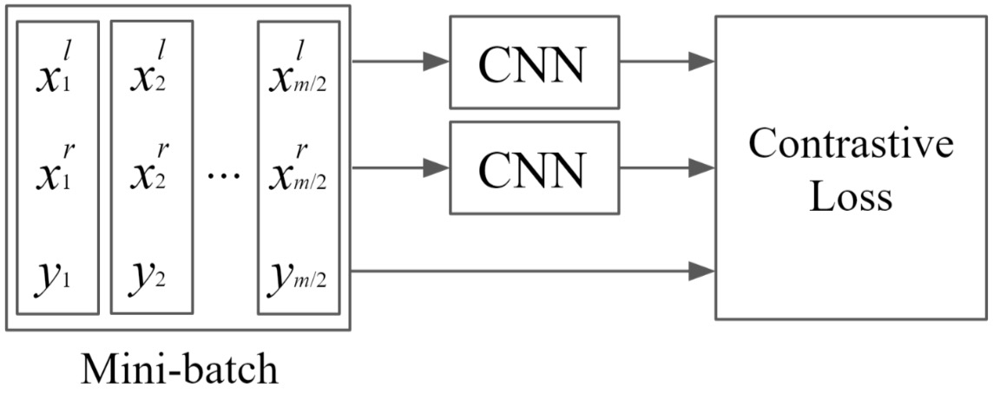
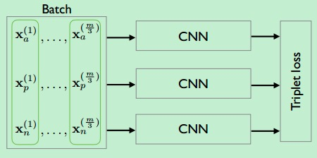
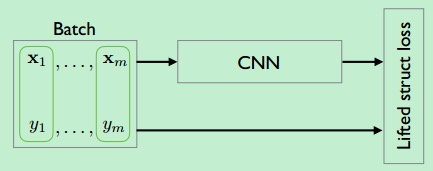
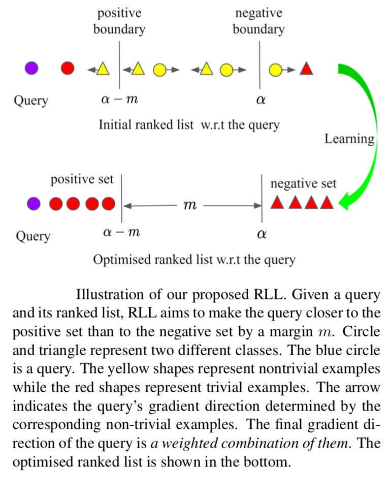
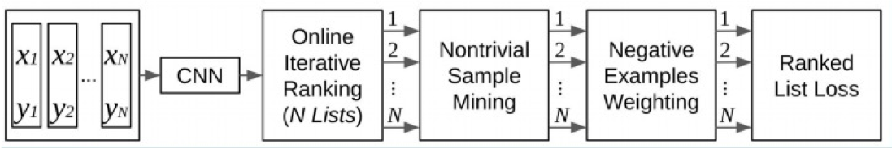
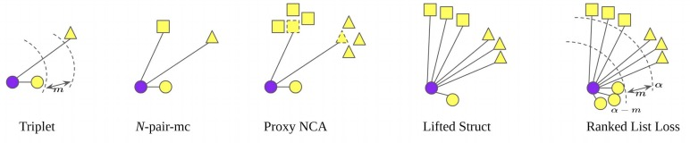
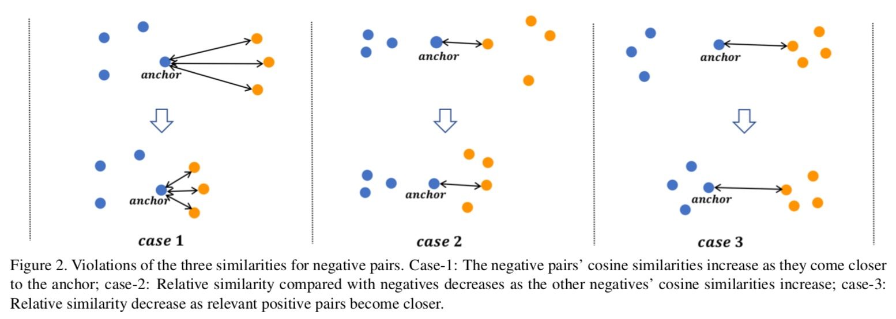
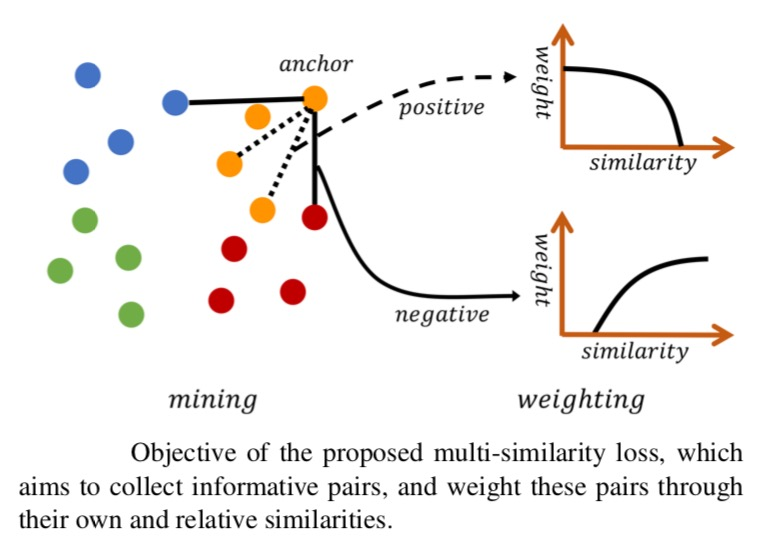

度量学习（metric learning）研究如何在一个特定的任务上学习一个距离函数，使得该距离函数能够帮助基于近邻的算法（kNN、k-means等）取得较好的性能。深度度量学习（deep metric learning）是度量学习的一种方法，它的目标是学习一个从原始特征到低维稠密的向量空间（称之为嵌入空间，embedding space）的映射，使得同类对象在嵌入空间上使用常用的距离函数（欧氏距离、cosine距离等）计算的距离比较近，而不同类的对象之间的距离则比较远。深度度量学习在计算机视觉领域取得了非常多的成功的应用，比如人脸识别、人脸验证、图像检索、签名验证、行人重识别等。

损失函数在深度度量学习中起到了非常重要的作用。很多深度度量学习的损失函数构建在样本对(pair)或者样本三元组(triplet)之上，因而样本空间的量级（$O(N^2)$或者$O(N^3)$）非常大。一般而言，模型在训练过程中很难穷举学习所有的样本对；并且大多数样本对或者样本三元组的信息量是很小的，尤其在模型训练的后期，这些样本对或者样本三元组上梯度值几乎为0。若不做任何针对性的优化，学习算法的收敛速度会很慢，且易陷入局部最优。

困难样本挖掘是加快学习算法的收敛速度，并改进学习效果的一种重要手段。它通常和特定的损失函数一起使用，以期望达到最好的效果。困难样本挖掘可以理解为在学习过程中给每一个样本对动态赋予一个权重。在学习不同样本对时给它们不同的权重，如果某个样本对包含的信息比较多或比较难学习，那么它就需要比较大的权重。信息量较少的样本对则会被赋予较小的权重。若某些样本对被赋予的权重为0，则意味着在计算梯度时不考虑这些样本对，相当于这些样本对被丢弃了。

不同的损失函数在设计时，对于样本对的赋权是不同的，或者说与这些损失函数配合使用的困难样本挖掘方法是不同的。下面列举一些常用的深度度量学习中使用的损失函数，同时了解一下它们是如何来给做困难样本挖掘的。
<!--more-->
## 损失函数(Loss functions)

### 1. Contrastive loss

Contrastive loss的输入是两个样本组成的样本对，label为该样本对是否属于同一类。

$$L(x_i,x_j;f)={\bf 1}\{y_i=y_j\}  \|f_i-f_j\|_2^2 + {\bf 1}\{y_i \neq y_j\} max(0, m-\|f_i-f_j\|_2)^2$$

其中，$f_i$是函数$f(x_i)$的简写，表示输入$x_i$映射之后的embedding向量；${\bf 1}\{ \cdot \}$是指示函数，在输入为true时返回1，否则返回0；$m$是预先设定的超参数，表示不同类样本之间的距离应超过该margin值。

最原始的contrastive loss只考虑了输入样本对本身的相似性。

### 2. Triplet loss

Triplet loss的输入由一个三元组组成，每个三元组包含一个query、一个与query属于同一类的正样本、一个与query属于不同类的负样本。

$$L(x,x^+,x^-;f)=max \left(0, \|f-f^+\|_2^2 -\|f-f^-\|_2^2 + m \right)$$

Triplet loss要求query到负样本的距离与query到正样本的距离之差要大于$m$。

Contrastive loss和triplet loss都很常用，一般来说，Triplet-Loss的效果比Contrastive Loss的效果要好，因为他考虑了正负样本与锚点的距离关系。然而，这两种loss函数如果单独使用则会遭遇收敛速度慢的问题。在学习过程的后期，大多数样本都能满足损失函数的约束条件，这些样本对应进一步学习的贡献很小。因此，这两种损失函数都需要配合hard sample mining的学习策略一起使用，例如FaceNet提出的simi-hard negative sample mining方法。

### 3. N-pair-ms loss

Triplet loss在学习参数的更新过程中，只比较了一个负样本，而忽略了其他类的负样本。因而，只能促进query的embedding向量与选中的一个负样本保持较大的距离，但却不能保证与其他未被选择的负样本也保持较大的距离。

N-pair-ms loss对Triplet loss的上述问题进行了改进，不同于Triplet Loss使用单个的正负样本，N-pair-ms loss损失函数利用了数据之间的结构信息来学习到更有区别性的表示，其在每次参数更新的过程中同时考虑了query样本与其他多个不同类的负样本之间的关系，促使query与其他所有类之间都保持距离，这样能够加快模型的收敛速度。N-pair-ms loss的每个训练样本由$N+1$元组组成，即$\{x, x^+, x_1, \cdots, x_{N-1} \}$，其中$x^+$是相对于$x$而言的正样本，$\{x_i\}_{i=1}^{N-1}$是负样本。$N+1$元组一般不会提前构建好，而是在训练的过程中，从同一个mini batch中构建出来。

$$L(x,x^+,\{x_i\}_{i=1}^{N-1};f)=log\left(1+\sum_{i=1}^{N-1}exp(f^Tf_i - f^Tf^+) \right)$$

其中，$f(\cdot;\theta)$是由深度神经网络定义的embedding kernel.

### 4. Lifted Struct loss

Lifted Struct loss基于训练集（mini batch）中所有的正负样本对来计算loss，其定义如下：

$$\begin{align}
L &= \frac{1}{2 \lvert \hat{P} \rvert} \sum_{(i, j) \in \hat{P}} \max (0, L_{i, j})^2 \\
L_{i, j} &= \max ( \max_{(i, k) \in \hat{N}} \alpha - D_{i, k}, \max_{(j, l) \in \hat{N}} \alpha - D_{j, l} ) + D_{i, j}
\end{align}$$

其中，$\hat{P}$是正样本对（pair的左变量和右边量来自同一个类）的集合；$\hat{N}$是负样本对的集合；$D_{i,j}$是样本对$\{i,j\}$的距离。

仔细分析该loss function，发现对于每一个正样本对$\{i,j\}$，模型分别挖掘其左变量$i$和右边量$j$对应的最困难的负样本，独立地找到距离左变量最近的负样本，假设为$k$；同时找到距离右边量最近的负样本，假设为$l$。接着通过比较$D_{i,k}$和$D_{j,l}$，找出其中较小的距离对应的负样本，假设为$n$。最后，计算三元组$\{i,j,n\}$确定的triplet loss函数。如下图所示：

Hard negative edge is mined with respect to each left and right example per each positive pairs. In this illustration with 6 examples in the batch, both x3 and x4 independently compares against all other negative edges and mines the hardest negative edge.

Lifted Struct loss与triplet loss的不同之处就在于，triplet loss的样本三元组是提前确定好的，而Lifted Struct loss是为每一个正样本对动态构建最困难的三元组，在构建的过程中考虑了（mini batch中)所有的负样本。

由于上述定义的Lifted Struct loss函数是不光滑的函数，嵌套的max函数在实际中容易导致网络陷入较差的局部最优，因此可以改写为一个光滑的上界函数来避免词问题。

$$\begin{align}
\tilde{L}_{i, j} &= \log ( \sum_{(i, k) \in N} \exp \{\alpha - D_{i, k}\} + \sum_{(j, l) \in N} \exp \{\alpha - D_{j, l}\} ) + D_{i, j} \\
\tilde{L} &= \frac{1}{2 \lvert P \rvert} \sum_{(i, j) \in P} \max (0, \tilde{L}_{i, j})^2
\end{align}$$

### 5. Proxy NCA loss

这个方法提出的目的是去解决采样的问题。假设W代表着训练集中的一小部分数据，在采样时通过选择与W中距离最近的一个样本u作为代理(proxy), 即：$$p(u)=argmin_{w \in W}d(u,w)$$

基于选择的proxy, NCA损失为：
$$L(a,u,)=-log\left( \frac{exp(-d(a,p(u)))}{\sum_{z \in Z}exp(-d(a,p(z)))}  \right)$$ 

### 6. Ranked list loss

上述的损失函数都存在如下的两点局限性：

1. 这些损失函数虽然都提出了加入更多的负样本来获得结构化的信息，但是使用的负样本仅仅是一小部分；
2. 另外这些损失函数没有考虑类内的数据分布，都追求将同一个class压缩到一个点上。

Ranked List Loss对着两个问题提出了改进。

假设$X=\{(x_i, y_i)\}_{i=1}^N$表示训练集，其中每一组元素$(x_i, y_i)$表示成对的样本与其标签，总共包括$C$个类别，即，$y_i \in [i,2,\cdots,C]$, $\{x_i^c\}_{i=1}^{N_c}$表示属于类别$c$的所有样本，$N_c$表示相应类别的样本数量。

我们的目标是学习到一个函数$f$使得正样本对之间的相似度高于负样本之间的相似度。为了将正负样本区分开，Ranked List Loss希望负样本之间的距离大于某个阈值$α$，并且正样本之间的距离小于$α-m$，即正负样本之间至少有$m$的间隔。基于此，提出了pairwise margin loss：
$$L_m(x_i, x_j;f)=(1-y_{ij})[α-d_{ij}]_+ + y_{ij}[d_{ij}-(α-m)]_+$$

其中，当$y_i=y_j$时，$y_{ij}=1$，否则$y_{ij}=0$；$d_{ij}$表示$f(x_i), f(x_j)$之间的欧式距离，$[\cdot]_+$是hinge函数。

对样本进行合适采样可以加快模型的收敛速率和提高模型性能。Ranked List Loss使用的采样策略很简单，就是损失函数不为0的样本，具体来说，对于正样本，损失函数不为0意味着它们与anchor之间的距离大于$α-m$, 类似的，对于负样本，损失函数不为0意味着它们与anchor之间的距离小于$α$，相当于使得同一类别位于一个半径为$α-m$大小的超球体内。

给定一个anchor $x_i^c$, 基于相似度对其他样本进行排序，在这个排序结果中，有$N_{c}-1$ 个正样本，用$P_{c,i}=\{x_j^c|j \neq i\}$表示。同样地，有$\sum_{k \neq c}N_k$个负样本，用$N_{c,i}=\{x_j^k|k \neq c\}$表示。于每个anchor $x_i^c$, 我们希望使得它与正样本集$P_{c,i}$的距离越近越好，并且与负样本集$N_{c,i}$之间存在着$m$的间隔，同时，我们还希望使得anchor与负样本的距离大于边界$α$。在执行困难样本挖掘后，得到困难的正样本集合为 $$P_{c,i}^{*}=\{x_j^c | j \neq i,d_{ij}>(\alpha-m)\}$$ ，困难的负样本集合为 $$N_{c,i}^{*}=\{x_j^k | k \neq c, d_{ij}<\alpha\}$$ 。

因此，对于正样本我们使用的损失函数为：
$$L_P(x_i^c;f)=\frac{1}{|P_{c,i}^*|}\sum_{x_j^c \in P_{c,j}^*}L_m(x_i^c,x_j^c;f)$$

对于负样本集，考虑到它的样本数量比较大，对每个负样本使用加权的方式：
$$L_N(x_i^c;f)=\sum_{x_j^k \in N_{c,i}^*} \frac{w_{ij}}{ \sum_{x_j^k \in P_{c,j}^*} w_{ij}} L_m(x_i^c,x_j^k;f)$$

其中，$w_{ij}=exp(T \cdot (\alpha-d_{ij})$，$T$是超参数。

最终，整个损失为：
$$L_{RLL}(x_i^c;f)=L_P(x_i^c;f)+\lambda L_N(x_i^c;f)$$

通常情况下，设置$\lambda=1$。

Ranked list loss的整体流程图如下：

上述几种loss函数的对比如下图所示：

其中，蓝色圆形表示anchor(query)样本，不同的形状表示来自不同类的样本。

### 7. Multi-Similarity loss

前面说过，困难样本挖掘可以理解为在学习过程中给每一个样本对动态赋予一个权重。给样本赋权的核心在于判断样本的局部分布，即它们之间的相似性，局部样本之间的分布和相互关系并不仅仅取决于当前两个样本之间的距离或相似性，还取决于当前样本对与其周围样本对之间的关系。

因此，对于每一个样本对，我们不仅需要考虑样本对本身的自相似性，同时还要考虑它与其它样本对的相对相似性。其中相对相似性又可以分为正相对相似性 (正样本)、负相对相似性（负样本）两种相似性。

1. 自相似性：根据样本对自身计算出的相似性，这是一种最常用也是最重要的相似性。例如，当一个负样本对的余弦相似性较大时，意味着很难把该样本对所对应的两种类别区分开来，这样的样本对对模型来说是困难的，也是有信息量的，对于模型学习更有区分度的特征很有帮助。另一方面，自相似性很难完整地描述embedding空间的样本分布情况。
2. 正相对相似性：不仅考虑当前样本对自身的相似性，还考虑局部邻域内正样本对之间的相对关系。
3. 负相对相似性：不仅考虑当前样本对自身的相似性，还考虑局部邻域内负样本对之间的相对关系。

各种损失函数都在给样本加权以确定「拉或推」的力度，那么使用什么样的函数来加权就非常重要了，在学习不同样本对时给它们不同的权重，如果某个样本包含的信息比较多或比较难学习，那么它就需要比较大的权重。不同的损失函数在设计时，对于样本对的赋权是不同的，往往会涉及到上述三种相似性的其中一种或多种的计算。以一个负样本对为例，上文提到的几个loss函数涉及到的相似性计算类型如下表所示。

| | contrastive | triplet | n-pair-ms |Lifted Struct loss|proxy NCA|Ranked List Loss|MS|
|---|---|---|---|---|---|---|---|
|自相似性    |✓|✗|✗|✗|✗|✗|✓|
|正相对相似性|✗|✓|✗|✗|✓|✗|✓|
|负相对相似性|✗|✗|✓|✓|✓|✓|✓|

Multi-Similarity Loss（MS loss） 综合考虑了三种相似性，它们能概括目前大多数基于样本对的损失函数。MS Loss 通过采样和加权两次迭代，实现更加高效的样本训练。它通过定义自相似性和相对相似性，在训练过程中更加全面地考虑了局部样本分布，从而能更高效精确的对重要样本对进行采用和加权。

对于一个给定的负样本对$\{x_i,x_j\} \in N_i$，MS loss给它赋予的权重为：
$$w_{ij}^-=\frac{1}{e^{\beta(\lambda-S_{ij})} +\sum_{k \in N_i}e^{\beta(S_{ik}-S_{ij})} }$$

类似地，对于一个给定的负样本对$\{x_i,x_j\} \in P_i$，MS loss给它赋予的权重为：
$$w_{ij}^+=\frac{1}{e^{-\alpha(\lambda-S_{ij})} +\sum_{k \in P_i}e^{-\alpha(S_{ik}-S_{ij})} }$$

最终，MS loss的定义为：
$$L_{MS}=\frac{1}{m} \sum_{i=1}^m \left\{\frac{1}{\alpha}log[1+\sum_{k \in P_i}e^{-\alpha(S_{ik}-\lambda)}] + \frac{1}{\beta}log[1+\sum_{k \in N_i}e^{\beta(S_{ik}-\lambda)}] \right\}$$

$L_{MS}$相对于$S_{ij}$求得的梯度刚好为上述样本权重。

MS Loss 在大部分图像检索基准数据库上都有很好的性能，且相比最新的方法也有较大的优势。

关注微信公众号“算法工程师的进阶之路”，后台回复“损失函数”获取常见深度度量学习loss函数的**完整源代码**。 如果觉得本文对您有帮助，请帮忙点个赞！
