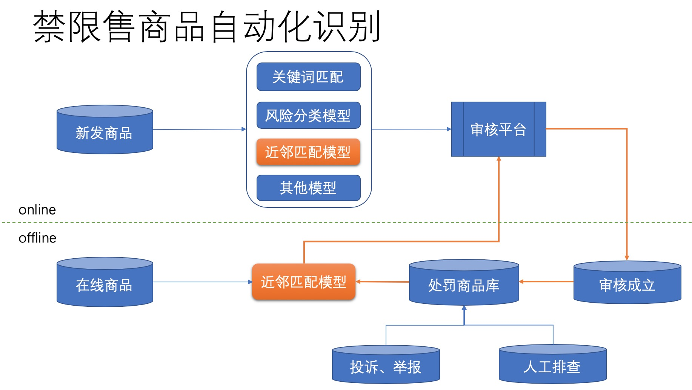
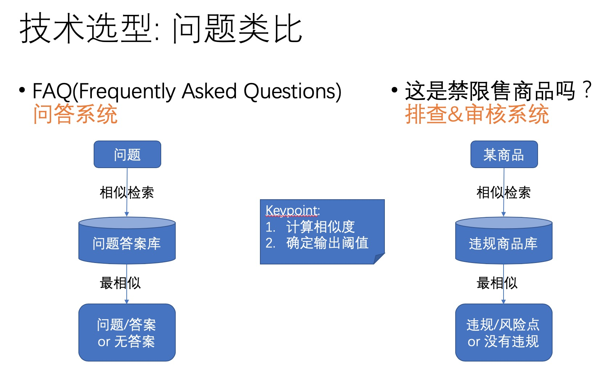

语义相似度有很多重要的应用场景，比如在检索系统中用来做语义召回，或者作为精排的特征。基于文本语义相似度模型做相似检索可以辅助文本分类，能够弥补分类模型更新迭代周期长的问题。在智能问答系统中，文本语义相似度模型也能发挥很大的作用。

目前，学习相似度的深度学习范式主要有两种，如下图所示。

第一种范式是首先通过深度神经网络模型提取输入的表示向量，再通过表示向量的简单距离函数（eg. inner product，欧式距离等）计算两者的相似度。这种方式在提取表示向量的过程中只考虑当前输入，不考虑要与之计算相似度的另一个输入的信息，通常用孪生网络来实现。属于这一类的常用模型包括DSSM、ARC-I、CNTN等。

第二种范式是通过深度模型提取两个输入的交叉特征，得到匹配信号张量，再聚合为匹配分数，该方式同时考虑两个输入的信息，因而一般情况下效果相比第一种范式要更好，不足之处在于预测阶段需要两两计算相似度，计算空间很高，因而不适合用来做大规模召回，只能用在精排阶段。ARC-II、MatchPyramid、Match-SRNN、Duet等模型都属于这一类型。

目前NLP领域的热门深度模型BERT、XLNET及其变体，我一般把它们看作是通用的文本特征提取器，根据输入和损失函数的不同定义，既可以应用在第一种范式中，也可以应用在第二种范式中。

为了更好地理解语义相似度模型在真实业务场景中的应用，下面我们用一个真实的业务场景来举例。这个业务场景就是电商平台的禁限售商品自动识别。

在一个电商平台做大做强之后，用户和流量水涨船高，一些不法分子发现有利可图，便会在平台上发布大量违规商品，为自己的非法产品引流和变现。商品合规风险指商家未能遵循国家有关法律法规、监管要求或平台制定的经营规则，在平台发布了禁止或限制销售的商品或服务。从发布内容的维度看，违规风险内容主要分为危害国家安全、民生安全、公共安全和市场秩序四大块内容。其中，危害国家安全的违规商品内容包括非法政治、枪支弹药、管制器具、军警用品、暴恐分裂渗透等；危害民生安全的违规商品内容包括毒品、危险化学品、管制药品、管制医疗器械、保护动植物等；危害公共安全的违规商品内容包括色情、低俗、赌博、个人隐私、作弊造假等；违反市场秩序的违规商品内容包括诚信交易类、公序良俗类等。

坚守风险底线，为用户服务提供良好的制度保障，助力平台提供更简单、更友好的经营环境，保护消费者权益是电商平台商品合规业务的主要目标。

禁限售商品的识别通常有多种方法，比如关键词规则匹配、风险分类模型、近邻匹配模型等等。一个典型的禁限售商品自动识别体系如下图所示：

其中，近邻匹配模型是通过商品语义相似度的方法，计算新发布商品是否与已有违规商品库中的某些违规商品类似，若找到相似度很高的违规商品，则判断新发布商品也疑似违规。整个过程，其实就是k近邻分类。

K近邻分类能否成功有一个重要的关键点，就是如何计算两个对象的距离，或者说相似度。相似度计算既要准确度高，又要速度快。

由于新商品与已有违规商品的数量级都巨大，因此我们不可能全部两两组成对输入给模型预测是否相似，因此第二种范式并不适合用在风险召回阶段。第一种范式就比较适合用来做快速召回。这是因为K近邻算法的样本库可以提前提取好特征，也就是说我们可以提前计算好违规商品的表示向量。新商品需要分类时，只需要实时提取好当前查询商品的特征向量，再通过向量检索引擎查询top K个最相似的邻居，最后根据KNN算法判定分类结果即可。

向量检索引擎可以解决相似度计算速度要快的问题，另一个待解决的问题则是相似度计算准确度要高。这完全取决于模型提取的特征向量的表示能力。表示学习是深度学习的一个重要的研究子领域。从本系列文章的下一篇开始，我们将会一些常用的相似度模型，相似度度量的损失函数，以及一些实践经验。
