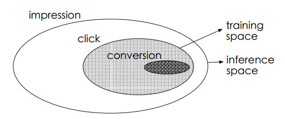
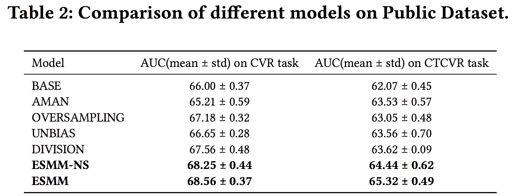
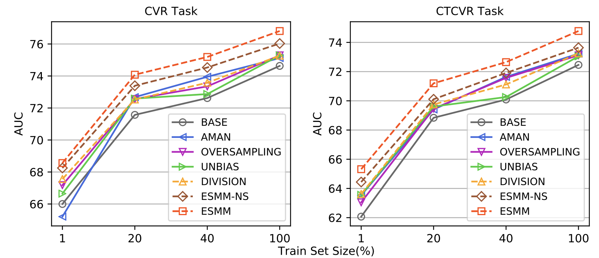

在诸如信息检索、推荐系统、在线广告投放系统等工业级的应用中准确预估转化率（post-click conversion rate，CVR）是至关重要的。例如，在电商平台的推荐系统中，最大化场景商品交易总额（GMV）是平台的重要目标之一，而GMV可以拆解为流量×点击率×转化率×客单价，可见转化率是优化目标的重要因子；从用户体验的角度来说准确预估的转换率被用来平衡用户的点击偏好与购买偏好。

阿里妈妈算法团队最近发表了一篇关于CVR预估的论文《Entire Space Multi-Task Model: An Effective Approach for Estimating Post-Click Conversion Rate》，提出了一种新颖的CVR预估模型，称之为“完整空间多任务模型”（Entire Space Multi-Task Model，ESMM），下文简称为ESMM模型。ESMM模型创新地利用用户行为序列数据，在完整的样本数据空间同时学习点击率和转化率（post-view clickthrough&conversion rate，CTCVR），解决了传统CVR预估模型难以克服的样本选择偏差（sample selection bias）和训练数据过于稀疏（data sparsity ）的问题。
<!--more-->
以电子商务平台为例，用户在观察到系统展现的推荐商品列表后，可能会点击自己感兴趣的商品，进而产生购买行为。换句话说，用户行为遵循一定的顺序决策模式：impression → click → conversion。CVR模型旨在预估用户在观察到曝光商品进而点击到商品详情页之后购买此商品的概率，即pCVR = p(conversion|click,impression)。

假设训练数据集为$S=\{(x_i,y_i \to z_i)\}|_{i=1}^N$，其中的样本$(x,y \to z)$是从域$X \times Y \times Z$中按照某种分布采样得到的，$X$是特征空间，$Y$和$Z$是标签空间，$N$ 为数据集中的样本总数量。在CVR预估任务中，$x$ 是高维稀疏多域的特征向量，$y$ 和 $z$ 的取值为0或1，分别表示是否点击和是否购买。$y \to z$揭示了用户行为的顺序性，即点击事情一般发生在购买事件之前。CVR模型的目标是预估条件概率pCVR ，与其相关的两个概率为点击率pCTR 和点击且转换率 pCTCVR ，它们之间的关系如下：

传统的CVR预估任务通常采用类似于CTR预估的技术，比如最近很流行的深度学习模型。然而，有别于CTR预估任务，CVR预估任务面临一些特有的挑战：1) 样本选择偏差；2) 训练数据稀疏；3) 延迟反馈等。

 图1. 训练样本空间

延迟反馈的问题不在本文讨论的范围内，下面简单介绍一下样本选择偏差与训练数据稀疏的问题。如图1所示，最外面的大椭圆为整个样本空间$S$，其中有点击事件（$y=1$）的样本组成的集合为$S_c=\{(x_j, z_j)|y_j = 1\}|_{j=1}^M$，对应图中的阴影区域，传统的CVR模型就是用此集合中的样本来训练的，同时训练好的模型又需要在整个样本空间做预测推断。由于点击事件相对于展现事件来说要少很多，因此$S_c$只是样本空间$S$的一个很小的子集，从$S_c$上提取的特征相对于从$S$中提取的特征而言是有偏的，甚至是很不相同。从而，按这种方法构建的训练样本集相当于是从一个与真实分布不一致的分布中采样得到的，这一定程度上违背了机器学习算法之所以有效的前提：训练样本与测试样本必须独立地采样自同一个分布，即独立同分布的假设。总结一下，训练样本从整体样本空间的一个较小子集中提取，而训练得到的模型却需要对整个样本空间中的样本做推断预测的现象称之为样本选择偏差。样本选择偏差会伤害学到的模型的泛化性能。

推荐系统展现给用户的商品数量要远远大于被用户点击的商品数量，同时有点击行为的用户也仅仅只占所有用户的一小部分，因此有点击行为的样本空间图片: $S_c$相对于整个样本空间$S$ 来说是很小的，通常来讲，量级要少1~3个数量级。如表1所示，在淘宝公开的训练数据集上，$S_c$只占整个样本空间$S$的4%。这就是所谓的训练数据稀疏的问题，高度稀疏的训练数据使得模型的学习变得相当困难。

阿里妈妈的算法同学提出的ESMM模型借鉴了多任务学习的思路，引入了两个辅助的学习任务，分别用来拟合pCTR和pCTCVR，从而同时消除了上文提到的两个挑战。ESMM模型能够充分利用用户行为的顺序性模式，其模型架构如图2所示。

 图2. ESMM模型

整体来看，对于一个给定的展现，ESMM模型能够同时输出预估的pCTR、pCVR 和pCTCVR。它主要由两个子神经网络组成，左边的子网络用来拟合pCVR ，右边的子网络用来拟合pCTR。两个子网络的结构是完全相同的，这里把子网络命名为BASE模型。两个子网络的输出结果相乘之后即得到pCTCVR，并作为整个任务的输出。

需要强调的是，ESMM模型有两个主要的特点，使其区别于传统的CVR预估模型，分别阐述如下。

1. 在整个样本空间建模。由下面的等式可以看出，pCVR 可以在先估计出pCTR 和pCTCVR之后推导出来。从原理上来说，相当于分别单独训练两个模型拟合出pCTR 和pCTCVR，再通过pCTCVR 除以pCTR 得到最终的拟合目标pCVR 。

    但是，由于pCTR 通常很小，除以一个很小的浮点数容易引起数组不稳定问题（计算内存溢出）。所以ESMM模型采用了乘法的形式，而没有采用除法形式。
    pCTR 和pCTCVR 是ESMM模型需要估计的两个主要因子，而且是在整个样本空间上建模得到的，pCVR 只是一个中间变量。由此可见，ESMM模型是在整个样本空间建模，而不像传统CVR预估模型那样只在点击样本空间建模。

2. 共享特征表示。ESMM模型借鉴迁移学习的思路，在两个子网络的embedding层共享embedding向量（特征表示）词典。网络的embedding层把大规模稀疏的输入数据映射到低维的表示向量，该层的参数占了整个网络参数的绝大部分，需要大量的训练样本才能充分学习得到。由于CTR任务的训练样本量要大大超过CVR任务的训练样本量，ESMM模型中特征表示共享的机制能够使得CVR子任务也能够从只有展现没有点击的样本中学习，从而能够极大地有利于缓解训练数据稀疏性问题。

需要补充说明的是，ESMM模型的损失函数由两部分组成，对应于pCTR 和pCTCVR 两个子任务，其形式如下：
$$L(\theta_{cvr},\theta_{ctr}) =\sum_{i=1}^N l(y_i, f(x_i; \theta_{ctr}))
+ \sum_{i=1}^N l(y_i\&z_i, f(x_i; \theta_{ctr}) \times f(x_i; \theta_{cvr}))$$
其中，$\theta_{ctr}$和$\theta_{cvr}$分别是CTR网络和CVR网络的参数，$l(\cdot)$是交叉熵损失函数。在CTR任务中，有点击行为的展现事件构成的样本标记为正样本，没有点击行为发生的展现事件标记为负样本；在CTCVR任务中，同时有点击和购买行为的展现事件标记为正样本，否则标记为负样本。

由于ESMM模型创新性地利用了用户的序列行为做完模型的训练样本，因此并没有公开的数据集可供测试，阿里的技术同学从淘宝的日志中采样了一部分数据，作为公开的测试集，下载地址为：https://tianchi.aliyun.com/datalab/dataSet.html?dataId=408 。阿里妈妈的工程师们分别在公开的数据集和淘宝生产环境的数据集上做了测试，相对于其他几个主流的竞争模型，都取得了更好的性能。

表2是在公开数据集上的不同算法AUC效果对比情况，其中BASE模型是ESMM模型中左边的子神经网络模型，由于其只在点击样本空间训练，会遭遇样本选择偏差和数据稀疏的问题，因为效果也是较差的。DIVISION模型是先分别训练出拟合CTR和CTCVR的模型，再拿CTCVR模型的预测结果除以CTR模型的预测结果得到对CVR模型的预估。ESMM-NS模型是ESMM模型的一个变种模型，其在ESMM模型的基础上去掉了特征表示共享的机制。AMAN、OVERSAMPLING、UNBIAS是三个竞争模型。

 图3.在淘宝生产环境数据集上几种不同算法的性能测试对比

图3是ESMM模型在淘宝生产环境数据集上的测试效果对比。相对于BASE模型，ESMM模型在CVR任务中AUC指标提升了 2.18%，在CTCVR任务中AUC指标提升了2.32%。通常AUC指标提升0.1%就可认为是一个显著的改进。

综上所述，ESMM模型是一个新颖的CVR预估方法，其首创了利用用户行为序列数据在完整样本空间建模，避免了传统CVR模型经常遭遇的样本选择偏差和训练数据稀疏的问题，取得了显著的效果。另一方面，ESMM模型的贡献在于其提出的利用学习CTR和CTCVR的辅助任务，迂回地学习CVR的思路。ESMM模型中的BASE子网络可以替换为任意的学习模型，因此ESMM的框架可以非常容易地和其他学习模型集成，从而吸收其他学习模型的优势，进一步提升学习效果，想象空间巨大。

原文链接：https://arxiv.org/abs/1804.07931

关于ESMM模型的实现，请参考另一篇文章：

关注微信公众号“算法工程师的进阶之路”，后台回复“ESMM“，获取**完整源代码**。
