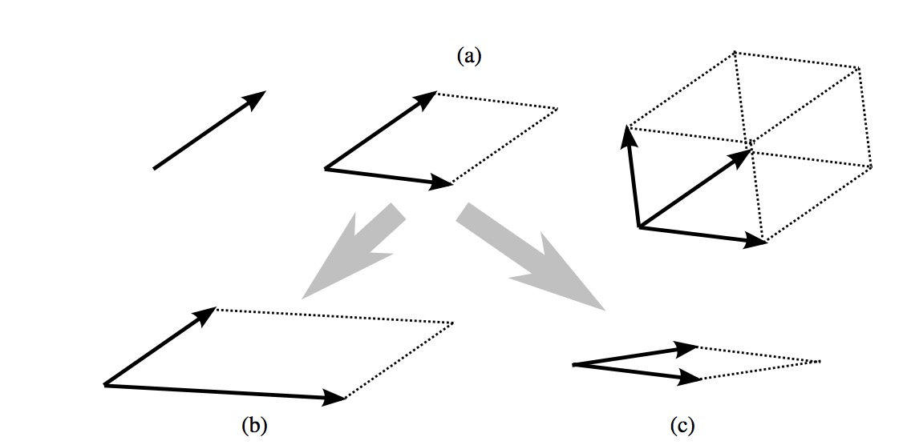
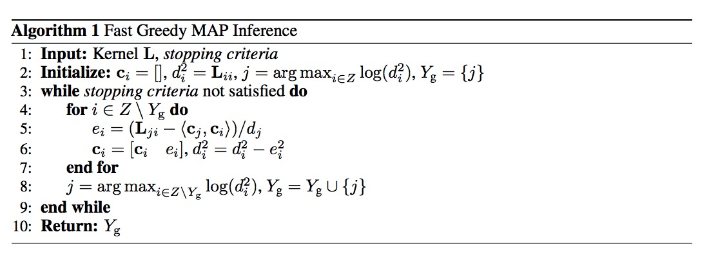

多样性和相关性是衡量推荐系统的常用的指标，这两个指标同时影响着推荐系统的商业目标和用户体验。Hulu在NIPS 2018 会议上发表的论文《[Fast Greedy MAP Inference for Determinantal Point Process to Improve Recommendation Diversity](http://papers.nips.cc/paper/7805-fast-greedy-map-inference-for-determinantal-point-process-to-improve-recommendation-diversity.pdf)》中，提出了基于行列式点过程的推荐多样性提升算法，虽然网上可以找到很多解读文章，但个人觉得解释得不是很直观和易懂。本文尝试给出一种更加简单和容易理解的解读，并且给出算法的实现代码，是对自己理解过程的一次总结，也希望能够帮助到读者。

我们有一个待推荐的候选商品集合$Z=\lbrace 1,2,...,M \rbrace$，针对一个给定的用户，推荐系统需要选择商品集合$Z$中的$N$个商品展现给用户，同时希望展现给用户的商品列表满足一定相关性和多样性。这就是我们要解决的问题，那么首先我们必须弄清楚如何衡量相关性和多样性。
<!--more-->

## 如何量化推荐列表的多样性和相关性

相关性很好理解，就是推荐给用户的商品必须符合用户的兴趣，满足用户的购物需求。用户会用点击行为来表达兴趣，用下单行为来满足购物需求。用户的点击和购买行为就是系统收集到的样本，基于这些样本推荐系统的从业者一直以来都在做的点击率和转化率预估，其实就是对相关性的一种衡量和量化。给定用户 $u$ 和候选商品集合 $C_u$，定义向量 $r_u$ 为相关性度量值，其中 $r_i$ 表示用户与商品 $i$ 的相关程度，具体地，可以用用户对该商品的预估点击转化率（$pCTCVR$）来刻画。关于如何预估点击转化率，可以参考《[CVR预估的新思路：完整空间多任务模型](https://zhuanlan.zhihu.com/p/37562283)》这篇文章。

推荐多样性（diversity）衡量单个推荐列表中物品之间的差异程度，通过计算在同一个推荐 list 中两两 Item 之间的相似度的平均值来进行衡量。那么如何量化推荐列表的多样性呢？要量化推荐列表的多样性，我们首先要能够计算列表中任意两个商品之间的相似性（similarity）。计算两个对象之间的相似性有很多方法，这里我们假设用特征向量的余弦相似度的方法来计算。商品在表示成特征向量之后，两个特征向量之间的夹角越小，说明这两个向量越相似，也就是对应的两个商品越相似。

推荐列表中的商品彼此之间的相似度越低，推荐列表的多样性也就越高。我们用一个定义在商品集合的相似度矩阵上的函数 $f(S)\in R$ 来表示商品集合的多样性。函数的输入是商品集合的相似度矩阵，矩阵的每个元素 $S_{ij}=cosine(x_i, x_j)$ 是商品对 $\langle i,j \rangle$ 的相似度度量；函数的输出是衡量商品集合多样性程度的一个标量。那么，什么样的函数可以满足这样的定义呢？

一个很好的选择就是矩阵 $S$ 的行列式 $det(S)$。这是因为矩阵可以看着是一组向量的集合，而矩阵的行列式的物理意义为矩阵中的各个向量张成的平行多面体体积的平方。这些向量彼此之间越不相似，向量间的夹角就会越大，张成的平行多面体的体积也就越大，**矩阵的行列式也就越大，对应的商品集合的多样性也就越高**。当这些向量彼此正交的时候，多样性达到最高。可以通过一个二维平面上的例子直观地理解一下这背后的逻辑。



现在我们可以分别度量相关性和多样性了，接下来的问题就是能否在同一个过程中同时度量相关性和多样性。答案当然是肯定的，具体地，我们引入一个叫做核矩阵(kernel matrix)的概念，用核矩阵的行列式来同时度量商品集合的多样性和相关性。那么核矩阵是如何定义的呢？怎么构建核矩阵才能有机融合相关性和多样性呢？

核矩阵是由$n$维欧氏空间中$k$个向量的内积组成的矩阵，可被称之为Gram矩阵。所以，核矩阵是一个半正定(positive semidefinite, PSD)矩阵。关于半正定矩阵的定义，可以参考“[如何理解正定矩阵和半正定矩阵](https://www.cnblogs.com/marsggbo/p/11461155.html)”。

> 给定一个大小为 $n \times n$ 的实对称矩阵 $A$，若对于任意长度为 $n$ 的非零向量 $x$，有 $ x^T Ax$恒成立，则矩阵 $A$ 是一个**半正定矩阵**。

因为核矩阵 $L$是一个半正定矩阵，所以可以被分解为 $L=B^T B$，其中 $B$ 的每一列(column)为候选集中商品的表示向量，具体地$B$ 的每一个列向量可以构建为相关性分数 $r_i \ge 0$ 与归一化后的商品特征向量 $f_i \in R^D (||f_i||_2=1)$ 的乘积。因此，核矩阵中的元素可以被写成：

$$L_{ij} = \langle B_i,B_j \rangle = \langle r_i f_i, r_j f_j \rangle = r_i r_j \langle f_i, f_j \rangle$$

其中，$\langle f_i, f_j \rangle = S_{ij}$ 是商品 $i$ 与商品 $j$ 之间的相似度的度量。所以，核矩阵可以被进一步写为:

$$L = Diag(r_u) \cdot S \cdot Diag(r_u)$$

其中，$Diag(r_u)$ 是对角阵（diagonal matrix），它的对角向量（diagonal vector）是相关性度量向量$r_u$。

假设系统筛选出的推荐给用户的商品子集为 $R_u$，$L_{R_u}$表示被商品子集$R_u$索引的核矩阵的子矩阵，则商品子集 $R_u$ 的相关性和多样性可以用下式度量：

$$log det(L_{R_u}) = \sum\limits_{i \in R_u} log(r_{u,i}^2) + log det(S_{R_u})$$

其中，$det(\cdot)$ 表示矩阵的行列式。上式等号右边的两项分别度量推荐列表的相关性和多样性；等式把相关性度量和多样性度量有机地融合在一起。

## 如何选择能够最大化相关性和多样性的商品子集

前一小节解释了如何度量推荐列表的相关性和多样性，但并未解释如何从候选商品集合中选择商品组成最终的推荐列表。商品列表选择的过程其实就是从所有的候选商品子集中选择一个能使上述量化值最大的子集，而这个选择的过程需要借助行列式点过程来实现。

DPP（Determinantal Point Process）行列式点过程，是一种性能较高的概率模型，其将复杂的概率计算转换成简单的行列式计算，通过核矩阵的行列式计算每一个子集的概率。该概率可以理解为用户对推荐列表满意的概率，受到相关性与多样性两个因素的影响。具体地，对于一个离散的集合$Z=\lbrace 1,2,...,M \rbrace$，一个DPP $P$ 是定义在该集合的所有子集$2^Z$上的一个概率度量。当 $P$ 会为空集给出非零概率时，存在一个矩阵 $L∈R^{M×M}$，对于所有子集$Y⊆Z$，$Y$的概率为：
$$P(Y) \propto det(L_Y)$$

其中，$L$ 是一个实数型(real)、半正定(positive semidefinite)的kernel matrix，它通过 $Z$ 的元素进行索引。

为了描述的方便，给出一些符合定义：

- 集合使用大写字母表示，比如：$Z$。
- 向量和矩阵分别通过粗体小写字母和粗体大写字母表示。
- $(\cdot)^{\top}$ 表示向量或矩阵的转置。
- $⟨x,y⟩$是向量$x$和$y$的内积。
- 给定子集$X$和$Y$，$L_{X,Y}$是 $L$ 的sub-matrix，通过行中的$X$和列中的$Y$索引。

出于简洁，我们假设:

- $L_{X,X} = L_X, L_{X,\lbrace i \rbrace}=L_{X,i}$，
- 以及$L_{\lbrace i \rbrace, X} = L_{i,X}$。
- $det(L)$是$L$的行列式，惯例上令$det(L_\emptyset)=1$。

推荐列表就是从候选商品集合中选择能够最大化后验概率的商品子集，这一筛选过程就是行列式点过程的最大后验概率推断MAP（maximum a posteriori inference）。
$$Y_{map} = \underset{y \subseteq Z}{argmax} \ det(L_Y)$$

行列式点过程的MAP求解是一个复杂的过程，Hulu的论文中提出了一种改进的贪心算法能够快速求解，该算法的时间复杂度为 $O(N^2 M)$，$N$为返回的商品列表中商品的个数。

这一求解过程简单来说就是每次从候选集中贪心地选择一个能使边际收益（ marginal gain）最大的商品加入到最终的结果子集中，直到满足停止条件为止，即每次选择商品 $j$ 添加到结果集中 $Y_g$中，$Y_g$初始化为空集，商品 $j$ 需要满足下面的等式：

$$j = \underset{i \in Z \backslash Y_g}{argmax} \ log det(Y_g \cup \lbrace i \rbrace) - log det(Y_g) \tag{1}$$

其中行列式$det(L_{Y_g})$直接求解复杂度较高，需要有巧妙的方法简化计算过程。假设$det(L_{Y_g})>0$，$L_{Y_g}$的柯列斯基分解(Cholesky decomposition)如下：
$$L_{Y_g} = V V^{\top}$$
其中$V$是一个可逆下三角矩阵。对于任意$i \in Z \backslash Y_g$，$L_{Y_g \cup \lbrace i \rbrace}$的柯列斯基分解(Cholesky decomposition)可以定为：

$$ L_{Y_g \cup \lbrace i \rbrace} = \begin{bmatrix}
    L_{Y_g} & L_{Y_{g,i}} \\
    L_{i,Y_g} & L_{ii} \\
    \end{bmatrix} = \begin{bmatrix}
    V & 0 \\
    c_i & d_i \\
    \end{bmatrix} \begin{bmatrix}
    V & 0 \\
    c_i & d_i \\
    \end{bmatrix}^{\top} \tag{2}$$

其中，等式右边右上角的子矩阵为0向量，是因为$V$是一个下三角矩阵。根据矩阵乘法公式，行向量$c_i$和标量$d_i≥0$满足：

\begin{align}
V{c_i^{\top}} &= L_{Y_{g,i}} \tag{3} \\
d_i^2 &= L_{ii} - \| c_i \|_2^2 \tag{4}
\end{align}

另外，根据等式(2), 可以得到：

$$det(L_{Y_g \cup \lbrace i \rbrace}) = det(VV^{\top}) \cdot d_i^2 = det(L_{Y_g}) \cdot d_i^2 \tag{5}$$

因此，等式(1)可以简化为：

$$j = \underset{i \in Z \backslash Y_g}{argmax} \ log(d_i^2) \tag{6}$$

一旦等式(6)被求解，根据等式(2)，$L_{Y_g \cup \lbrace i \rbrace}$的Cholesky decomposition变成是：

$$L_{Y_g \cup \lbrace j \rbrace} = \begin{bmatrix}
    V & 0 \\
    c_j & d_j \\
    \end{bmatrix} \begin{bmatrix}
    V & 0 \\
    c_j & d_j \\
    \end{bmatrix}^{\top}  \tag{7}$$

其中，$c_j$ 和 $d_j$ 是已经计算出来了的。当一个新item被添加到$Y_g$之后，$L_{Y_g}$的Cholesky因子可以被有效更新。

对于每个item $i$，$c_i$ 和 $d_i$ 可以被增量更新。在等式(6)被求解后，将 $c_i'$ 和 $d_i'$ 定义为新的需求求解的向量和标量，其中 $i \in Z \backslash (Y_g \cup \lbrace j \rbrace)$。根据等式(3)和等式(7)，我们有：
$$
\begin{bmatrix}
V & 0 \\
c_i & d_i \\
\end{bmatrix} c_i'^T = L_{Y_g \cup \lbrace j \rbrace, i} = \begin{bmatrix}
L_{Y_{g,i}} \\
L_{ji} \\
\end{bmatrix} \tag{8}
$$

通过将等式(3)和等式(8)组合，我们可以对 $c_i$ 和 $d^2_i$ 进行更新，有：

$$c_i' = \begin{bmatrix} c_i & (L_{ji}- \langle c_j,c_i\rangle) / d_j \end{bmatrix} \doteq  \begin{bmatrix} c_i & e_i \end{bmatrix}$$

等式(4)意味着：
$$d_i'^2 = L_{ii} - \| c_i' \|_2^2 = L_{ii} - \| c_i \|_2^2 - e_i^2 = d_i^2 - e_i^2 \tag{9}$$

最初，$Y_g = \emptyset$, 等式(5)意味着: $d_i^2 = det(L_{ii}) = L_{ii}$。完整算法描述如下：



其中，停止条件（stopping criteria）为$d_j^2 < 1$或者$|Y_g| > N$。

## 实现代码

Python代码如下：
```
import numpy as np
import math


def dpp(kernel_matrix, max_length, epsilon=1E-10):
    """
    fast implementation of the greedy algorithm
    :param kernel_matrix: 2-d array
    :param max_length: positive int
    :param epsilon: small positive scalar
    :return: list
    """
    item_size = kernel_matrix.shape[0]
    cis = np.zeros((max_length, item_size))
    di2s = np.copy(np.diag(kernel_matrix))
    selected_items = list()
    selected_item = np.argmax(di2s)
    selected_items.append(selected_item)
    while len(selected_items) < max_length:
        k = len(selected_items) - 1
        ci_optimal = cis[:k, selected_item]
        di_optimal = math.sqrt(di2s[selected_item])
        elements = kernel_matrix[selected_item, :]
        eis = (elements - np.dot(ci_optimal, cis[:k, :])) / di_optimal
        cis[k, :] = eis
        di2s -= np.square(eis)
        selected_item = np.argmax(di2s)
        if di2s[selected_item] < epsilon:
            break
        selected_items.append(selected_item)
    return selected_items
```


测试代码：
```
from dpp import *

import time

item_size = 5000
feature_dimension = 5000
max_length = 1000

scores = np.exp(0.01 * np.random.randn(item_size) + 0.2)
feature_vectors = np.random.randn(item_size, feature_dimension)

feature_vectors /= np.linalg.norm(feature_vectors, axis=1, keepdims=True)
similarities = np.dot(feature_vectors, feature_vectors.T)
kernel_matrix = scores.reshape((item_size, 1)) * similarities * scores.reshape((1, item_size))

print 'kernel matrix generated!'

t = time.time()
result = dpp(kernel_matrix, max_length)
print 'algorithm running time: ' + '\t' + "{0:.4e}".format(time.time() - t)
```

## 参考资料

1. [《基于行列式点过程的推荐多样性提升算法》原理详解](https://blog.csdn.net/yz930618/article/details/84862751)
2. [行列式点过程](http://www.doc88.com/p-8089116412071.html)
3. [论文解读](http://d0evi1.com/fast-map-dpp/)、[作者报告视频](https://vimeo.com/240776466)
4. [Learning and Enforcing Diversity with Determinantal Point Processes](https://dspace.mit.edu/bitstream/handle/1721.1/103671/953457802-MIT.pdf?sequence=1)

## 推荐阅读

1. [Contextual Bandit算法在推荐系统中的实现及应用](https://zhuanlan.zhihu.com/p/35753281)
2. [商品人气分模型](https://zhuanlan.zhihu.com/p/35512064)
3. [电商平台商家流量分配机制算法](https://zhuanlan.zhihu.com/p/36051733)
4. [个人博客](https://yangxudong.github.io)，会不定期更新
5. [主流CTR预估模型的演化及对比](https://zhuanlan.zhihu.com/p/35465875)

