作者：【日】佐佐木圭一


措辞就像做菜，是有谱可循的。
只要掌握了菜谱，任何人都可能做出美味佳肴。


# 把“No”变成“Yes”的7个突破口

- 投其所好
- 儆其所恶
- 选择的自由
- 被认可欲
- 非你不可
- 团队化
- 表示感谢

【✘】“对不起，我突然有工作要做。今天的约会取消吧。”
【✓】“对不起，我突然有工作要做，但我更想见你了。”

## 3个重要步骤
1. 不要直接说出自己的想法
2. 揣摩对方的心理
3. 考虑符合对方利益的措辞
<!-- more -->

## 突破口1：投其所好

这是最基本的，也是最管用的。利用“投其所好”，既能获得对方的好感，又能实现自己的期望。

情景1：店员与顾客
【✘】“抱歉，这种衬衫只剩这一件了。”
【✓】“这种衬衫卖得特别快，这是最后一件了。”

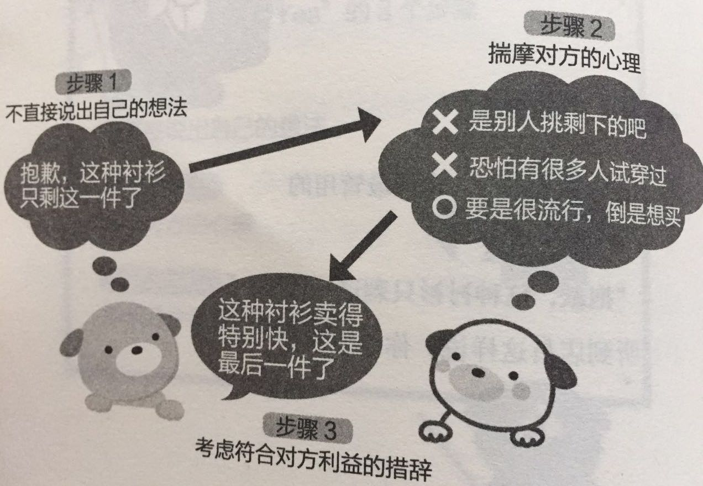

情景2：飞机供餐的鱼剩下很多时，怎样的措辞才能顺利调整配量
【✘】“对不起，只剩下鱼了。”
【✓】“机内供应以优质香草、富含矿物质的天然岩盐和粗制黑胡椒嫩煎而成的白身鱼，以及普通牛肉。”

情景3：让习惯压低价格的厂商收购高价商品的措辞
【✘】“让我们制作高价的高规格型号吧。”
【✓】“让我们制作贵公司的旗舰型号吧。”

## 突破口2：儆其所恶

对难以说服的人有效。效力强劲的最终手段。但有时会显得带有强迫行，需要注意使用场合，并避免连续使用。

情景1：博物馆
【✘】“请勿触碰展品。”
【✓】“涂有药品，请勿触碰。”

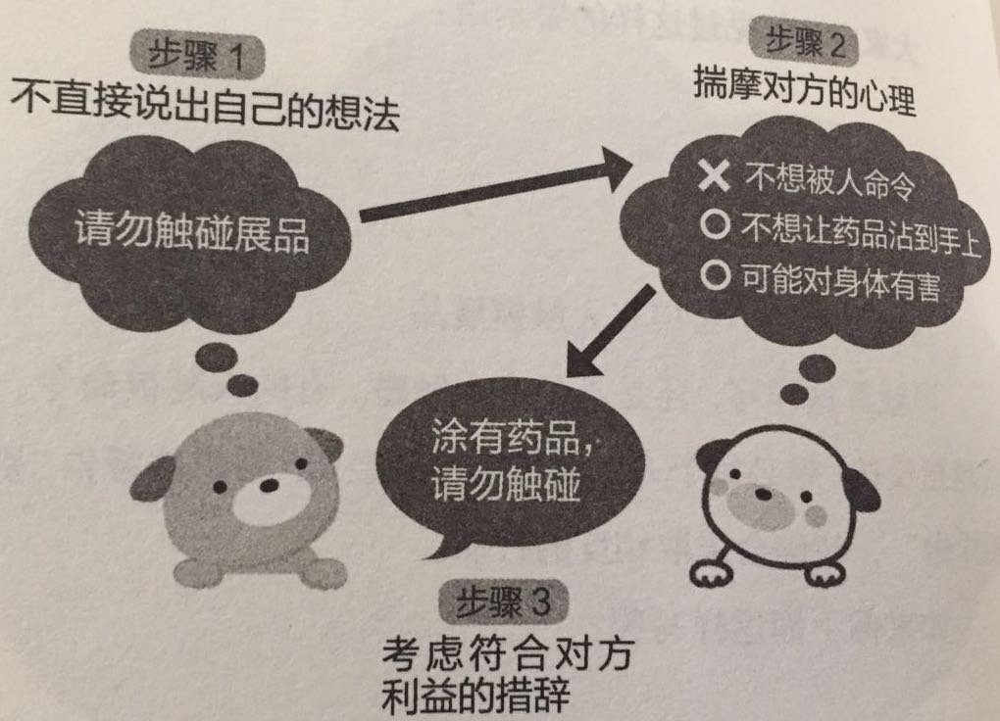

情景2：让不合上马桶盖的丈夫乖乖改正的措辞
【✘】“合上马桶盖。”
【✓】“听说不合上马桶盖会失去财运哦。”

情景3：餐厅里，让一直不管淘气孩子的妈妈摇身一变的措辞
【✘】“为了避免打扰其他客人，可否请你们让孩子坐在座位上？”
【✓】“刚做好的菜很烫，如果端出来的时候被撞撒了，会给孩子造成很严重的烫伤。可否请你们让孩子坐在座位上？”

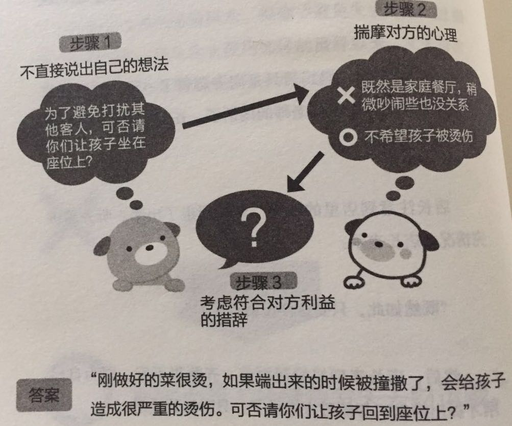

情景4：书店里使偷书行为剧减的警示语
【✘】“盗窃是犯罪。”
【✓】“多亏大家的协助，我们捉到了盗窃犯。谢谢！”

## 突破口3：选择的自由

关键在于，要给出两个合适的选项，无论对方选择哪个，自己都能达到目的。归根结底，这种“选择的自由”是由对方决定如何选择，所以对方能产生“自主选择”的意识，被迫的感觉就会减少。

情景1：餐厅
【✘】“要不要来份甜点？”
【✓】“甜点有芒果布丁和抹茶冰激凌，您要哪种？”

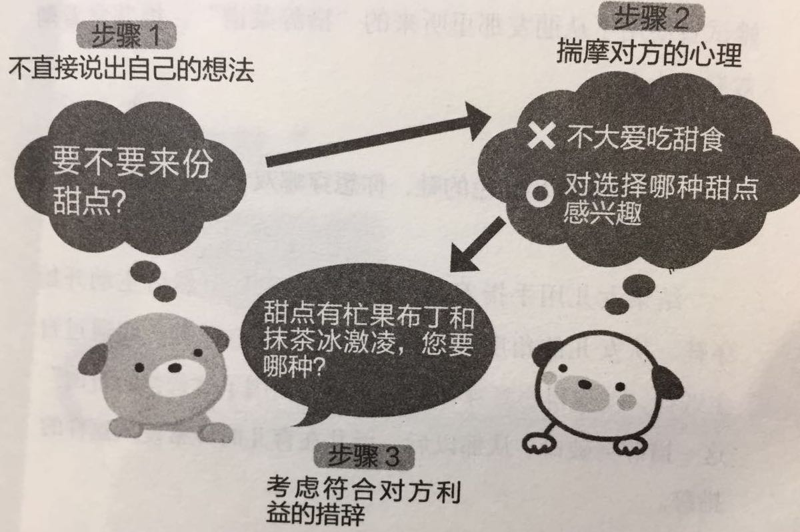

情景2：让不愿穿鞋的幼儿下意识穿上鞋的措辞
【✘】“穿鞋。”
【✓】“蓝色的鞋和红色的鞋，你想穿哪双？”

情景3：让不愿出席的人参加工会会议的措辞
【✘】“请出席碰头会。”
【✓】“碰头会的便当是可选的。烤肉饭和猪排饭，要哪个？”

## 突破口4：被认可欲

对于生意和家人效果极大！人际关系也会改善。
“被认可欲”可以解释为心理学上的“尊重需求”，即“一个人能做出与他人的期待相对应的成果”。

情景1：让丈夫帮忙做家务的措辞
【✘】“你把窗户擦擦！我忙不过来。”
【✓】“你能够到高的地方，能把窗户擦得更亮。拜托了！”

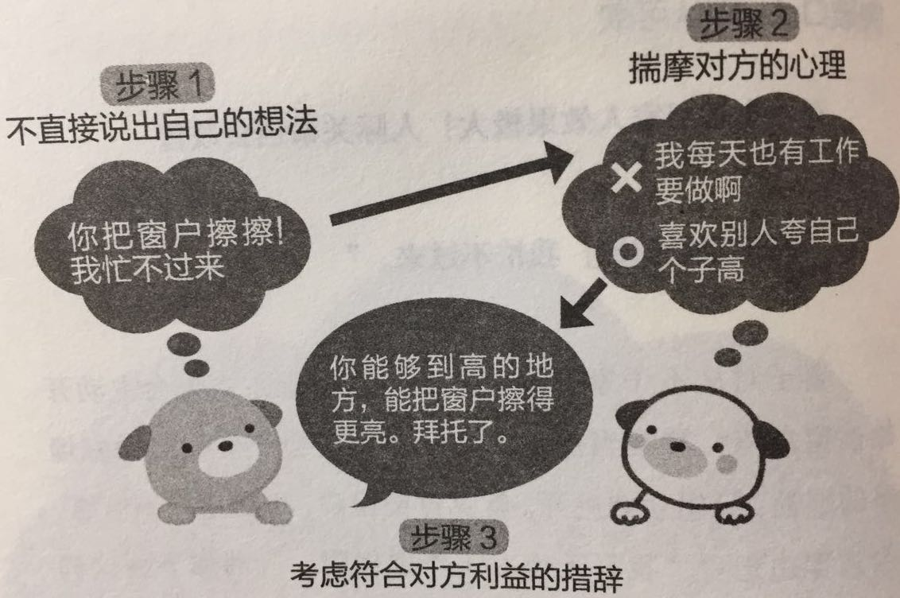

情景2：新员工犯错误时，让打算辞职的新人恢复自信的措辞
【✘】“连这点小事都办不到？”
【✓】“没关系，铃木你一定能做到！”

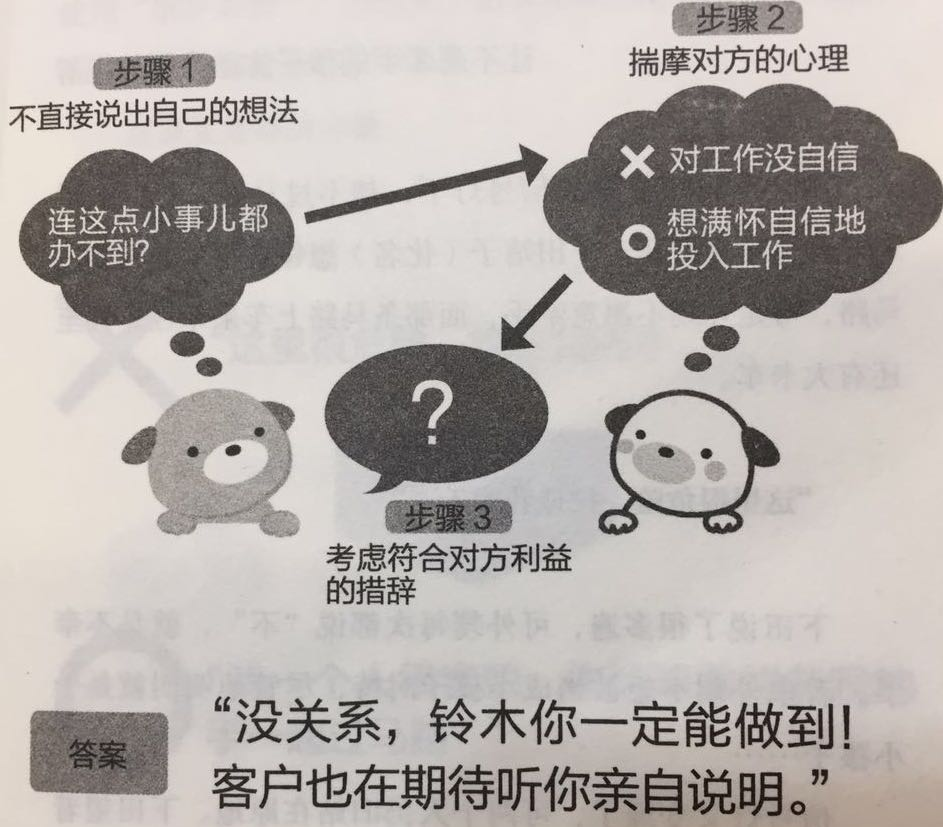

情景3：过马路时，让不愿牵手的孩子主动牵手的措辞
【✘】“这里很危险，拉住我的手。”
【✓】“我一个人很害怕，你能不能拉着我的手一起过马路？”

## 突破口5：非你不可

听到“只有你是特别的”，人就容易被说到。利用“非你不可”能让对方感到只有自己被选中的优越感，从而乐于做出回应。

情景1：邀请同事参加公司酒会的措辞
【✘】“去喝酒吧？”
【✓】“市川，你不来不热闹，所以只有市川你务必得出席啊。”

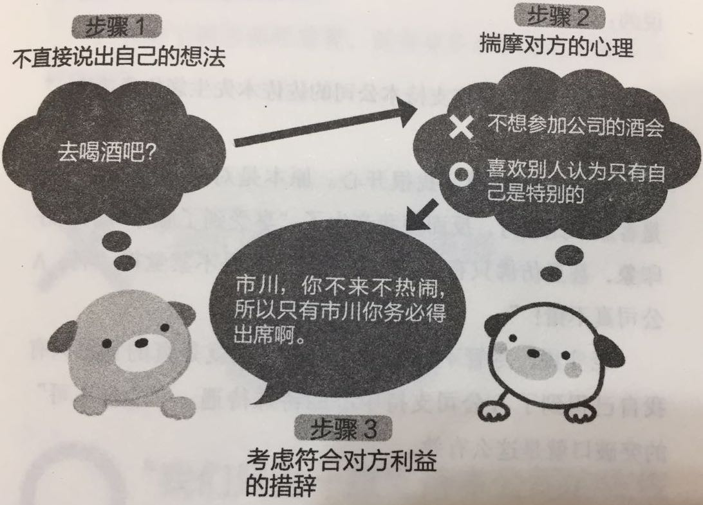

情景2：把投诉变成喜爱的客服措辞
【✘】“我们会为您更换。”
【✓】“我们只为一直支持本公司的佐佐木先生您免费更换。”

情景3：终极问题：“工作和我哪个重要？”的正确答案
【✘】“对不起。但我也不是因为喜欢才工作的。”
【✓】“对不起。但是只有优子你，我不愿让你这样想。对不起，是我没用。”

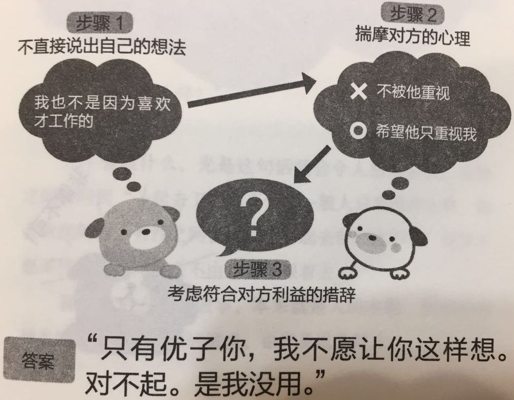

备注：语句中的名字不能省略。

## 突破口6：团队化

“一起”这种说法，本身就令人愉快。利用“团队化”，能使对方产生伙伴意识，即使是麻烦的请求，也会乐于接受。

情景1：邀请同事帮忙组织酒会的措辞
【✘】“你也来组织酒会吧？”
【✓】“咋们一起组织酒会吧。”

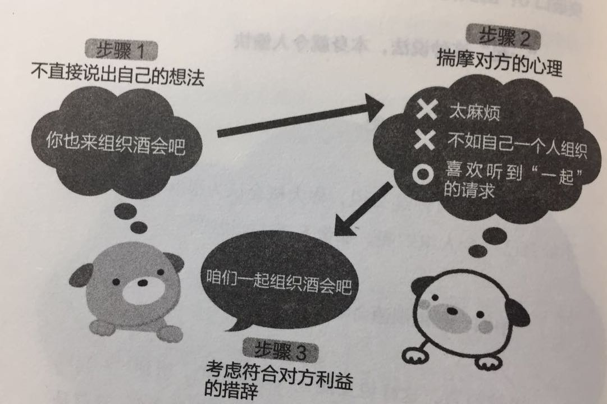

情景2：使陷入恐慌状态的涩谷十字路口得到巧妙疏导的DJ警察的措辞

补充说明：13年6月4日，世界杯预选赛一直以0：1落后的日本队在全场比赛即将结束的补时阶段，由本田圭佑射入点球，帮助日本队拿到了参加巴西世界杯正赛的入场券。在涩谷附近喝酒的年轻球迷太过兴奋，大量聚集在涩谷十字路口，造成拥堵，还开始陷入恐慌。

【✘】“请不要踏入车道！请遵守交通规则！”
【✓】“别看我这个巡警在你们面前板着脸，其实我也因为日本队的世界杯出线而感到开心。”
【✓】“巡警也是你们的队友。请听听队友的话。”

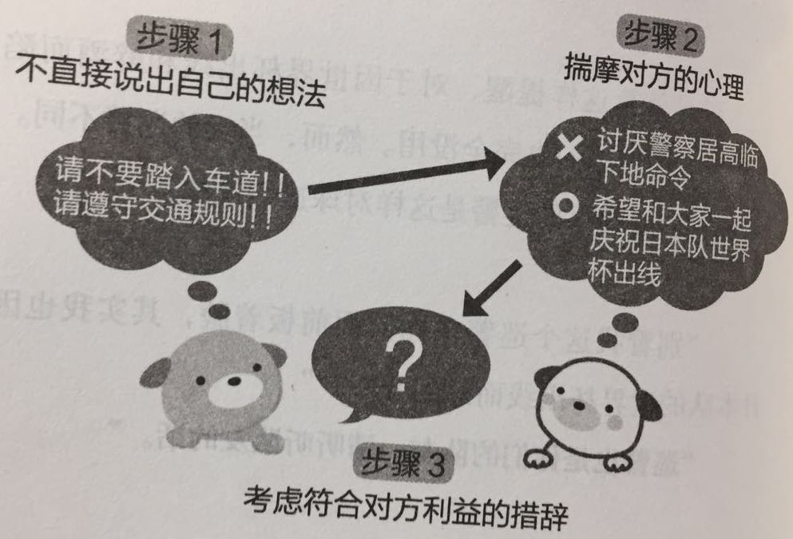

情景3：女儿说服完全不运动的父亲开始锻炼的措辞
【✘】“多运动运动吧。”
【✓】“我想夜跑，但自己一个人害怕，你能不能陪我一起跑？”

## 突破口7：感谢

仅凭一句“谢谢”，就能拉近自己与对方的距离，使对方很难说出“No”。这种情况可以用心理学上的“互惠式好感”来解释，即“一个人接收到好意，就会产生向对方回报以好意的心理”。

利用“感谢”能让对方隐约产生信赖意识，从而难以轻易拒绝。

情景1：邀请别人帮忙
【✘】“把这桌子搬走。”
【✓】“把这桌子搬走。谢谢啊！”

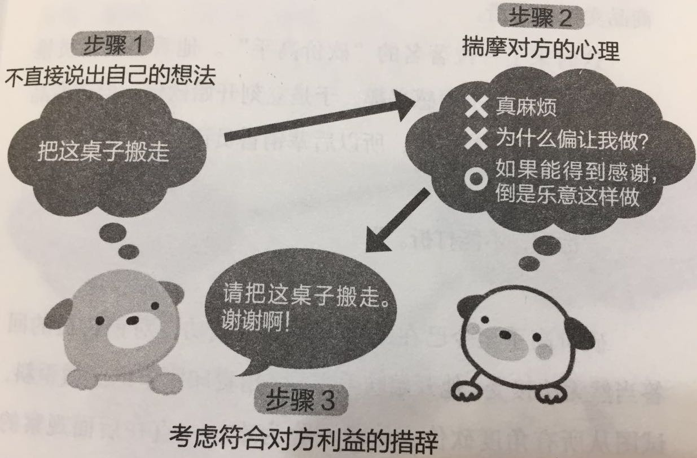

情景2：让砍价高手按定价购买的措辞
【✘】“抱歉，不能打折。”
【✓】“请允许我送上我的真心作为赠品，还请高抬贵手。谢谢。”

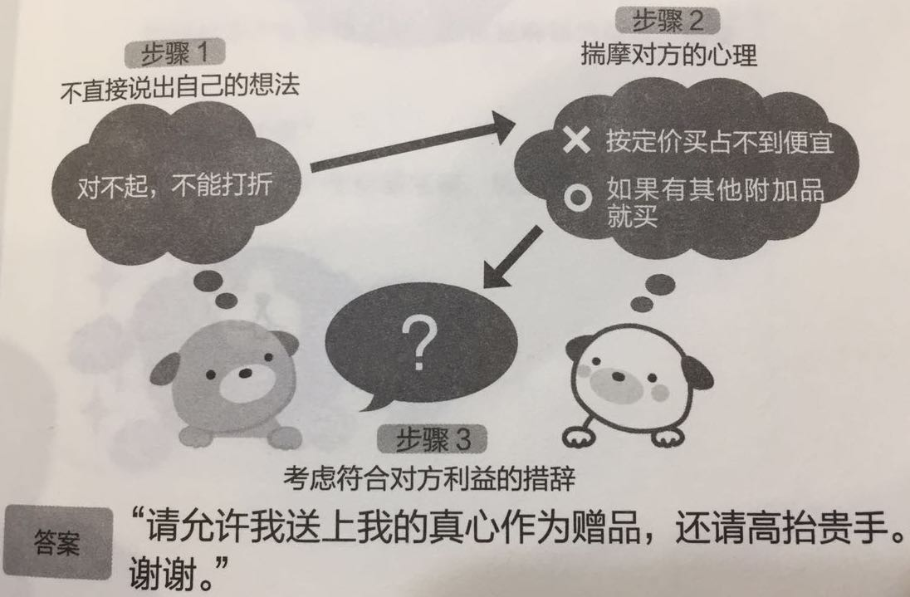

要点：在对方还没有做出回应之前，就说谢谢。

## 检验你的措辞拿手度

Q: 前辈（上司）的孩子叫什么名字？

答不上来的人需要注意了。所有人都会对自己的孩子爱若珍宝。知道孩子的名字说明你考虑过“上司或前辈的爱好”。相反，不知道孩子的名字，就说明你几乎没考虑过“上司或前辈的爱好”，没能实践“揣摩对方的心理”这条社交基本原则。

Q：你还记得今天说过“谢谢”的人吗？
