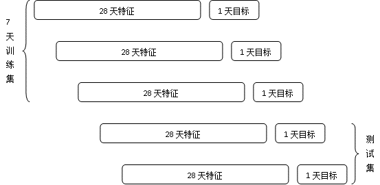

在电商平台中，量化每个商品的静态质量及受欢迎的程度有着重要的意义。我们把这个量化值称之为商品人气分。商品人气分在搜索排序、个性化推荐排序及推荐候选集截断、竞价广告系统中都有着重要的应用。

商品人气分受哪些因素的影响，以及这些因素最终如何共同决定商品人气分值？本文总结了一个实际系统中人气分模型的构建过程，从特征和模型两个角度来回答上述两个问题。
<!--more-->
## 特征

多维度交叉统计特征是一类重要的特征来源，主要有以下4个维度：实体、时间段、行为类型、统计量。

1. 实体维度：商品、品牌、商家（店铺）、叶子类目、一级类目等。
2. 时间维度：1天、3天、7天、14天、30天、时间衰减加权等。
3. 行为维度：曝光、浏览、收藏、加购、购买、评级、商详页停留时间、是否退货等。
4. 统计维度：数量、人数、频率、排名（百分比）、点击率、转化率、金额等。

具体地，每个特征从以上4个维度中各取一到两个进行组合，再从历史数据中统计该组合特征最终的特征值。比如，商品（实体）最近1天（时间）的曝光（行为）量（统计指标）；商品所在店铺（实体）最近30天（时间）的销量（行为类型+统计维度）；商品（实体）最近7天（时间）的平均成交（行为）单价（统计）在同一叶子类目下的排名百分比（统计）；等等。由以上方法产生的特征数量级相当于4个维度的笛卡尔积。可以看出这些特征覆盖了大家常说的销售额、销售量、转化率、评论数、好评率、差评率、退货率、加购数、收藏关注度、详情页访问深度等方方面面。

另外还有一些不便归类到上述4个维度的特征，比如商品“年龄”（从上架到目前为止的时间间隔），DQC，店铺DSR，ID类特征（如一级类目）等。

## 样本

最近1天的成交日志留着生成训练目标（该商品当天有成交则为正样本，当天没有成交则为负样本），1天前的一个月的各类日志用来统计特征值，这样便可以生成1天的训练数据。

为了有足够数量的训练样本，我们取7天的训练数据的并集作为最终的训练集，同时留一到两天的数据作为验证集合测试集。流程如下图所示。

## 模型

选用了GBDT作为待拟合的模型，损失函数为binaryLogLoss函数，最终模型的结果解释为商品未来1天有成交的概率。之所以选择GBDT模型，是因为一方面我们需要足够的非线性拟合能力；另外一方面是因为GBDT算法足够简单，在大多数任务中都表现良好，并且开源的工具也比较成熟。

模型调参基本遵循业界的经验值，同时各个参数在小范围内用GridSearch的方法交叉验证取得。特别值得一提的是设置样本权重对最终效果的提升有很大帮助，具体地，所有负样本的权重设置为1，正样本的权重设置为该商品在当天的成交件数。

## 效果

在我们公司多个推荐场景的实测结果，与没有人气分的基准桶相比，UV点击率和UV价值都取得了5%~10%左右的提升。
