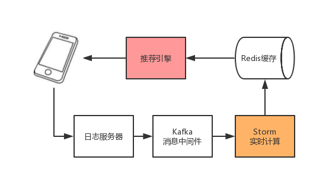

推荐系统选择商品展现给用户，并期待用户的正向反馈（点击、成交）。然而推荐系统并不能提前知道用户在观察到商品之后如何反馈，也就是不能提前获得本次推荐的收益，唯一能做的就是不停地尝试，并实时收集反馈以便更新自己试错的策略。目的是使得整个过程损失的收益最小。这一过程就类似与一个赌徒在赌场里玩老虎机赌博。赌徒要去摇老虎机，走进赌场一看，一排老虎机，外表一模一样，但是每个老虎机吐钱的概率可不一样，他不知道每个老虎机吐钱的概率分布是什么，那么每次该选择哪个老虎机可以做到最大化收益呢？这就是多臂赌博机问题（Multi-armed bandit problem, MAB）。

MAB问题的难点是Exploitation-Exploration(E&E)两难的问题：对已知的吐钱概率比较高的老虎机，应该更多的去尝试(exploitation)，以便获得一定的累计收益；对未知的或尝试次数较少的老虎机，还要分配一定的尝试机会（exploration），以免错失收益更高的选择，但同时较多的探索也意味着较高的风险（机会成本）。

Bandit算法是一类用来实现Exploitation-Exploration机制的策略。根据是否考虑上下文特征，Bandit算法分为context-free bandit和contextual bandit两大类。
<!--more-->
## 1. UCB

Context-free Bandit算法有很多种，比如$\epsilon-greedy$、softmax、Thompson Sampling、UCB(Upper Confidence Bound)等。

在此，重点介绍一下UCB方法的基本思想。在统计学中，对于一个未知量的估计，总能找到一种量化其置信度的方法。最普遍的分布正态分布（或曰高斯分布）$N(μ,δ)$，其中的$μ$就是估计量的期望，而$δ$则表示其不确定性（$δ$越大则表示越不可信）。比如你掷一个标准的6面色子，它的平均值是3.5，而如果你只掷一次，比如说到2，那你对平均值的估计只能是2，但是这个置信度应该很低，我们可以知道，这个色子的预估平均值是2，而以95%的置信区间在[1.4,5.2]。

UCB（Upper Confidence Bound - 置信上限）就是以收益（bonus）均值的置信区间上限代表对该arm未来收益的预估值：
$$\hat{\mu_i} + \sqrt{\frac{2ln(n)}{n_i}}$$

其中$\hat{\mu_i}$是对arm $i$期望收益的预估，$n$是总的选择次数，${n_i}$是对arm $i$的尝试次数，可以看到尝试越多，其预估值与置信上限的差值就越小，也就是越有置信度。

UCB在此时的决策是选择置信区间上界最大的arm。这个策略的好处是，能让没有机会尝试的arm得到更多尝试的机会，是骡子是马拉出来溜溜！

* 对于未知或较少尝试的arm，尽管其均值可能很低，但是由于其不确定性会导致置信区间的上界较大，从而有较大的概率触发exploration
* 对于已经很熟悉的arm(尝试过较多次)，更多的是触发exploitation机制：如果其均值很高，会获得更多的利用机会；反之，则会减少对其尝试的机会

## 2. LinUCB

在推荐系统中，通常把待推荐的商品作为MAB问题的arm。UCB这样的context-free类算法，没有充分利用推荐场景的上下文信息，为所有用户的选择展现商品的策略都是相同的，忽略了用户作为一个个活生生的个性本身的兴趣点、偏好、购买力等因素都是不同的，因而，同一个商品在不同的用户、不同的情景下接受程度是不同的。故在实际的推荐系统中，context-free的MAB算法基本都不会被采用。

与context-free MAB算法对应的是Contextual Bandit算法，顾名思义，这类算法在实现E&E时考虑了上下文信息，因而更加适合实际的个性化推荐场景。

形式化地说，在时间步$t$，**contextual-bandit算法**观察到当前用户$u_t$，以及每个可选择的商品（arm）$a$的特征向量$x_{t,a}$。$x_{t,a}$称之为上下文信息，它概况了用户和商品两方面的信息。算法根据之前观察到的反馈结果选择一个商品$a_t$展现给用户，并接受到用户的反馈收益$r_{t,a_t}$，$r_{t,a_t}$的期望取决于用户和商品两个方面。接着，算法根据新的观察$(x_{t,a},a_t,r_{t,a_t})$改进自身选择商品展现的策略，目标是使得整个过程中损失的收益最小，即regret值$R_A(T)$最小。$R_A(T)$的定义如下：
$$R_A(T)=E\left[ \sum_{t=1}^T r,a_t^* \right]-E\left[ \sum_{t=1}^T r,a_t \right]$$
其中，$T$为实验的总步数；$a_t^*$为在时间步$t$时有最大期望收益的arm，不能提前得知。

LinUCB是处理Contextual Bandit的一个方法，在LinUCB中，设定每个arm的期望收益为该arm的特征向量(context)的线性函数，如下：

\begin{align}
E\left[r_{t,a}|x_{t,a}\right] = x_{t,a}^T\theta_a
\end{align}

$\theta_a$是LinUCB模型的参数，维度为$d$。每个arm维护一个$\theta_a$

对于单个arm $a$，以其前$m$个context向量为行向量组成的矩阵称为$D_a$，维度为$m \times n$。前$m$个收益（reward）组成的向量称为$c_a$。采用平方损失函数
$$loss=\sum_{i=1}^m\left(c_{a,i}-\sum_{j=0}^d \theta_{a,j}x_{ij} \right)^2 + \lambda\sum_{j=0}^d \theta_{a,j}^2$$
，其中$\lambda$为正则项系数。求损失函数的最小值，令损失函数对$\theta_a$求导，结果为
$$\nabla_{\theta_a}loss=2D_a^T(c_a-D_a\theta_a)-2\lambda\theta_a$$
令$\nabla_{\theta_a}loss=0, \lambda=1$，可得
$$\theta_a = (D_a^TD_a + I)^{-1}D_a^Tc_a$$

使用岭回归（ridge regression）方法，可以得到$\theta_a$的概率分布为高斯分布：

\begin{align}
\theta_a \sim N \left((D_a^TD_a + I)^{-1}D_a^Tc_a, (D_a^TD_a + I)^{-1}\right)
\end{align}

为了符号简洁，令

\begin{align}
\hat{\theta}_a &= (D_a^TD_a + I)^{-1}D_a^Tc_a \\
A_a &= D_a^TD_a + I
\end{align}

于是$\theta_a$的概率分布可表示为$\theta_a \sim N(\hat{\theta}_a, A_a^{-1})$

于是在第$t$次时可以得到$$x_{t,a}^T\theta_a \sim N(x_{t,a}^T\hat{\theta}_a, x_{t,a}^TA_a^{-1}x_{t,a})$$，也就是$$r_{t,a} \sim N(x_{t,a}^T\hat{\theta}_a, x_{t,a}^TA_a^{-1}x_{t,a})$$

根据高斯分布的性质，得到置信上界后就可以使用普通UCB规则了，即每次选择 $x_{t,a}^T\hat{\theta}_a + \alpha \sqrt{x_{t,a}^TA_a^{-1}x_{t,a})}$最大的arm。

需要注意的是，$A_a$与$D_a^Tc_a$可以增量异步更新，于是标准流程如下：

* 设定$\alpha$
* For $t$ = 1,2,3,...
	* 对所有的arm获得本次的context向量
	* For all $a$
		* if $a$ is new
			* 设置$A_a$为单位矩阵
			* 设置$b_a$为$d$维零向量
		* 计算$\hat{\theta}_a = A_a^{-1}b_a$
		* 计算上界 $p_{t,a}=x_{t,a}^T\hat{\theta}_a + \alpha \sqrt{x_{t,a}^TA_a^{-1}x_{t,a})}$
	* 选择最大上界$p_{t,a}$对应的arm即$a_t$，并得到对应的$r_t$
	* 更新$A_{a_t} = A_{a_t} + x_{t,a_t}x_{t,a_t}^T$
	* 更新$b_{a_t} = b_{a_t} + r_tx_{t,a_t}$

LinUCB算法的优势：

* 计算复杂度与arm的数量成线性关系
* 支持动态变化的候选arm集合

## 3. 业务场景介绍

在我们的电商平台App首页，有一个商品瀑布流推荐场景，每次大概展示30个商品左右。商品候选集都是运营人工精选的历史销售情况较好，在更多流量刺激下有可能成为爆款的商品，并且每天都会汰换掉一部分，加入一些新品进来。

用过实现LinUcb算法，系统会对每个商品做充分的exploration和exploitation，从而发掘出真正有销售潜力的商品，逐渐淘汰掉不够理想的商品，纠正运营人工选品的局限。经过考验的商品，说明在一段时间内销量还是不错的，这些商品运营可以深度控价，要求商家提供更多的优惠和让利给用户，从而形成良性循环，同时也给其他商家树立标杆，促进平台更加健康地发展。

## 4. 系统架构

在我们的系统中，LinUCB算法的实现分为两个部分：一部分实现在推荐引擎里，主要完成特征向量提取、获取每个商品的$A_a$矩阵和$b_a$向量数据、完成置信区间上届的计算、并选择最终展现的商品；另一部分逻辑实现在实时计算平台Storm上，这部分任务实时解析场景的曝光、点击和购买行为日志，每条日志里包含了商品ID、时间戳和特征向量等信息，根据公式更新每个商品的$A_a$矩阵和$b_a$向量，并把更新后的结果写到Redis缓存里，供推荐引擎获取。



## 5. 核心代码逻辑

每个商品都维护一个队列queue，用于临时存放接受到的行为事件。之所以不在接受到事情的时候立马处理掉，主要有两个原因：一是用户对每个展现商品的反馈并不是原子操作，比如反馈是曝光未点击，或是曝光且点击但未购买，还是即曝光又点击最后还购买了，这些操作不是一步就能完成的，而是保护了好几步，因此在仅仅收到曝光事情或者点击事情时，我们不知道用户的反馈序列操作有没有结束，也就不能准确设置反馈的收益值；二是由于客户端对曝光事情有缓存不是实时上报的，因而不能保证曝光事情一定在点击事情之前被上传到日志服务器。

具体实现时，设置一个时间间隔（比如，5分钟），一个曝光或者点击事情到达Storm计算节点时，先缓存在队列里，等待设置好的时间间隔后，再消费掉。如果在时间间隔内高优先级的事情到达，则会直接移除掉低优先级的事情。优先级顺序为购买大于点击、点击大于曝光。另外，为了防止日志重复上报，还会根据推荐引擎的请求ID（不同请求不同）对接受到是事情去重。当然，为了容错，如果预设的事情队列满了，则会动态把时间间隔缩短为原来的二分之一，把新的时间间隔之前的事情强制消费掉，这个过程会递归执行，直到队列的长度小于预设的大小为止。

Storm任务中，某个商品的参数（$A_a$矩阵和$b_a$向量）更新逻辑：
```
public int consume(Event newEvent, Config config) {
    if (newEvent.getPid() != pid)
        return -1;

    reset(config);

    int showConsumedCount = 0;
    int clickConsumedCount = 0;
    long current = System.currentTimeMillis();
    Iterator<Event> iter = queue.iterator();
    while (iter.hasNext()) {
        Event event = iter.next();
        if (event.isSameFlow(newEvent)) {
            if (newEvent.isShow()) {
                newEvent = null; // 重复曝光，或者点击事件在曝光事件前到达
                break;
            }
            if (newEvent.isClick() && event.isClick()) {
                newEvent = null; // 重复点击事件
                break;
            }
            iter.remove(); // 高优先级的事情会覆盖低优先级的事情
            if (null == newEvent.getItemTrackData()) {
                newEvent.setItemTrackData(event.getItemTrackData());
            }
            continue;
        }
        if (current - event.getTimestamp() < config.cacheTimeSpan)
            continue;

        INDArray xt = event.getFeature(config);
        INDArray x = xt.transpose();
        A.addi(x.mmul(xt));
        double reward = event.getReward();
        if (reward > 0.0)
            b.addi(x.muli(reward));
        iter.remove();
        if (event.isShow())
            showConsumedCount ++;
        else if (event.isClick())
            clickConsumedCount ++;
    }
    if (null == newEvent)
        return 0;
    if (newEvent.getType().equals(EventType.BUY)) {
        // 购买事情立即消费
        INDArray xt = newEvent.getFeature(config);
        if (null == xt) {
            LogPushUtil.push("BuyFeatureMissingEvent");
        }
        else if (xt.length() == b.length()) {
            INDArray x = xt.transpose();
            A.addi(x.mmul(xt));
            double reward = newEvent.getReward();
            b.addi(x.muli(reward));
            LogPushUtil.push("BuyEventConsumed");
            records += config.updateRecords;
        }
    } else if (StringUtils.isNotEmpty(newEvent.getItemTrackData())) {
        queue.add(newEvent);
        checkQueueIsFullOrNot(config.cacheTimeSpan / 2, config);
    }
    if (showConsumedCount > 0) {
        records += showConsumedCount;
        LogPushUtil.push("ShowEventConsumed", showConsumedCount);
    }
    if (clickConsumedCount > 0) {
        records += clickConsumedCount;
        LogPushUtil.push("ClickEventConsumed", clickConsumedCount);
    }
    if (records >= config.updateRecords) {
        writeToRedis(config);
    }
    return records;
}
```

在线推荐引擎计算每个商品的ucb分数的代码如下：
```
private void parallelGetLinUcbScore(Session session, INDArray features, List<Item> items) throws InterruptedException {
    int concurrency = Math.min(session.config.linUcbConcurrency, items.size());
    int num = items.size() / concurrency;

    ExecutorService es = session.context.getThreadExecutorService(session.reqId, session.reqId.getSceneId());
    final CountDownLatch countDownLatch = new CountDownLatch(concurrency);
    int left = items.size() - num * concurrency;
    int start = 0, end = num;
    for (int i = 0; i < concurrency; ++i) {
        if (i < left)
            end++;
        Logger.debug("prepare to start linucb score sub thread: [" + start + ", " + end + "]");
        int finalStart = start;
        int finalEnd = end;
        Runnable runnable = () -> {
            long startTime = System.currentTimeMillis();
            try {
                getLinUcbScore(session, features, items, finalStart, finalEnd);
            } catch (Exception e) {
                String exception = ExceptionUtils.getFullStackTrace(e);
                Logger.error("linucb worker exception:", exception);
            }
            finally {
                countDownLatch.countDown();
            }
            long time = System.currentTimeMillis() - startTime;
            Logger.info("[Timer] compute sub linUcb scores [", finalStart, ", ", finalEnd, "] taken", time, "ms");
        };
        es.execute(TtlRunnable.get(runnable));
        start = end;
        end = start + num;
    }
    countDownLatch.await(session.config.linUcbTimeOut, TimeUnit.MILLISECONDS);
}

private void getLinUcbScore(Session session, INDArray features, List<Item> items, int start, int end) throws IOException {
    if (items.isEmpty() || null == features)
        return;
    StopWatch stopWatch = StopWatch.CreateStopWatchAndStart();
    for (int i = start; i < end; ++i) {
        stopWatch.restart();
        Item item = items.get(i);
        long pid = item.getProductId();
        byte[] matrix = getLinUcbMatrix(session, pid);

        INDArray feature = features.getRow(i);
        INDArray featureT = feature.transpose();
        Logger.detail("<", i, ">", pid, "item feature:", item.getTrackInfo(), "vector:", feature);
        if (matrix == null) {
            double p = session.config.linUcbAlpha * FastMath.sqrt(feature.mmul(featureT).getDouble(0));
            item.setMatchScore(p);
            Logger.info("<", i, "> linucb new item:", pid, "ucb score:", p);
            continue;
        }

        ByteArrayInputStream in = new ByteArrayInputStream(matrix);
        INDArray[] Ab = ByteSerde.fromByteArrayStream(in);
        if (Ab.length < 2)
            continue;
        INDArray invertA = Ab[0];
        INDArray b = Ab[1];
        Logger.detail("<", i, ">", pid, "[Timer] fetch matrix taken", stopWatch.click(), "ms");
        if (b.length() != feature.length()) {
            Logger.error("the length of b is", b.length(), "should be", feature.length());
            double p = session.config.linUcbAlpha * FastMath.sqrt(feature.mmuli(featureT).getFloat(0));
            item.setMatchScore(p);
            continue;
        }
        INDArray theta = invertA.mmul(b);
        INDArray thetaX = theta.transposei().mmul(featureT);
        INDArray temp = feature.mmuli(invertA).mmul(featureT);
        double p = thetaX.getDouble(0);
        item.setPreferScore(p);
        p += session.config.linUcbAlpha * FastMath.sqrt(temp.getDouble(0));
        item.setMatchScore(p);
        Logger.detail("<", i, ">", pid, "[Timer] one iteration linucb score taken", stopWatch.click(), "ms. match score:", p);
    }
}
```

实现中矩阵计算的部分，用了ND4J（https://nd4j.org/）的库。

## 6. 业务效果

经过线上充分的A/B测试，最终测得LinUCB算法的UV CTR相对基准桶提升25%+，UV价值提升20%+。并且算法能够很好地支持商品动态上下架。

## 7. 参考资料

[Lihong Li, et al, 2010] A Contextual-Bandit Approach to Personalized News Article Recommendation.
