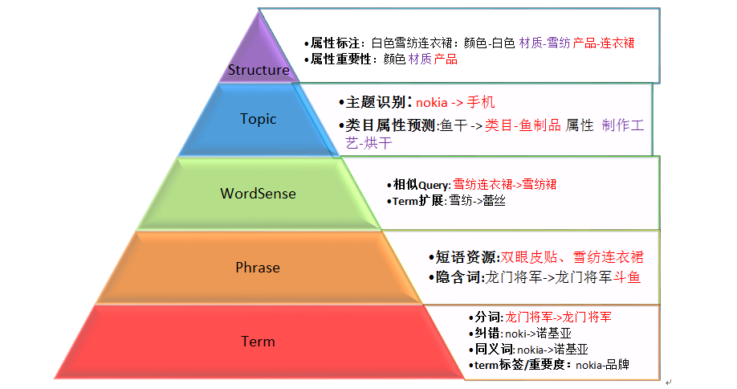
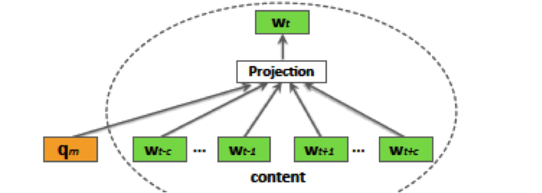
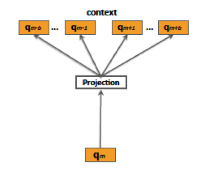

# 为何需要Query改写

Query分析是搜索引擎的一个重要模块，对搜索结果的覆盖率和相关性至关重要。搜索引擎的检索过程包含了两个重要的阶段：匹配和排序。匹配也叫召回，表示根据用户的查询条件，尽可能多地匹配出主题相关的文档，尽可能少地匹配出主题不相关的文档。排序是指对召回阶段返回的文档集合进行合理的排序，把最满足用户意图的结果尽可能排到前面。Query分析的主要目标是为匹配过程提供必要的知识和信息，同时兼顾后面的排序过程，为排序模型提供原始特征。

Query改写是Query分析的一个重要组成部分。通过对原始Query进行改写，生成一系列相关Query，把相关Query作为原始Query的补充，与原始Query一起参与搜索，从而得到更加丰富和准确的匹配结果。下面分别从网页搜索、电商搜索和广告搜索三个方面来论证Query改写的必要性。
<!--more-->
## 网页搜索

有研究表明，互联网用户在使用网页搜索功能时，所提交的查询短语具有以下两个特点：(1) 查询短语较短，平均长度为2.2个单词，其中常用的查询短语的平均长度为1.7个单词；(2) 查询短语的使用频率呈幂率分布(Power Law)，近50%的查询短语每小时的使用频率在5次以下。查询短语短，则字面上蕴含的信息量较少，表义不够充分，因此需要理解Query的意图，对查询短语进行补充。

用户的查询语言与网页的文档书写语言之间通常存在一定的鸿沟，用户和文档作者可能倾向于用不同的表达方式来描述同一个意思。比如，天文学相关的文档可能会描述“太阳和地球的距离是XXX”，而用户的查询则可能是“地球和太阳有多远”。

自然语言中存在大量的“一词多义”和“一义多词”的现象。比如用户检索“苹果”，可能是想查找作为水果的苹果，也可能是想找苹果手机或是其他苹果品牌的电子产品；再比如用户检索“客栈”，其真实意图是想找住宿的地方，这时标题中包含“宾馆”、“酒店”、“旅社”的商品都应该能够被检索出来。同一实体存在多种不同的表达方式，比如“土豆”与“马铃薯”、“番茄”与“西红柿”等。不同的人翻译外文文献时可能会用不同的术语来表达同一个概念，“reinforcement learing”有人翻译为“强化学习”，有人翻译为“增强学习”。

另一方面，用过的查询短语还经常包含错别字，比如“克莉丝汀”可能会被写成“克里斯汀”等；网络上还存在大量没有写完的查询，比如“noki”表示“nokia(诺基亚)"。

上述问题的存在都为通过文本匹配是搜索系统带来了挑战，而Query改写正是解决上述问题的一种思路。

## 电商搜索

电商搜索引擎一般都是对商品标题分词建立倒排索引，用户搜索时对用户Query进行分词然后与倒排索引进行匹配召回。如果不对用户Query做任何改写，只有Query与商品标题中的词完全匹配时才能被召回，那么虽然这种召回方法比较简单，但也会导致很多问题：

- Query和商品的标题描述语言之间存在一些差异， 可能导致一些满足用户Query意图但不完全匹配的商品无法被召回。例如：
> Query：老年机；        商品：老年手机
Query：牛仔连衣裙；      商品：连衣牛仔裙
Query：欧美凉鞋平底；    商品： 罗马鞋 夹趾

- 熟悉搜索机制的卖家会对标题进行SEO、堆砌与宝贝不符的词，以获取额外流量；而一些B类大商家的商品标题通常比较简洁，却很难与用户Query完全匹配，导致无法召回而损失流量。例如:
> Query=袜子 男； 商品：男装 短袜

- 搜索Query用户可能无意识的会输入一些冗余的词。由于所有的查询词都要出现在商品标题中，用户无意识输入的这些冗余词会对召回造成比较大损失。例如：
> 连衣裙 女， 羽绒服 冬季，  女装 妈妈装

## 广告搜索

广告搜索引擎的索引方式和普通是搜索引擎有很大的差异，因为广告搜索需要匹配的是广告的竞价词，而不是广告内容本身的文本信息。广告搜索引擎的倒排索引一般是以广告的竞价词（归一化之后的形式）为查询的Key。用户的Query（包括改写之后的Query）需要和竞价词完全匹配才能召回广告。

在进行广告检索时，往往由于查询短语较短，只能够获得部分与查询相匹配的广告；同时，由于某些查询对应的直接竞标广告数据较少，数量不够在搜索结果页面中展示；另外，由于查询短语的使用频率呈幂率分布，往往会导致部分广告被频繁地检索到。为了解决这些问题，赞助商搜索系统通常都会引入查询重写机制。相应的赞助商搜索系统架构通常分裂成两个部分，如下图所示。

在上图中，前端接受输入查询q并产生一系列重写结果，这些重写结果与查询q之间具有一定的相关性。比如，对于查询“相机”，查询“数码相机”和“拍摄设备”可能是有用的，因为用户可能会对与这些查询相关的广告感兴趣。同时，查询“电池”和原始查询也具有一定的相关性，尽管它们在文本上毫不相关，因为用户在购买相机的时候也会对相机的备用零件感兴趣。因而，Query改写方法需要能把“相机”改写为“数码相机”和“拍摄设备”，甚至是“电池”。

原始查询和重写查询会被后端处理，与这些查询相关联的竞价广告会被检索出来。把系统架构分裂成两个部分降低了系统的复杂性。系统前端专注于查询重写，后端专注于处理快速变化的广告竞价数据、匹配相关内容和对检索结果排序。

# Query分析的层次结构

Query分析可以按照如下的层次结构来理解：

1. 文本归一化。包括特殊符号过滤、大小写归一、繁体转简体、全角转半角等操作。

2. Term：对Query做中文切词/纠错处理/同义词转换/term标签与重要度。
> 举例：Query=“nokia 5230 皮套”
> 切词结果：nokia / 5230 /皮套
> 同义词：诺基亚 / 5230 /（手机皮套，手机套，皮壳）
> Term标签：品牌-nokia; 型号-5230; 产品词-皮套
> Term重要度：nokia:score=0.5; 5230:score=0.8; 皮套:score=1.0

3. Phrase：对Query做短语单元切分。
> 举例：Query=“双眼皮贴”不可以切分成“双眼皮”和“贴”
> 隐含词：“龙门将军”等同于“龙门将军斗鱼”

4. WordSense： Query中term的相关term扩展，从而得到改写query。
改写query与原始query具有一定的相关性
>举例：Translation Model将query与其他query通过相同的term位置对齐，得到扩展的相关term.

5. Topic： 对Query做分类、识别Query的主题。
+ 电商特有的类目体系就是一个天然的宝贝聚合类别标签库，类目预测模块作用就是将query分类到N个类目下。
> 举例：Query=nokia
> 类别：手机类目 / 二手闲置手机类目
+ 通过PLSA、LDA等主题模型计算Query所包含的主题的概率分布。

6. Structure：对Query做结构化分析和标注。
> 举例：Query=白色雪纺连衣裙
> 标注为：tag1=连衣裙类目-裙子款式-连体; score=1
> tag2=连衣裙类目-颜色分类-白色; score=0.5
> tag3=连衣裙类目-材质-雪纺; scsore=0.8

  有了这些属性标注和权重，我们可以做很多有意义的事情：
+ query扩展：通过相同的属性做term扩展。
举例：连衣裙类目-材质-雪纺 和连衣裙类目-材质-蕾丝
从而得到扩展term:雪纺 与 蕾丝
+ query或宝贝相似度计算：将标注tag作为特征加入相关性模型中，作为query-query或query-宝贝的相似度计算特征
+ query聚类：提取重要tag组合作为类别，对query或宝贝聚类。还可以构建一颗语义树，树的每个结点是属性tag，结点下挂载标注该tag的query或宝贝。在这颗语义树上做策略裁剪，就可以得到不同的类别集合。

# Query改写的常用方法

Query改写本质上是要找到和原始Query相似的候选Query，如何找相似Query呢？

## 基于Query的内容

1. 基于文本相似度。比如，文本编辑距离（基于字或者词）。
2. 基于Query的意图。比如识别出query中的产品、品牌、性别、颜色、型号等重要属性，在这些重要属性组成的向量上计算相似度。
3. 基于预测类目的相似度或差异度。比如，计算两个query预测类目集合的Jaccard相似度；

## 基于Query的点击行为

该方法适用于用户行为比较丰富的Query；由于许多卖家的SEO，标题对同一种商品有多种描述堆砌，导致这些商品在相似Query下都能被召回而且有点击行为。

1. 协同过滤。例如可以用7的日志数据，建立Query下商品点击行为矩阵；采用协同过滤的思想计算Q1和Q2相似度，具体计算相似度的方法可以有很多种，常用的入cosine余弦相似度。在query的点击行为比较稀疏时，还可以通过在query和商品的点击二部图上游走来扩充query的行为向量。
2. 基于随机游走的方法。比如SimRank、SimRank++等。
3. 基于点击文档集合的差异度。比如电商搜索中，计算query点击商品集合或点击商品的类目集合的差异度。差异度越小，说明query越相似。
>f1=#(S(q2)-S(q1))/#S(q2); f2=#(S(q1)-S(q2))/#S(q1)； 其中，S(q)表示q点击宝贝的集合，#表示取集合是size
4. 基于点击商品的图片的相似度。电商平台的一些卖家卖的商品和别人是完全相同的，但在电商平台上有不同的商品ID。有些小卖家经常会盗用别人的图，或者直接用代理商的图，因此相同或相似的图实际上是对商品做了聚类。

## 基于语义信息

计算query的语义向量，并根据语义向量计算Q1和Q2的语义相似度。

1. 先计算出词向量，再通过（加权）加和的方法融合词向量得到query向量。
2. 采用Doc2Vec方法将Query向量化。考虑到搜索Query通常比较短，将Query本身当做doc比较难以向量化。用Query下点击的商品的标题作为一个完整的doc, 采用doc2vec向量化Query。在用户点击行为的基础上加入一些语义信息，应该能挖掘到比行为相似更丰富的一些候选。每个Query限制用N个点击商品标题来构造doc；中高频Query点击商品数大于N时，按商品的点击次数进行采样：点击次数越多被采样的概率越大。

## 基于Session

将用户session内的所有行为看做一个doc, 而每个query看做这个doc内的词。再用word2vec的方法学习每个query的语义向量。假设用户session内的行为具有比较高的相似性，在相似session context下的Query可能具有比较高的相似度。

# 计算Query相似度的统一模型

上节介绍的各种方法都可以用来生成候选query，不同的方法生成的候选query与原始query的相关程度通常难以直接比较，因此，需要一个统一的模型来考量最终的相关程度。

上述的方法本身在生成候选query时，可以计算出针对该方法本身的候选query相似性分数，这些分数就可以用来作为统一模型的特征。

有了度量相似度的统一模型，就可以选取与原始查询最相似的topK个候选查询, 与原始查询一起参与召回。

# 参考文献

Context- and Content-aware Embeddings for Query Rewriting in Sponsored Search
