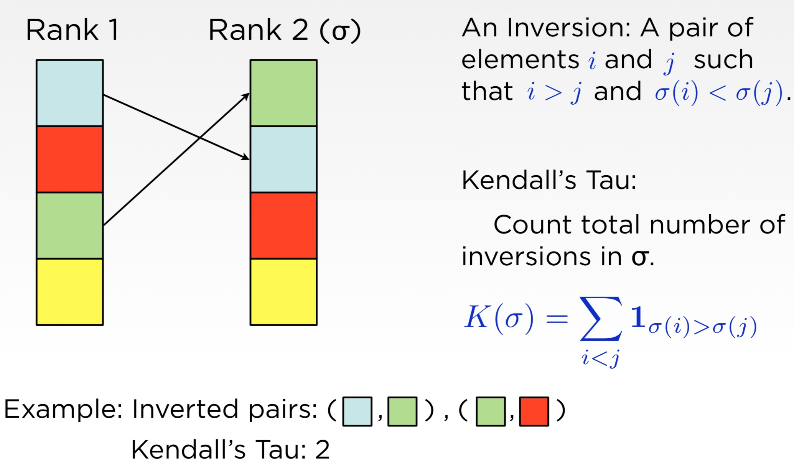
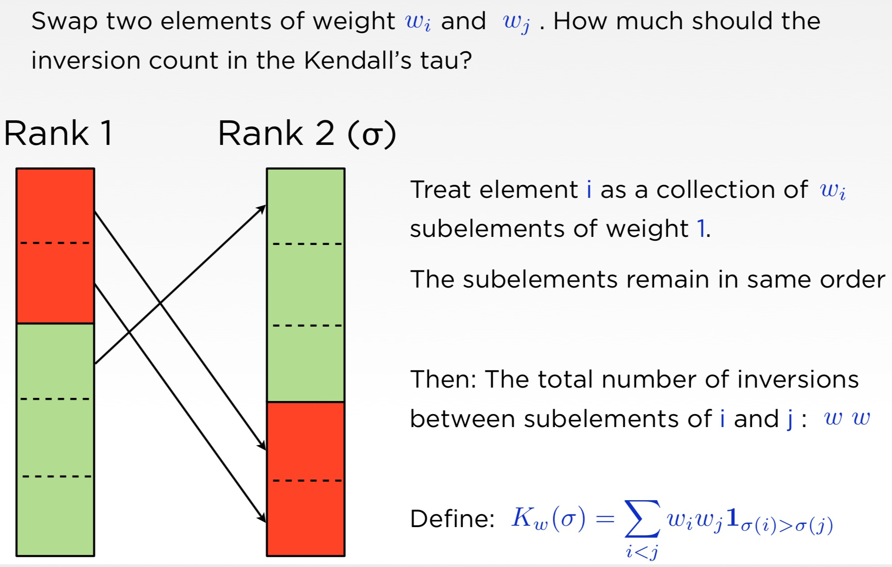
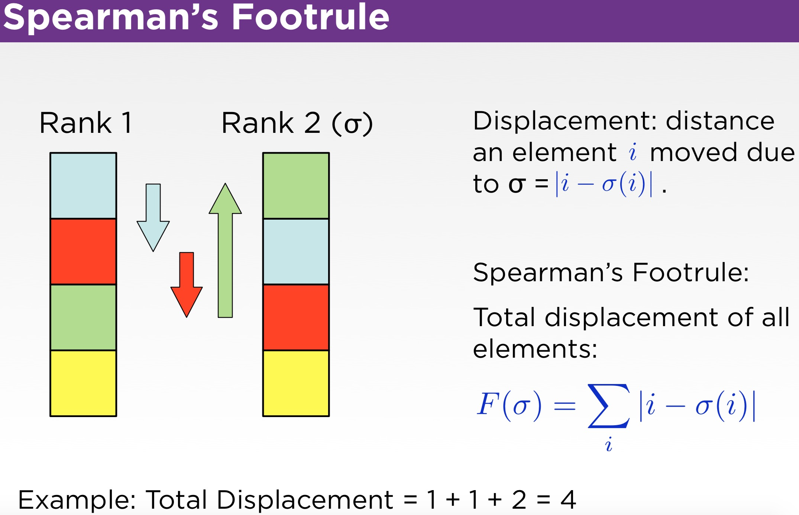
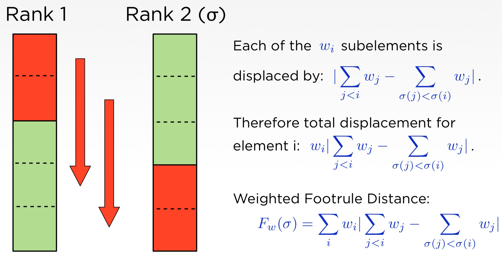

在某些情况下，我们需要度量两个排序列表的距离，或者说相似程度。比如，在信息检索领域，我们可能需要计算在某个查询条件下系统给出的文档的排序列表与一个预先定义好的“完美”排序列表的接近程度。或者我们可能需要比较不同搜索引擎的结果。又或者，在推荐系统中，我们需要监控某次算法迭代（A/B测试）中，新算法针对某个用户给出的推荐列表与旧算法给出的推荐列表的差异程度，以便决定是否要触发自动报警。

在信息检索领域，我们常用MAP、MRR、NDCG来评估排序算法的好坏，然而这些指标依赖人工标注的query与document的相关性档位（relevance level）。当没有此标注数据，或者我们要评估的排序列表跟相关性无关，并且我们刚好有一个待比较的基准列表时，该如何评估它们之间的距离呢？how to measure the similarity between two rank list?

定义这样一个排序列表之间比较的指标，我们期待它能满足以下几个方面：

- 丰富度（Richness）
  + 能够支持元素加权、位置加权等
  + Support element weights, position weights, etc.
- 简洁性（Simplicity）
  + 易于理解
  + Be simple to understand
- 普适性（Generalization）
  + 也能支持不考虑权重的情况 
  + Collapse to a natural metric with no weights are present
  + Should behave similar to other approaches
  + Allows us to select a metric best suited to the problem
- 满足距离定义的基本属性（Satisfy Basic Properties）
  + Scale free, invariant under relabeling, triangle inequality...

排序列表距离度量大致可以分为两大类方法: (1) 基于排序之间的相互关系（Ranked Correlation）；(2) 基于集合的度量（Set Based Measure）。

<!--more-->

## 一、Rank Correlation

基于Rank correlation的距离度量方法本质上是量化任意两个不同元素在两个待比较的排序列表中的相对位置，例如，两者保持相同顺序的概率等。

### 1. 肯德尔等级相关系数（Kendall Tau）

我们可以用逆序对数量来量化两个排序列表的不一致程度。

> 设 A 为一个有 n 个数字的有序集 (n>1)，其中所有数字各不相同。如果存在正整数 i, j 使得 1 ≤ i < j ≤ n 而且 A[i] > A[j]，则 <A[i], A[j]> 这个有序对称为 A 的一个逆序对，也称作逆序数。

逆序数有时候也叫做肯德尔等级相关系数。直接用逆序数来度量量列表之间的距离有个问题，就是不同长度的列表scale不一致。然而，多数情况下，我们希望用一个统一的量纲来度量列表距离。

现在我们常把肯德尔等级相关系数定义为统一量纲的版本，即两个列表正序对的概率减去逆序对的概率，比如，计算元素A在列表1中排在元素B前面，那么在列表2中元素A依然排在元素B前面的概率，具体值可以通过下面的公式计算：

$$ \tau = P(C)-P(D)=\frac{C}{N}-\frac{D}{N}=\frac{C-D}{N}$$

其中，$N$是总的元素对数量，当列表有$n$个元素时，$N=\frac{1}{2}n(n-1)$；$C$是在两个列表中相对顺序保持一致的元素对数量；$D$是在两个列表中相对顺序不一致的元素对数量。

有时候列表中元素的重要性是不同的，交换两个重要的元素之间的相对位置比交换两个不那么重要的元素之间的相对位置影响要大很多。那么，如何在度量列表排序相似度的时候，考虑元素的权重呢？

一种方法是把权重为$w$的元素理解为有$w$个权重为1的元素连在一起构成一个整体，如下图：

### 2. Spearman's Footrule

Spearman's Footrule是两个排序列表之间的绝对距离，类似于文本编辑距离，度量把一个列表修改为另一个列表最少需要移动各个元素的距离的总和。

例如，假设`A=[1,2,3];B=[2,1,3]`,则A和B的Footrule距离为$d_{AB}=|1-2|+|2-1|+|3-3|=2$。

Footrule距离可以理解为在$n$为空间上把其中一个点沿着坐标轴的方向移动到另外一个点最少需要移动的距离之和。

Spearman's Footrule距离度量也可以考虑元素权重，可以参考与Kendall Tau一致的方法。

## 二、Set Based Measure

基于集合的方法通过在计算两个不同排序列表在不同深度时对应集合的交集大小来计算排序列表的相似度。假设我们有两个列表：

> A: [a, b, c, d, e]
> B: [b, a, c, d, e]

依次计算它们前k个元素组成的两个集合的交集，以及交集大小相对于当前深度的比例。

|深度|列表A的前k个元素|列表B的前k个元素|交集|比例|
|---|---|---|---|---|
|1|a|b|{}|0/1=0|
|2|a,b|b,a|{a,b}|2/2 = 1|
|3|a,b,c|b,a,c|{a,b,c}|3/3 = 1|
|4|a,b,c,d|b,a,c,d|{a,b,c,d}|4/4 = 1|
|5|a,b,c,d,e|b,a,c,d,e|{a,b,c,d,e}|5/5 = 1|

一旦计算出不同深度的交集比例后，我们就可以通过交集比例的分布来量化两个列表的相似程度，最简单的方式就是直接计算交集比例的平均值。在上面的例子中，当列表长度为5时，列表A和B的相似度为 4/5=0.8。

一般情况下，排序越靠前的位置的元素的权重越高。比如搜索引擎的结果，我们一般只关注排在最前面的文档的相对顺序，而排在后面的文档一般不太关注。在中国互联网公司实力排行榜上我们通常也只会关注那些Top的公司的相对顺序，而不太关心几百名之后的公司如何排名。因此，我们希望在比较两个排序列表的相似性时，能够考虑不同位置的元素的权重，尤其是关注top元素的相对位置权重。

假设我们另外有一列表`C: [a, b, c, e, d]`，与列表A比较后发现，列表C是通过交换列表A的最好两个元素的位置得到的；而列表B是通过交换列表A的前2个元素的位置得到的。基于Set Based Measure，我们发现列表C与列表A的相似度为(1+1+1+0.75+1)/5=0.95，大于列表B与列表A的相似度（0.8），这正是我们所期望的。

综上，Set Based Measure天然带有top-weighteness属性。

+ RBO(Rank Biased Overlap)

Rank Biased Overlap 距离度量方法进一步拓展了上述Set Based的方法。上述Naive的Set Based Measure方法计算出的距离是没有上界的，随着列表长度的不断增加，有可能距离值会无穷大。为了解决这个问题，RBO给每个深度的交集比例定义了一个权重系数，最后计算结果时是加权和，而不是原来的平均值。

当然，不是任意的权重值分布都能保证距离收敛。RBO选择了几何序列来保证这一点，具体地，RBO在无限长度的列表上计算两个排序列表的步骤如下：

假设$S$和$T$为两个无限长度的排序列表，$S_i$为列表$S$的第$i$个元素，$S_{c:d}=\{ S_i : c \leq i \leq d \}$表示列表中从位置$c$到位置$d$的所有元素组成的集合。在深度为$d$时，列表S和T的交集为：
$$I_d=S_{1:d} \cap T_{1:d}$$

交集的元素个数称之为列表S和T在深度为d时的交叠（overlap），该overlap相对于深度$d$的比值称之为列表S和T的一致度（agreement）。
$$A_d=\frac{|I_d|}{d}=\frac{|S_{1:d} \cap T_{1:d}|}{d}$$

之前介绍的Naive Set Based Measure实际上是在计算平均交叠，即$AO(S,T,k)=\frac{1}{k} \sum_{d=1}^{k} A_d$，其中$k$是需要计算的深度。

RBO不再简单地计算平均交叠，而是给每个深度的一致度一个权重$w_d$，再计算加权和:
$$SIM(S,T,w)=\sum_{d=1}^{\infty} w_d \cdot A_d$$

定义权重$w_d=(1-p)\cdot p^{d-1}$，则$\sum_d w_d = 1$，因为当$0<p<1$时，几何级数$p^{d-1}$收敛到$\frac{1}{1-p}$，即$$\sum_{d=1}^{\infty} p^{d-1} = \frac{1}{1-p}$$

根据定义，$A_d$是小于1的，则有$0 \leq SIM \leq \sum_d w_d < 1$。

至此，RBO距离度量方法可以定义为：
$$RBO(S,T,p)=(1-p)\sum_{d=1}^{\infty}p^{d-1} \cdot A_d$$

其中$p$是一个可以预先定下来的参数。可以看到RBO指标是有界的，值在0~1的范围之间，并且RBO指标还带有top-weighteness属性。

RBO指标有很好的性质，非常适合用来度量两个排序列表的相似度，强烈推荐！

## 参考资料

1. [Comparing Ranked List](https://ragrawal.wordpress.com/2013/01/18/comparing-ranked-list/)
2. [A Similarity Measure for Indefinite Rankings](http://codalism.com/research/papers/wmz10_tois.pdf)
3. [Rank Correlation and Distance Between Rankings](http://ciir-publications.cs.umass.edu/pdf/IR-649.pdf)
4. [信息检索评价指标(nDCG,MRR,MAP)](https://weirping.github.io/blog/Metrics-in-IR.html)
5. [Generalized Distances Between Rankings - Stanford CS Theory](http://theory.stanford.edu/~sergei/slides/www10-metrics.pdf)
6. [A New Weighted Spearman's Footrule as A Measure of The Distance Between Two Rankings](https://arxiv.org/abs/1207.2541)
