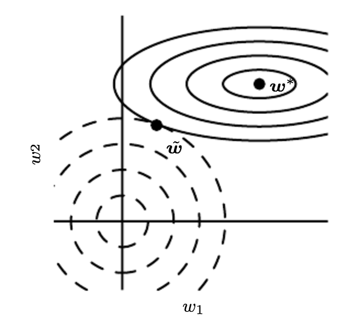
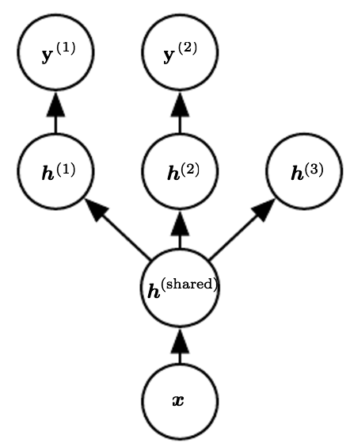
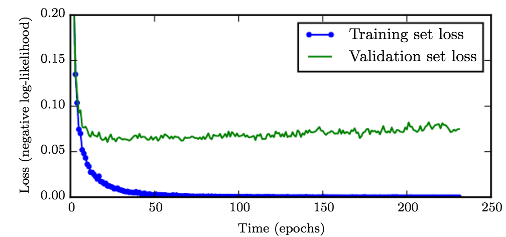
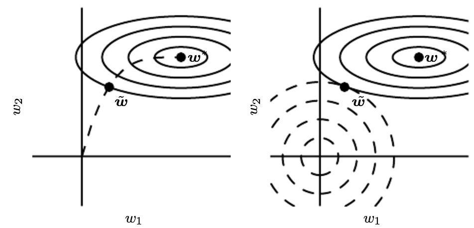

标签：深度学习 神经网络 正则化

---

在训练数据不够多时，或者over training时，常常会导致过拟合（overfitting）。正则化是向原始模型引入额外信息，以便防止过拟合和提高模型泛化性能的一类方法的统称。在实际的深度学习场景中我们几乎总是会发现，最好的拟合模型（从最小化泛化误差的意义上）是一个适当正则化的大型模型。

<!-- more -->
# 参数范数惩罚
通过向目标函数添加一个参数范数惩罚$\Omega(\theta)$项来降低模型的容量，是一类常用的正则化方法。将正则化后的损失函数记作$\tilde J$：
$$
\begin{align}
 \tilde J(\theta; X, y) =  J(\theta; X, y)  + \alpha \Omega(\theta),
\end{align}
$$
其中$\alpha \in [0, \infty]$ 权衡范数惩罚项的相对贡献，越大的$\alpha$对应越多的正则化。

通常情况下，深度学习中只对网络权重$\theta$添加约束，对偏置项不加约束。主要原因是偏置项一般需要较少的数据就能精确的拟合，不对其正则化也不会引起太大的方差。另外，正则化偏置参数反而可能会引起显著的欠拟合。

## L2参数正则化

常用的L2参数正则化通过向目标函数添加一个正则项$\Omega(\theta) = \frac{1}{2} \|{w}\|^2$，使权重更加接近原点。L2参数正则化方法也叫做权重衰减，有时候也叫做岭回归（ridge regression）。
 L2参数正则化之后的模型具有以下总的目标函数：
$$\begin{align}
  \tilde{J}(w;X,y) =\frac{\alpha}{2} w^\top w +  J(w;X,y)
\end{align}
$$
与之对应的梯度为
$$
\begin{align}
 \nabla_{w} \tilde{J}(w;X,y) =\alpha w +  \nabla_{w} J(w;X,y)
\end{align}
$$
使用单步梯度下降更新权重，即执行以下更新：
$$\begin{align}
 w \leftarrow w - \epsilon(\alpha w + \nabla_{w} J(w;X,y))
\end{align}
$$
换种写法就是：
$$
\begin{align}
 w \leftarrow (1-\epsilon \alpha)w - \epsilon \nabla_{w} J(w;X,y)
\end{align}
$$
我们可以看到，加入权重衰减后会引起学习规则的修改，即在每步执行通常的梯度更新之前先收缩权重向量（将权重向量乘以一个常数因子）。由于$\epsilon$和$\alpha$都是大于0的数，因此相对于不加正则化的模型而言，正则化之后的模型权重在每步更新之后的值都要更小。

假设$J$是一个二次优化问题（比如采用平方损失函数）时，模型参数可以进一步表示为$\overline w = \frac{\lambda_i}{\lambda_i + \alpha}w_i$，即相当于在原来的参数上添加了一个控制因子，其中$\lambda$是参数Hessian矩阵的特征值。由此可见
1. 当$\lambda_i \gg \alpha$时，惩罚因子作用比较小。
2. 当$\lambda_i \ll \alpha$时，对应的参数会缩减至0。

如上图所示，实线表示未经过正则化的目标函数的等高线，虚线圆圈表示L2正则项的等高线。在点$\tilde w$处这两个互相竞争的目标达到均衡。在横轴这个方向，从点$w^{\ast}$处开始水平移动，目标函数并没有增加太多，也就是在这个方向上目标函数并没有很强的偏好，因而正则化在这个方向上有较强的效果，表现为把$w_1$往原点拉动了较长的距离。另一方面，在纵轴这个方向上，目标函数对应远离$w^{\ast}$的移动很敏感，即目标函数在这个方向的曲率很高，因此正则化对于$w_2$的影响就较小。

在原目标函数的基础上增加L2范数惩罚，将原函数进行了一定程度的平滑化，这个可以从其梯度函数有所体现。

对于一类存在大量驻点（Stationary point，即梯度为0的点），增加L2范数意味着将原本导数为零的区域，加入了先验知识进行区分（几何上，意味着原本一个平台的区域向0点方向倾斜），这样可以帮助优化算法至少收敛到一个局部最优解，而不是停留在一个鞍点上。

通过限制参数$w$在0点附近，加快收敛，降低优化难度。回忆一下，对于一类常见激活函数，如Sigmoid，满足：单调有界。根据单调有界定理，对于任意小的$\eta > 0$，我们可以取得足够大的$z_0$，使得$f'(z)<\eta(z_0 < z)$。换句话说，对于该变量，我们可以找到一个足够大的区域$(z_0, \infty)$使得其导数接近于0，这意味着通过梯度方法改进该变量会变得极其缓慢（回忆后向传播算法的更新），甚至受浮点精度等影响其收敛。那么，采用范数控制变量的大小在0附近，可以避免上述情况，从而在很大程度上可以让优化算法加快收敛。

## L1参数正则化 

L2权重衰减是权重衰减最常见的形式，我们还可以使用其他的方法限制模型参数的规模。 比如我们还可以使用L1参数正则化。

形式地，对模型参数$w$的L1正则化被定义为：$$ \begin{align} \Omega(\theta) = \|w\|_1 = \sum_i | w_i |, \end{align}$$ 即各个参数的绝对值之和。

接着我们将讨论L1正则化对简单线性回归模型的影响，与分析L2正则化时一样不考虑偏置参数。

我们尤其感兴趣的是找出L1和L2正则化之间的差异。与L2权重衰减类似，我们也可以通过缩放惩罚项$\Omega$的正超参数$\alpha$来控制L1权重衰减的强度。 因此，正则化的目标函数 $\tilde{J}(w;X,y)$如下所示
$$\begin{align}
\tilde{J}(w;X,y) = \alpha | w |_1 +  J(w;X,y)
\end{align}$$
对应的梯度(实际上是次梯度)： $$\begin{align}
\nabla{w} \tilde{J}(w; X,y) = \alpha \text{sign}(w) + \nabla_{w} J(w; X, y)
\end{align}$$
其中$\text{sign}(w)$只是简单地取$w$各个元素的正负号。

观察上述等式，我们立刻发现L1的正则化效果与L2大不一样。 具体来说，我们可以看到正则化对梯度的影响不再是线性地缩放每个$w_i$；而是添加了一项与$\text{sign}(w_i)$同号的常数。使用这种形式的梯度之后，我们不一定能得到$J(X,y;w)$二次近似的直接算术解（L2正则化时可以）。

由于$\alpha$是一个大于0的数，因此L1参数正则化相对于不加正则化的模型而言，每步更新后的权重向量都向0靠拢。

特殊情况下，对于二次优化问题，并且假设对应的Hessian矩阵是对角矩阵，可以推导出参数递推公式为$w_i=sign(w_i^∗)max(|w_i^∗|−\frac{α}{λ_i},0)$，从中可以看出 当$|w_i^∗|<αλi$时，对应的参数会缩减到0，这也是和L2正则不同地方。对比L2优化方法，L2不会直接将参数缩减为0，而是一个非常接近于0的值。

## L1正则化和L2正则化的区别
1. 通过上面的分析，L1相对于L2能够产生更加稀疏的模型，即当L1正则在参数w比较小的情况下，能够直接缩减至0.因此可以起到特征选择的作用，该技术也称之为 LASSO
2. 如果从概率角度进行分析，很多范数约束相当于对参数添加先验分布，其中L2范数相当于参数服从高斯先验分布；L1范数相当于拉普拉斯分布。

|L2正则化|L1正则化|
|---|---|
|计算效率高，因为有解析解|在非稀疏的情况下，计算效率不高|
|非稀疏输出|稀疏输出|
|不可用来做特征选择|可用来做特征选择|

从另外一个角度可以将范数约束看出带有参数的约束优化问题。带有参数惩罚的优化目标$\tilde J(\theta; X, y) =  J(\theta; X, y)  + \alpha \Omega(\theta)$可以表示为带约束的最优化问题：
$$ min\tilde J(\theta; X, y) \\ s.t. \quad \Omega(\theta)< k $$
通过KKT条件进行求解时，对应的拉格朗日函数为:
$$L(θ,α;x,y)=\tilde J(θ;x,y)+α(Ω(θ)−k)$$

从约束优化问题也可以进一步看出，L1相对于L2能产生更稀疏的解, 如下图所示，L1最优解常常出现在定点处，此时某些维度上的值肯定为0。

更多关于L1正则化和L2正则化的区别请参考这篇[博文](http://www.chioka.in/differences-between-l1-and-l2-as-loss-function-and-regularization/)。

# 数据集增强
使用更多的样本数据训练模型可以获得更好的泛化性能，然而，实践中我们很难获得更多的训练数据。一种解决方法是人为创造一些合理的假数据并把它们添加到训练集。

这样的方法对于分类任务来说是最简单的。一个分类器需要有能力把一个复杂高维的输入$x$映射到单一类目的输出$y$，因此分类器需要对大量$x$的变换保持预测结果的不变，即对于相似的输入需要有相同的输出。因此，我们可以轻易地转换训练集中的$x$来生成新的$(x,y)$对。例如，对于图像识别任务来说，像素的部分平移、缩放、旋转操作并不会改变图片中物体对语义表达，因而我们可以使用这些操作来生存新对训练数据。数据集增强对于语音识别任务也是有效的。

另一种数据集增强的方法是向网络的输入层注入噪声。神经网络已被证明对噪声不是非常健壮。简单地将随机噪声施加到输入再进行训练可以改善神经网络的健壮性。对于某些模型，在模型的输入上添加方差极小的噪声等价于对权重施加范数惩罚（Bishop）。

研究表明，将噪声施加到网络的隐藏层也是有效的，这可以被看成是在多个抽象层上进行数据集增强。著名的Dropout方法可以看作是对隐藏层输出乘以一个噪声后输出到下一层。

# 噪音的鲁棒性

一般情况下，噪声注入远比简单的收缩参数强大，特别是噪声被添加到隐藏单元时。

另一种正则化模型的噪声使用方法是将其直接添加到学习到的权重上。这项技术主要被用于循环神经网络的情况下。这种方法可以看作是权重的贝叶斯推断的一种随机实现。贝叶斯方法认为学习到的模型权重上不确定的，并且这种不确定性可以通过权重的概率分布来表示。添加噪音到学习到的权重上可以看着是反映这种不确定行的一种随机的、实用的方式。

在适当的假设下，施加噪声到权重可以被解释与传统的正则化形式等价，鼓励学习到的函数保存一定的稳定性。这种形式的正则化鼓励模型的参数进入到参数空间中相对较稳定的区域，在这些区域小的权重扰动对于模型的输出影响较小。

## 向输出目标注入噪声

大多数数据集的标签$y$都有一定错误,错误的$y$不利于最大化$\log p(y \mid x)$。 避免这种情况的一种方法是显式地对标签上的噪声进行建模。 例如，我们可以假设，对于一些小常数$ϵ$，训练集标记$y$是正确的概率是$1−ϵ$，（以$ϵ$的概率）任何其他可能的标签也是正确的。这个假设很容易就能解析地与代价函数结合，而不用显式地抽取噪声样本。 例如，标签平滑(label smoothing) 通过把确切分类目标从0和1替换成$\frac{\epsilon}{k-1}$和$1-\epsilon$，正则化具有$k$个输出的softmax函数模型。标准交叉熵损失可以用在这些非确切目标的输出上。 使用softmax函数和明确目标的最大似然学习可能永远不会收敛, 因为softmax函数永远无法真正预测0概率或1概率，因此它会继续学习越来越大的权重，使预测更极端。使用如权重衰减等其他正则化策略能够防止这种情况。标签平滑的优势是能够防止模型追求确切概率而不影响模型学习正确分类。这种策略自20世纪80年代就已经被使用，并在现代神经网络继续保持显著特色。

# 半监督学习

在半监督学习的框架下，$P(x)$产生的未标记样本和$P(x,y)$中的标记样本都用于估计$P(y \mid x)$或者根据$x$预测$y$。

在深度学习的背景下，半监督学习通常指的是学习一个表示$h = f(x)$。 学习表示的目的是使相同类中的样本有类似的表示。无监督学习可以为如何在表示空间聚集样本提供有用线索。在输入空间紧密聚集的样本应该被映射到类似的表示。在许多情况下，新空间上的线性分类器可以达到较好的泛化。这种方法的一个经典变种是使用主成分分析作为分类前（在投影后的数据上分类）的预处理步骤。

我们可以构建这样一个模型，其中生成模型$P(x)$或$P(x,y)$与判别模型$P(y \mid x)$共享参数，而不用分离无监督和监督部分。 我们权衡监督模型准则 $-P(y \mid x)$和无监督或生成模型准则（如$-P(x)$)或$-P(x, y)$)。生成模型准则表达了对监督学习问题解的特殊形式的先验知识，即$P(x)$的结构通过某种共享参数的方式连接到$P(y \mid x)$。通过控制在总准则中的生成准则，我们可以获得比纯生成或纯判别训练准则更好的权衡。

{Russ+Geoff-nips-2007}描述了一种学习回归核机器中核函数的方法，其中建模$P(x)$时使用的未标记样本大大提高了$P(y \mid x)$的效果。

# 多任务学习

多任务学习是通过合并几个任务中的样例（可以视为对参数施加的软约束）来提高泛化的一种方式。额外的训练样本以同样的方式将模型的参数推向泛化更好的方向，当模型的一部分在任务之间共享时，模型的这一部分更多地被约束为良好的值（假设共享是合理的），往往能更好地泛化。

上图是深度学习中多任务学习的一个例子，网络中的输入层和第一个隐藏层是在多个任务之间共享的，上层的$h^{(1)}$、$h^{(2)}$和$h^{(2)}$(对应一个无监督学习任务)是不同任务特有的参数。这里假设$h^{(shared)}$是对原始输入的某种公共的抽象表示，可以在多个任务间共享。

因为共享参数，其统计强度可大大提高（共享参数的样本数量相对于单任务模式增加的比例），并能改善泛化和泛化误差的范围。当然，仅当不同的任务之间存在某些统计关系的假设是合理（意味着某些参数能通过不同任务共享）时才会发生这种情况。

从深度学习的观点看，底层的先验知识如下：能解释数据变化（在与之相关联的不同任务中观察到）的因素中，某些因素是跨两个或更多任务共享的。例如，在出来图像识别相关的任务时卷积层和pooling层可以在多个任务间共享。

# 提前终止

在模型训练过程中经常出现随着不断迭代，训练误差不断减少，但是验证误差先减少然后开始增长，如下图所示。

提前停止（Early Stopping）的策略是：在验证误差不在提升后，提前结束训练；而不是一直等待验证误差到最小值。该策略可以用于任意的模型，不限于深度学习。算法天然适合采用Early Stopping策略来确定需要训练多少颗子树，因为是一个加法模型，采用提前终止策略都不需要额外存储模型的副本。

提前终止的算法如下：

---
Let $n$ be the number of steps between evaluations.
Let $p$ be the “patience,” the number of times to observe worsening validation set error before giving up.
Let $\theta_0$ be the initial parameters.
$\theta \leftarrow \theta_0$
$i \leftarrow 0$
$j \leftarrow 0$
$v \leftarrow \infty$
$\theta^{\ast} \leftarrow \theta$
$i^{\ast} \leftarrow i$
while $j < p$ do
　Update $θ$ by running the training algorithm for $n$ steps.
　$i ← i + n$
　$v'← ValidationSetError(θ)$
　if $v'< v$ then
　　$j ← 0$
　　$θ^{\ast}← θ$
　　$i^{\ast}← i$
　　$v ← v'$
　else
　　$j ← j + 1$
　end if
end while
Best parameters are $θ^{\ast}$, best number of training steps is $i^{\ast}$

---

- 提前停止策略使用起来非常方便，不需要改变原有损失函数，简单而且执行效率高。但是它需要一个额外的空间来备份多份模型参数。
- 提前停止策略可以和其他正则化策略一起使用。
- 提前停止策略确定训练迭代次数后，有两种策略来充分利用训练数据，一是将全量训练数据一起训练一定迭代次数；二是迭代训练流程直到训练误差小于提前停止策略的验证误差。
- 对于二次优化目标和线性模型，提前停止策略相当于L2正则化。

提前终止策略和L2正则化的关系如下图所示。

左图中的椭圆形实线指负对数似然的等值线，虚线表示从原点出发的SGD算法的轨迹，提前停止策略使得最终的权重更新为$\tilde w$，而不是停在使得损失函数最小化的点$w^{\ast}$。右图中的虚线圆圈表示L2正则项的等值线，其导致总体目标函数最小化的点$\tilde w$相对于$w^{\ast}$而言更加靠近原点。

# 参数绑定和共享

有时我们需要一种方式来表达我们对模型参数适当值的先验知识。我们可能无法准确地知道应该使用什么样的参数，但我们根据领域和模型结构方面的知识得知模型参数之间应该存在一些相关性。

我们经常想要表达的一种常见依赖是某些参数应当彼此接近。考虑以下情形：我们有两个模型执行相同的分类任务（具有相同类别），但输入分布稍有不同。 形式地，我们有参数为$w^{(A)}$的模型A和参数为$w^{(B)}$的模型B。 这两种模型将输入映射到两个不同但相关的输出：$\hat y^{(A)} = f(w^{(A)}, x)$和$\hat y^{(B)} = f(w^{(B)}, x)$。

我们可以想象，这些任务会足够相似（或许具有相似的输入和输出分布），因此我们认为模型参数应彼此靠近：  $\forall i, w_i^{(A)}$应该与$w_i^{(B)}$接近。 我们可以通过正则化利用此信息。 具体来说，我们可以使用以下形式的参数范数惩罚： $ \Omega(w^{(A)}, w^{(B)}) = \|{w^{(A)}-w^{(B)}}\|_2$。 在这里我们使用L2惩罚，但也可以使用其他选择。

这种方法由{LasserreJ2006}提出，正则化一个模型（监督模式下训练的分类器）的参数，使其接近另一个无监督模式下训练的模型（捕捉观察到的输入数据的分布）的参数。 这种构造架构使得许多分类模型中的参数能与之对应的无监督模型的参数匹配。

参数范数惩罚是正则化参数使其彼此接近的一种方式，而更流行的方法是使用约束：强迫某些参数相等。 由于我们将各种模型或模型组件解释为共享唯一的一组参数，这种正则化方法通常被称为参数共享。和正则化参数使其接近（通过范数惩罚）相比，参数共享的一个显著优点是，只有参数（唯一一个集合）的子集需要被存储在内存中。 对于某些特定模型，如卷积神经网络，这可能可以显著减少模型所占用的内存。

目前为止，最流行和广泛使用的参数共享出现在应用于计算机视觉的卷积神经网络中。 自然图像有许多统计属性是对转换不变的。 例如，猫的照片即使向右边移了一个像素，仍保持猫的照片。 CNN通过在图像多个位置共享参数来考虑这个特性。 相同的特征（具有相同权重的隐藏单元）在输入的不同位置上计算获得。 这意味着无论猫出现在图像中的第$i$列或$i + 1$ 列，我们都可以使用相同的猫探测器找到猫。

参数共享显著降低了CNN模型的参数数量，并显著提高了网络的大小而不需要相应地增加训练数据。它仍然是将领域知识有效地整合到网络架构的最佳范例之一。

# 稀疏表示

深度学习可以看着时一种表示学习（representation learning），比如卷积神经网络可以学习图像的不同层次的特征表示，word2vec学习词的Distributed representation，其共同特点是用隐层权重作为表示。

L1惩罚可以诱导稀疏的参数，即许多参数为零（或接近于零）。
表示的范数惩罚正则化是通过向损失函数$J$添加对表示的范数惩罚来实现的。 我们将这个惩罚记作$\Omega(h)$。 和以前一样，我们将正则化后的损失函数记作$\tilde J$：
$$
\begin{align}
 \tilde J(\theta; X, y) =  J(\theta; X, y)  + \alpha \Omega(h),
\end{align}
$$
其中$\alpha \in [0, \infty]$ 权衡范数惩罚项的相对贡献，越大的$\alpha$对应越多的正则化。

通过上述方法，含有隐藏单元的模型在本质上都能变得稀疏。

#集成化方法（Ensemble Methods）

集成化方法是一种通用的降低泛化误差的方法，通过合并多个模型的结果，也叫作模型平均。主要想法是分别训练几个不同的模型，然后让所有模型表决测试样例的输出。
经验：原始输入每一个节点选择概率0.8，隐藏层选择概率为0.5。

Bagging是一种常用的集成学习方法。Bagging的策略很多，例如不同初始化方法、不同mini batch选择方法、不同的超参数选择方法。

与之对应的集成方法是Boosting，通过改变样本权重来训练不同模型。

# Dropout

Dropout方法提供了正则化一大类模型的方法，计算方便但功能强大。其基本思路非常简单：在训练阶段，对于每个mini-batch随机抹去一定比例的神经元进行前向及后向传播更新, 如下图所示。

通过控制每个单元的开关，我们潜在使用了$2^n$个不同的网络（$n$为采用Dropout的神经元数量），这样的模型相当于对$2^n$个不同的共享变量的网络集成学习，因而Dropout可以看作是一种集成学习的方法。

经验：原始输入每一个节点选择概率0.8，隐藏层选择概率为0.5。

既然Dropout过程类似于集成方法，预测时需要将所有相关模型进行求平均，然而遍历所有屏蔽变量得到的子模型不是可能的事情，因此需要一些策略进行预测。
1. 随机选择10-20个屏蔽向量就可以得到一个较好的解。
2. 采用几何平均然后在归一化的思路，从而达到平滑的效果。

Dropout还可以看作是一种在隐藏层注入掩码噪声的方法。了解这一事实是重要的, 这可以看作是对输入内容的信息高度智能化、自适应破坏的一种形式，而不是对输入原始值的破坏。

对于一类更特定的模型，Dropout有在理论上有进一步的论证。如果我们限制所研究的为广义线性模型（Generalized linear models），并且Dropout只在输入$x$变量上进行，那么通过对广义线性模型通过泰勒展开进行二次近似，可以得到

$$Reg_{dropout}(w) = \frac \delta {2(1-\delta)} w^T diag(nI(w))w$$

其中$I(w)$为参数$w$的Fisher information矩阵：

$$ I(w)=-E[\nabla^2 \log p(X|w)] $$

那么，对于输入$x$进行Dropout，实际上就相当于首先将输入$x$采用$diag(I(w))^{-1/2}$进行归一化得到$\hat w$，然后采用传统范数$\| \hat w \|_2$对参数进行正则化，从而建立起了采用Dropout与范数正则化的联系。具体的推导可以参见：[Dropout Training as Adaptive Regularization](http://arxiv.org/pdf/1307.1493v2.pdf)。

# 对抗训练

对抗训练的一个主要思路是，总有些输入变量$x$和$x’$，他们本身非常相似但是属于不同的类别。如果能单独拿出来特殊对待能够取得比较好的效果。

