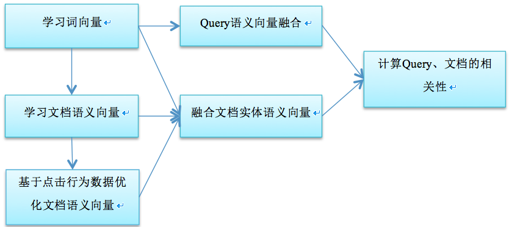
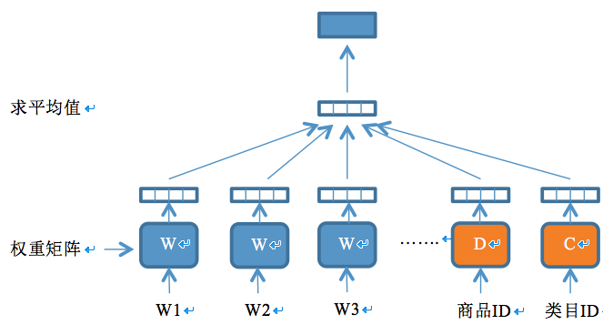
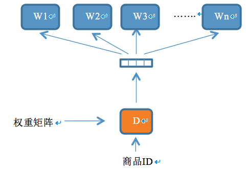

相关性是影响用户对搜索引擎检索结果满意度的重要因素之一。传统的基于词袋模型（bag of words）的文本匹配的检索方法存在语义失配和主题转义的问题。语义失配的原因可以归结为自然语言中的“一词多义”和“一义多词”现象。比如用户在电子商务网站中检索“小米”，可能是想查找作为粮食用的小米，也可能是想找小米手机或是其他小米品牌的电子产品；再比如用户检索“客栈”，其真实意图是想找住宿的地方，这时标题中包含“宾馆”、“酒店”、“旅社”的商品都应该能够被检索出来。主题转义一般是由于用户的查询匹配了文档的次要部分，而没有匹配文档的主要成分。比如，用户搜索“早餐”，却召回了标题为“某某酒店住宿一晚优惠券，不含早餐”的商品。

本文提出了一种基于深度学习方法的语义相关性计算方法，该方法包括：学习Query的语义向量；学习文档的语义向量；根据Query和文档的语义向量计算Query和文档的相关性；根据语义相关性计算结果调整搜索引擎的召回和排序逻辑，帮助提高搜索结果的相关性。

# 术语解释

1. 深度学习(Deep Learning)是机器学习理论中的一个新的研究领域，其动机在于建立、模拟人脑进行分析学习的神经网络，它模仿人脑的机制来解释数据。
2. 主题模型（Topic Model）在机器学习和自然语言处理等领域是用来在一系列文档中发现抽象主题的一种统计模型。
3. 词向量是对自然语言数学化的一种方式，词向量通常有两种表示方法，一种是one-hot representation，就是用一个很长的向量来表示一个词，向量的长度是词典D的大小N，向量的元素只有一个为1，其他全为0，1的位置对应该词在词典中的索引；另一种是Distributed Representation，用一个相对较短的实数向量来表示一个词。
4. O2O(Online To Offline) 一种线上营销线下消费的电子商务模式。
<!-- more -->

# 背景

搜索引擎是用户获取信息的一种重要方式。搜索引擎根据用户输入的query检索出一系列相关文档展现给用户。检索过程包含了两个重要的阶段：召回和排序。召回表示根据用户的查询条件，尽可能多地匹配出主题相关的文档，尽可能少地匹配出主题不相关的文档。排序是指对召回阶段返回的文档集合进行合理的排序，把最满足用户意图的结果尽可能排到前面。

在召回阶段，判断用户的query和索引库中的文档是否主题相关，不能仅仅看文本上两者是否匹配，因为容易触发语义失配和主题转义的问题，因而需要一个主题模型从语义层面来精确判断两者是否相关。

在排序阶段，query和文档的相关程度也是文档排序的重要因素之一，因此需要对相关性有一个量化的评价指标。

现有的主题模型方法都用定义在词上的概率分布来刻画主题，并认为文档是从一些潜在主题中生成的词的集合。文档和词的关系如图1所示。Query被当成是一种词数相对较少的短文档。该类方法都是从文档集合中学习主题模型，Query和文档都映射到各自的主题分布向量，在主题级别计算相关性。该类方法主要分为三步：1. 从文档集合中学习到主题的集合，每个主题是定义在词汇表中的词上的概率分布。2. 将文档表示为一个主题向量，向量中的每个元素表示文档在该主题下的概率分布；3. 根据下面的等式计算Query和文档的相关性：
$$s(q,d)=α \cdot s_{topic} (q,d)+(1-α)s_{term} (q,d)$$
其中，系数$α \in [0,1]$，$s_{term} (q,d)$是term匹配分数，可以用VSM或者BM25等方法计算，$s_{topic} (q,d)$是主题匹配分数。不同的主题模型有不同的计算$s_{topic} (q,d)$的方法。比如，LDA模型的计算公式为：
$$s_{topic}(q,d)=1- \frac12 \sum_{k=1}^K{\left( (v_q^k-v_d^k )log \frac{v_q^k}{v_d^k} \right)}$$
其中，$v_q$是Query $q$的主题向量表示，$v_d$是文档$d$的主题向量表示。

【图1. 主题模型中词和文档的关系】

主题模型的运用可以帮助检索系统缓解语义失配的问题。比如查询条件为“学院”时，传统的方法很难认为描述“大学”的文档是相关的，因为两者在词的级别上是不匹配的。然而，主题模型很可能认为“学院”和“大学”是属于同一个主题，因而在主题匹配层面可以认为两者是相关的。

传统的主题模型本质上都是采用了基于词袋（bag of words）的方法，这种方法将Query、文档都视为一个词频向量，从而将文本信息转化为了易于建模的数字信息。但是词袋方法没有考虑词与词之间的顺序，这简化了问题的复杂性，同时也丢失了部分语义信息，即不同的文本序列只要使用了相同的词，其主题向量的表示是一样的。而且基于传统主题模型的方法难以度量词与词之间的相似性。比如，假设同一主题下有三个词：“食府”、“酒楼”、“饺子馆”，传统方法没办法知道“食府”和“酒楼”的相似性比“食府”和“饺子馆”更高。

传统的主题模型方法的另一个缺点是这些方法都是无监督的机器学习方法，其训练语料通常是一个静态的文档集合，模型难以利用额外的标签信息。比如，这些方法难以利用用户行为的反馈数据。另外，这些方法较容易产生过拟合现象，在实际应用中的效果会大打折扣。

为了避免上述问题，本文提出的方法能够把词、短语、句子、文档表示为一个固定长度的语义向量，即语义空间中的一个点，并且可以有效的衡量彼此之间的距离（相似性）。比如，能够计算出“食府”和“酒楼”的相似性比“食府”和“饺子馆”更高。除此之外，提出的方法还能够学习文本之外的实体的语义向量表示，如商品搜索引擎索引库中的商品和商品对应的类目、属性等，融合文本和实体的语义向量有助于更加精确地刻画待搜索的对象。

本文提出的技术方案继承了主题模型的优点，并且能够学习更加精准的Query和文档的语义向量表示，从而得到更加精确的相关性度量。同时，本文提出的方法还能够利用如用户反馈行为等标签数据进行半监督学习。搜索引擎有丰富的点击log，其中蕴含了大量的模式和知识。提出的方法利用用户的点击数据，优化了商品的语义向量表示，进一步提升了效果。

# 核心模块

本文提出的技术方案包括四个核心模块：（1）词向量学习模块；（2）文档语义向量学习模块；（3）语义向量融合模块；（4）相关性计算模块。算法流程图如图2所示。

【图2. 算法流程图】

## 词向量学习模块

词向量学习模块使用word2vec工具来学习词向量的Distributed Representation。每个词在词向量空间中用一个点来表示，在这个空间上引入“距离”，就可以根据词之间的距离来计算它们之间的（词法、语义上的）相似性。训练语料预处理是该模块的重要步骤。预处理阶段需要做文本归一化、切词、实体短语识别等操作。文本归一化包括特殊符号过滤、大写转小写、繁体转简体、全角转半角等操作。实体短语识别的主要作用是把被切词工具切碎的实体名称重新连接起来，作为一个整体参与模型的训练，并学习到对实体整体的一个语义向量表示。该步骤需要用到垂直领域的实体知识库，在O2O商品检索引擎中，实体库包括商户（POI）、区域、品牌、产品或服务等。本方法用一个基于词为单位的前缀树（Trie）数据结构来优先识别字符长度最长的实体。关于word2vec算法的详细描述请参考我之前的一篇博文：《》。关于基于词为单位的前缀树的实现请参考：《》。

## 文档语义向量学习模块

文档语义向量学习模块利用一个深度神经网络模型学习文档的语义向量。在O2O商品检索引擎中，文档即O2O商品（服务），每个商品有对应的类目。该模块同时学习商品和类目的语义向量，其模型结构图如图3所示。该模型用一个四层的神经网络结构来学习商品和类目的语义向量。网络的输入层由三部分构成：商品标题的切词（或短语）列表、商品ID、商品类目ID。输入层之上是一个映射层，根据权重矩阵把各个输入分量映射为固定长度的向量，其中商品标题的切词（或短语）对应的权重矩阵初始化为词向量学习模块的输出结果；商品ID和类目ID对应的权重矩阵初始化为小的随机数。映射层之上是神经元个数等于映射层每个分量向量长度的隐含层，其输入值为映射层各分量的平均值，输出值为输入值的非线性变换，变换函数为$f=tanh(x)$。隐含层之上就是模型的输出层，输出层一个长度为词汇表大小的向量，其值的计算方式为$y=U \cdot f$。其中$f$为隐含层的输出，$U$为待学习的权重矩阵。模型的学习目标是最大化似然函数：$L=\sum_w{log⁡p(w|context(w),doc_w,cat_w })$ ，其中$context(w)$为词$w$对应的上下文，$doc_w$为标题中包含词w的商品ID，$cat_w$为标题中包含词$w$的商品的类目ID。

【图3. 文档实体语义向量学习的深度神经网络模型】

文档语义向量学习模块所采用的深度神经网络模型是一个半监督的机器学习模型，能够从训练语料中自动生成训练样本。训练语料是从引擎索引库生成的三元组：<商品ID，商品类目ID，商品标题的切词/短语列表>。每个三元组可以生成多个神经网络模型的训练样本，生成过程如下：针对商品标题的切词/短语列表，设置一个长度为$C$的滑动窗口，滑动窗口最中间的词$w$作为待求值的目标值，窗口中的其他词加上商品ID和类目ID构成词$w$的上下文$Context$，则每条训练样本的形式为<$Context$, $w$>。$Context$是神经网络的输入，神经网络的输出经过softmax归一化之后表示在$Context$的条件下生成词$w$的概率$P(w|Context)$。当滑动窗口的位置确定后，<$Context$, $w$>构成一个正样本；按照某种策略随机采样N个词$w'$，则构成N个负样本：<$Context, w'$>。神经网络模型的学习目标是使得$P(w|Context)$尽量接近1，$P(w'|Context)$尽量等于0。模型的损失函数采样对数损失函数：$L(Y,P(Y|X))=-logP(Y|X)$。模型采样随机梯度下降算法来训练，训练过程中不断更新权重矩阵，直到算法收敛。最终产出的商品ID和类目ID对应的权重矩阵就是我们关心的内容，矩阵的每一行表示某个ID对应的语义向量。

【图4 学习商品ID的神经网络模型】

上述训练过程已经可以产出比较精准的商品和类目对应的语义向量了，然而由于商品ID参与训练的次数相对较少，存在训练不充分的风险。检索系统中用户的行为数据蕴含了用户对检索结果的反馈，在用户搜索的query条件下展现的商品被用户点击与否表达了用户对搜集结果是否满意，也表达了展现的商品与query的相关程度。可以假设与query越相关的商品被点击的概率越高。充分挖掘利用用户行为数据，可以进一步改善模型的效果。为了利用用户的点击行为数据优化商品ID对应的语义向量，在上述神经网络的基础上，设计一个新的神经网络模型，结构如图4所示。该模型的优化目标为最大化似然函数：$L=\sum_{(q,doc)∈R}\sum_{w∈q}log⁡p(w|doc)$ ，其中$R$是所有query与该query点击的doc（商品）构成的pair集合。从搜索引擎的点击log中抽取出形如二元组<商品ID，query的切词/短语列表>的训练语料。模型自动从训练语料中生成形如<商品ID，word>的训练样本，当word为点击该商品的query中的某个词时，构成一个正样本；当word为随机采样的一个词时，构成一个负样本。该模型的输入层为商品ID，经过权重矩阵的映射之后转换为隐含层，再经过另一个权重矩阵的转换输出，其中商品ID对应的权重矩阵初始化为上一步学习出的结果。模型的训练算法依然为随机梯度下降，训练过程中不断更新权重矩阵，最终得到商品ID对应的权重矩阵即为模型优化之后的商品ID对应的语义向量列表。

## 语义向量融合模块

语义向量融合模块主要解决两个问题：1. 如何根据词向量融合出不定长文本序列（如搜索引擎的Query）的语义向量；2. 如何根据词向量、文档语义向量融合出最终的文档（商品）实体对应的语义向量。
根据词向量融合文本序列的语义向量主要有两种方法：1. 直接把文本序列中的词/短语对应的词向量求和；2. 对文本序列中的词/短语对应的词向量加权求和。本文采用第二种方法，其中词权重简单地根据词的语义标签来确定，即对于产品/服务词、品牌词、短语权重设为2，其余词权重为1。
本文融合商品语义的方法为：先对商品标题，采用根据词向量融合文本序列的语义向量相同的方法，得到候选语义向量；在此基础上，把候选语义向量、商品ID对应的语义向量、商品类目ID对应的语义向量三者进行加权求和，三者的权重分别为1,3,3。

## 相关性计算模块

相关性计算模块根据Query、商品的语义向量在线计算Query和商品的语义相关性，计算方法采用余弦相似度：
$$sim(Q,D)=\frac{QD}{|Q|\cdot|D|}$$
其中，$Q$为Query对应的语义向量，$D$为商品对应的语义向量。

# 总结

在做搜索引擎检索相关性时，本文提出了一种新的深度学习神经网络结构，用来学习商品、商品类目的语义向量；并考虑了利用用户的点击行为数据来优化商品对应的语义向量，同时阐述了一种根据商品标题词向量、商品语义向量、商品类目语义向量融合最终商品实体的语义向量的方法。

提出的文档实体语义向量学习模型还可以同时学习除商品类目之外其他商品属性（如商品品牌等）对应的语义向量；最终商品实体的语义向量可以融合其他学习到的商品属性语义向量。另外，提出的方法不仅仅可以用于O2O垂直搜索引擎，同样适用于全类目的商品搜索引擎。
