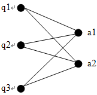

# 背景

本文主要针对广告检索领域的查询重写应用，根据查询-广告点击二部图，在MapReduce框架上实现SimRank++算法，关于SimRank++算法的背景和原理请参看前一篇文章《》。关于权值转移概率矩阵的实现请参看另一位文章《》。

# 准备工作

在广告检索系统的查询重写应用中，对象分为两种类型：查询和广告。对象间的关系为点击关系。关系图为二部图，图中的每一条边表示在相应的查询下点击了对应的广告，边的权值为点击次数。下图表示由3个查询和2个广告构成的完全二部图，图中略去了边的权值。



<!--more-->

其对应的权值矩阵为：
$$P=\left[\begin{array}{ccc:cc}
0 & 0 & 0 & w_{q_1a_1} & w_{q_1a_2} \\
0 & 0 & 0 & w_{q_2a_1} & w_{q_2a_2} \\
0 & 0 & 0 & w_{q_3a_1} & w_{q_3a_2} \\
\hdashline
w_{a_1q_1} & w_{a_1q_2} & w_{a_1q_3} & 0 & 0 \\
w_{a_2q_1} & w_{a_2q_2} & w_{a_2q_3} & 0 & 0
\end{array}\right]$$

把矩阵P右上角的非零子矩阵记为Q2A，左下角的非零子矩阵记为A2Q，则矩阵P可以写成分块矩阵的形式：$P=\left[ \begin{smallmatrix}0 & Q2A \\ A2Q & 0 \end{smallmatrix} \right]$

对应的矩阵P的转置矩阵为：$P^T=\left[ \begin{smallmatrix}0 & (A2Q)^T \\ (Q2A)^T & 0 \end{smallmatrix} \right]$

假设算法在第$k$轮迭代时计算出的相似性分数矩阵为：
$$S_k=\left[\begin{array}{ccc:cc}
1 & s_{q_1q_2}^k & s_{q_1q_3}^k & 0 & 0 \\
s_{q_2q_1}^k & 1 & s_{q_2q_3}^k & 0 & 0 \\
s_{q_3q_1}^k & s_{q_3q_2}^k & 1 & 0 & 0 \\
\hdashline
0 & 0 & 0 & 1 & s_{a_1a_2}^k \\
0 & 0 & 0 & s_{a_2a_1}^k & 1
\end{array}\right]$$

把矩阵$S_k$的左上角的非零子矩阵记为$(Q-Q)^k$，右下角的非零子矩阵记为$(A-A)^k$，则矩阵$S_k$可以简写为：$S_k=\left[ \begin{smallmatrix}(Q-Q)^k & 0 \\ 0 & (A-A)^k \end{smallmatrix} \right]$

根据SimRank++算法的计算公式可得，
$$\begin{align} P^T \cdot S_k \cdot P &= \begin{bmatrix}
0 & (A2Q)^T(A-A)^k \\
(Q2A)^T(Q-Q)^k & 0
\end{bmatrix} \cdot \begin{bmatrix}
0 & Q2A \\
A2Q & 0
\end{bmatrix} \\
&= \begin{bmatrix}
(A2Q)^T(A-A)^k(A2Q) & 0 \\
 0 & (Q2A)^T(Q-Q)^k(Q2A)
\end{bmatrix}
\end{align}$$

所以，二部图的相似性计算可以拆分成两部分：
$$ (Q-Q)^{k+1}=c \cdot (A2Q)^T(A-A)^k(A2Q) + I_{N(q)} - Diag(c \cdot (A2Q)^T(A-A)^k(A2Q)) $$
$$ (A-A)^{k+1}=c \cdot (Q2A)^T(Q-Q)^k(Q2A) + I_{N(a)} - Diag(c \cdot (Q2A)^T(Q-Q)^k(Q2A)) $$

其中， 操作符$Diag(M)$表示把矩阵$M$的非对角线元素全部都置为0得到的新矩阵，$N(q)$是参加计算的Query总数量，$N(a)$是参与计算的广告总数量。为了计算方便，公式可以变换为：
$$ (Q-Q)^{k+1}=c \cdot ((A-A)^k(A2Q))^T(A2Q) + I_{N(q)} - Diag(c \cdot ((A-A)^k(A2Q))^T(A2Q)) $$
$$ (A-A)^{k+1}=c \cdot ((Q-Q)^k(Q2A))^T(Q2A) + I_{N(a)} - Diag(c \cdot ((Q-Q)^k(Q2A))^T(Q2A)) $$
其中，$(A-A)^0=I_{N(a)}$，$(Q-Q)^0=I_{N(q)}$。

由于矩阵$(Q-Q)$和矩阵$(A-A)$的规模与原始的权值矩阵P相比，减少了很多。这样，通过把SimRank++算法的每一步都拆分成两个独立的操作，大大减少了算法操作数的规模，提高了算法的伸缩性。

# 迭代计算

由于SimRank算法依赖于矩阵乘法运算，因此这里用一个函数封装矩阵乘法运算MapReduce作业。函数的声明和主要参数如下：

> MatrixMultiply(String inputPathA, String inputPathB, String outputDirPath, double decayFactor, boolean transA, boolean trans_multiply_self, boolean symm_result, …)

参数的含义如下表所示：

| 参数 | 含义 |
| --- | --- |
| inputPathA	| 矩阵乘法的左操作数（矩阵A）的输入文件或目录 |
| inputPathB	| 矩阵乘法的右操作数（矩阵B）的输入文件或目录 |
| outputDirPath	| 运算结果的输出目录 |
| decayFactor	| SimRank算法的衰减因子，默认值为1.0 |
| transA	| 标识是否要在乘法运算前转置矩阵A |
| trans_multiply_self	| 若为真，则计算AT * A（忽略inputPathB参数） |
| symm_result	| 标识输出结果是否为对称矩阵，若为真，则只输出上（或下）对角阵 |

迭代计算的算法会产生大量的中间结果。对过期的中间结果应及时清理，否则占用的HDFS空间很可能会超过运行算法的账户配额，导致算法中途停止。我们通过输出输出目录的重复使用来及时清理中间结果。假设“MatrixMultiply”函数会在输出前自动删除outputDirPath目录内的所有内容。

计算两两Query之间的相似性分数的函数伪代码如下表所示：
```
computeQ2Q(curr_iter){
	if (0 == curr_iter)
	{
		inputPathA = inputPath_W_A2Q;
		inputPathB = null;
		outputPath = outputPath_S_Q2Q;
		MatrixMultiply(inputPathA, inputPathB, outputPath, decay_factor, true, true, true);
	}
	else {
		inputPathA = outputPath_S_A2A;
		inputPathB = inputPath_W_A2Q;
		outputPath = outputPath_M_Q2Q;
		MatrixMultiply(inputPathA, inputPathB, outputPath, 1.0, false, false, false);
		inputPathA = outputPath_M_Q2Q;
		outputPath = outputPath_S_Q2Q2;
		MatrixMultiply(inputPathA, inputPathB, outputPath, decay_factor, true, false, true);
}
```
计算两两Ad之间的相似性分数的函数伪代码如下所示：

```
computeA2A(curr_iter){
	if (0 == curr_iter)
	{
		inputPathA = inputPath_W_Q2A;
		inputPathB = null;
		outputPath = outputPath_S_A2A;
		MatrixMultiply(inputPathA, inputPathB, outputPath, decay_factor, true, true, true);
	}
	else {
		inputPathA = outputPath_S_Q2Q;
		inputPathB = inputPath_W_Q2A;
		outputPath = outputPath_M_A2A;
		MatrixMultiply(inputPathA, inputPathB, outputPath, 1.0, false, false, false);
		inputPathA = outputPath_M_A2A;
		outputPath = outputPath_S_A2A;
		MatrixMultiply(inputPathA, inputPathB, outputPath, decay_factor, true, false, true);
}
```
SimRank迭代计算的伪代码如下：
```
curr_iter = 0
while (curr_iter < iter_times)
{
	computeQ2Q(curr_iter);
	computeA2A(curr_iter);
	curr_iter++;
}
```
# 系列文章

- 
- 
- 
- 
