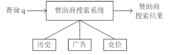
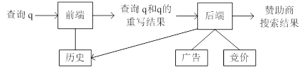
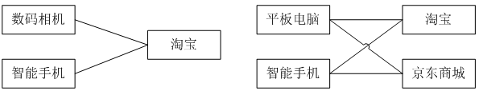
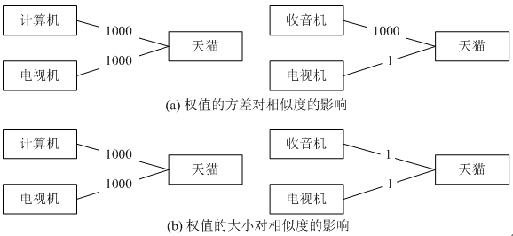

##一、算法应用背景

计算广告学(Computational Advertising)是一门广告营销科学，以追求广告投放的收益最大化为目标，重点解决用户与广告匹配的相关性和广告的竞价模型问题，涉及到自然语言处理、数据挖掘以及竞价营销、创意设计等诸多学科的融合。计算广告是根据给定的用户和网页内容，通过计算得到与之最匹配的广告并进行精准定向投放的一种广告投放机制，其目的是为用户提供最易于接受的优质广告；对于广告主的广告投放效果负责；综合用户和广告主之间的关系，进行广告竞价产生最大收益。

对于用户而言，计算广告存在赞助商搜索广告、浏览页面投放广告、社区人群广告等多种形式。其中，赞助商搜索(Sponsored Search)是一种特定的广告投放形式，其广告投放的目标位置是搜索引擎所返回的搜索结果页面。与其他广告投放形式不同，在赞助商搜索的场景中，搜索引擎既充当了网络媒体也充当了广告网络，因此赞助商搜索便成为广告主、用户和搜索引擎三方的一个博弈过程，博弈的目标是要使三方的总收益(Payoff)最大。
<!--more-->
理想情况下，赞助商搜索系统架构如下图所示。当一个新的查询q到达时，首先会利用查询中包含的关键词查询现有数据库中的各种数据，包括查询历史、广告数据和竞价数据，获得与查询q相关的广告，并按照竞拍价格排序规则将这些广告投放在查询结果的页面的相关位置。

实际应用中，一次竞价在概念上包括一个查询词或短语、一个广告和相应的竞标价格，表示当用户提交相应的查询词或短语时，广告主愿意付出不超过竞标价格的费用来使自己的广告得到展示和点击。在一个实际的赞助商搜索系统中，有许多查询没有足够数量的直接竞标广告，因而赞助商搜索系统应能够发现提交这些查询的用户可能感兴趣的非直接竞标广告。如果用户点击了系统推荐的这些广告，搜索引擎就能够获得一定的收入，广告主也获得了一些顾客。对于系统而言，挑战在于如何匹配到与输入查询相关的并且用户可能会点击的广告。

有研究表明，互联网用户在使用网页搜索功能时，所提交的查询短语具有以下两个特点：(1) 查询短语较短，平均长度为2.2个单词，其中常用的查询短语的平均长度为1.7个单词；(2) 查询短语的使用频率呈幂率分布(Power Law)，近50%的查询短语每小时的使用频率在5次以下。

在进行广告检索时，往往由于查询短语较短，只能够获得部分与查询相匹配的广告；同时，由于某些查询对应的直接竞标广告数据较少，数量不够在搜索结果页面中展示；另外，由于查询短语的使用频率呈幂率分布，往往会导致部分广告被频繁地检索到。为了解决这些问题，赞助商搜索系统通常都会引入查询重写机制。相应的赞助商搜索系统架构通常分裂成两个部分，如下图所示。

前端接受输入查询q并产生一系列重写结果，这些重写结果与查询q之间具有一定的相关性。比如，对于查询“相机”，查询“数码相机”和“摄影”可能是有用的，因为用户可能会对与这些查询相关的广告感兴趣。同时，查询“电池”和原始查询也具有一定的相关性，尽管它们在文本上毫不相关，因为用户在购买相机的时候也会对相机的备用零件感兴趣。原始查询和重写查询会被后端处理，与这些查询相关联的竞价广告会被检索出来。把系统架构分裂成两个部分降低了系统的复杂性。系统前端专注于查询重写，后端专注于处理快速变化的广告竞价数据、匹配相关内容和对检索结果排序。

目前已有许多查询重写方法被提出和应用，如查询替代和查询扩展等。其中，优化后的SimRank算法以大量的历史点击数据为基础，利用加权的广告点击二部图(Bipartite Graph)结构信息，计算出的查询相关性具有较高的精度，能够有效地实现查询重写。

##二、SimRank算法

许多应用领域都需要度量对象之间的相似性。目前主要有两大类相似性度量方法：(1) 基于内容(content-based)的特定领域(domain-specific)度量方法，如匹配文本相似度，计算项集合的重叠区域等；(2) 基于链接（对象间的关系）的方法，如PageRank、SimRank和PageSim等。最近的研究表明，第二类方法度量出的对象间相似性更加符合人的直觉判断。

SimRank算法是一种用于衡量结构上下文中个体相似度的方法，其基本思想是：如果两个对象a和b分别与另外两个对象c和d关联，且已知c与d是相似的，则a与b也是相似的；并且任意节点与其自身拥有最大的相似度值为1。SimRank算法的主要出发点是利用已有个体的相似度来推算其他与之有关联个体的相似度。

SimRank算法基于一个简单和直观的图论模型，它把对象和对象之间的关系建模为一个有向图G = (V, E)，其中V是有向图的节点集合，代表应用领域中的所有对象；E是有向图的边的集合，表示对象间的关系。对于图中的一个节点$a$，与其所有入边关联的邻节点集合(in-neighbors)记为$I(a)$，同时，其出边对应的邻节点集合(out-neighbors)集合记为$O(a)$。用$s(a, b)$表示对象$a$和对象$b$之间的相似性，其计算公式为：
$$
s(a,b) =
\begin{cases}
1, & a=b \\
\frac{c}{|I(a)||I(b)|} \sum_i^{|I(a)|} \sum_j^{|I(b)|} s\left( I_i(a),I_j(b) \right), & a \neq b \wedge I(a),I(b) \neq \emptyset\\
0, & \text{otherwise}
\end{cases}
$$
从该计算公式可以看出，个体$a$, $b$的相似度取决于所有与$a$, $b$相连节点的相似度。式中$c$是一个常量衰减因子。

上述公式可以用矩阵的形式表示出来。假设S表示有向图G的SimRank分数矩阵，其中$s(i,j)$表示对象$i$和$j$之间的相似性分数； P表示G的连接矩阵，其中$P(i,j)$表示从顶点$i$到顶点$j$的边数，则
$$\begin{aligned}
s^{k+1}(a,b) &= \frac{c}{|I(a)||I(b)|} \sum_i^n \sum_j^n p_{i,a} \cdot s^{k}(a,b) \cdot p_{j,b} \\
&= c \cdot \sum_i^n \sum_j^n \left( \frac{p_{i,a}}{\sum_i^n p_{i,a}} \right) \cdot s^{k}(a,b) \cdot \left( \frac{p_{j,b}}{\sum_j^n p_{j,b}} \right)
\end{aligned}$$
用矩阵的符号表示，即为：
$$ S^k = \begin{cases}
cW^T S^{k-1} W + I_n - Diag(diag(cW^T S^{k-1} W)), &k>0\\
I_n, & k=0
\end{cases} $$
其中，矩阵$W$表示按列归一化的$P$矩阵， $I$是$n×n$的单位矩阵。对于一个矩阵$X$，$diag(X)$表示获得由所有$X$的主对角线上的元素构成的向量；对于一个向量$x$，$Diag(x)$操作得到相应的对角矩阵，即$x = diag(Diag(x))$。由于任意对象和自己的相似度值为1，所以加上项$I_n - Diag(diag(cW^T S^{k-1} W))$，其作用是把矩阵 的主对角线元素设为1。

把SimRank计算公式用矩阵乘法的形式表示，便于利用MapReduce分布式并行编程模型实现，从而可以大幅度提升算法的扩展能力，使之能够处理千万级甚至上亿级的数据规模。

##三、SimRank++算法
在广告检索领域，用户在给定查询下点击广告链接的活动也可以抽象成一个典型的二部图，其中顶点分为两类：查询和广告；每条边表示在给定的查询下点击了对应的广告。SimRank算法正是基于对广告点击二部图的分析处理来进行查询重写。根据SimRank算法的基本思想可以得出两个结论：(1) 关联到相似广告的查询是相似的；(2) 关联到相似查询的广告也是相似的。

原始的SimRank算法在该应用领域存在的一个问题就是在完全二部图中，算法计算出来的分数和人的直观是不一致的，一个具体的例子如下图所示，图中两个完全二部图的相似性分数根据原始SimRank算法计算的结果如下表所示，计算时采用的衰减因子为0.8。

|迭代|数码相机-智能手机|平板电脑-智能手机|
|---|---|---|
|1|0.8|0.4|
|2|0.8|0.56|
|3|0.8|0.624|
|4|0.8|0.6496|
|5|0.8|0.65984|
|6|0.8|0.663936|
|7|0.8|0.6655744|

从图中我们可以看出“平板电脑-智能手机”有更多的证据（更多的共同连接对象）表明它们之间的相似性更高，然而，尽管“平板电脑-智能手机”的相似性分数随着迭代的进行不停地增加，原始的SimRank算法在初始的7轮迭代中计算出来的“平板电脑-智能手机”相似性分数总是低于“数码相机-智能手机”的相似性分数。

一个可行的校正方法是对原始的SimRank算法的迭代公式进行修改，添加一个证据(evidence)因子，定义为：$$evidence(q,q')=\sum_{i=1}^{|E(q)\cap E(q')|}{\frac1{2^i}}$$
其中，$E(q)$表示和对象$q$相关联的所有对象， $|E(q)∩E(q')|$表示节点$q$和节点$q'$共有邻居的数目。可见$|E(q)∩E(q')|$和$evidence(q, q')$呈正比关系， $|E(q)∩E(q')|$值越大，$evidence(q, q')$越接近于1。相应地，新的计算公式变为：$$ s_{evidence}(q,q')=evidence(q,q') \cdot s(q,q') $$

利用新公式重新计算上述问题的相似性分数，结果如下表，可以看到新的方法在第二轮迭代时，“平板电脑-智能手机”的相似性分数就高于“数码相机-智能手机”的相似性分数。

|迭代|数码相机-智能手机|平板电脑-智能手机|
|---|---|---|
|1|0.4|0.3|
|2|0.4|0.42|
|3|0.4|0.468|
|4|0.4|0.4872|
|5|0.4|0.49488|
|6|0.4|0.497952|
|7|0.4|0.4991808|

另一方面，原始的SimRank算法没有考虑边的权值。在下图(a)所示的情况下，“计算机-电视机”的相似度显然比“收音机-电视机”的相似度高，因为前两个查询点击同一个广告的次数相同，而后两个查询点击同一个广告的次数相差很大。然而，由于原始的SimRank算法不考虑广告的点击次数，只考虑是不是点击了相同的广告，因而其计算出来的“计算机-电视机”的相似度和“收音机-电视机”的相似度相同。同样，在下图(b)所示的情况下，“计算机-电视机”的相似度依然应该比“收音机-电视机”的相似度高，因而尽管每个查询对都以相同的次数点击了同一个广告，但是前一个查询对点击的次数在数量上要比第二个查询对要多，更多的点击次数代表了两个查询之间更高的相似度。原始的SimRank算法再一次不能很好地处理这种情况，它只是简单地忽略了不同查询下的广告点击次数，因而计算出的相似性分数值不够精确。

考虑二部图边的权值，可以改进SimRank算法的计算结果。考虑权值时的两个基本出发点是：如果两个节点对应的权值的方差相等，那么权值较大的节点对之间的相似性较高；如果两个节点对应的权值的方差不相等，那么方差较小并且权值较大的节点对之间的相似性较高。

引入一个新的函数$p(·,·)$表示二部图中节点间的转移概率：
$$\begin{aligned} p(a,a)&=1-\sum_{i \in E(a)}p(a,i),\\
p(a,i)&=spread(i) \cdot normalized\_weight(a,i),\forall i \in E(a)\\
spread(i)&=\frac1{variance(i)} \quad \text{or} \quad e^{-variance(i)}\\
normalized\_weight(a,i) &= \frac{w(a,i)}{\sum_{j \in E(a)}w(a,j)}
\end{aligned}$$

从而，新的算法迭代公式如下：
$$s_{weighted}(q,q')=evidence(q,q') \cdot c\sum_{i \in E(q)} \sum_{j \in E(q')} W(q,i)W(q',j)s_{weighted}(i,j)$$
$$s_{weighted}(a,a')=evidence(a,a') \cdot c\sum_{i \in E(a)} \sum_{j \in E(a')} W(a,i)W(a',j)s_{weighted}(i,j)$$

其中，$q$和$q'$表示任意两个查询，$a$和$a'$表示任意两个广告，因子$W(q,i)$和$W(a,i)$的定义如下：
$$W(q,i)=spread(i) \cdot normalized\_weight(q,i) = e^{-variance(i)} \frac{w(q,i)}{\sum_{j \in E(q)}w(q,j)} \\
W(a,i)=spread(i) \cdot normalized\_weight(a,i) = e^{-variance(i)} \frac{w(a,i)}{\sum_{j \in E(a)}w(a,j)}$$

对SimRank算法进行上述两个方面的扩展，即通过“权值”和“证据值”对原始计算结果进行校正，所得的新算法就是SimRank++算法。SimRank++算法由Antonellis等人于2008年专门针对赞助商广告检索领域的查询重写应用提出的。

类似于SimRank算法，SimRank++算法也可以写成矩阵运算的形式，如下式所示。
$$ S^k = \begin{cases}
cP^T S^{k-1} P + I_n - Diag(diag(cP^T S^{k-1} P)), &k>0\\
I_n, & k=0
\end{cases} $$
其中，矩阵$P$是二部图中节点间的转移概率矩阵。

SimRank++算法针对查询重写的具体应用，可以很好地衡量不同查询关键词之间的相似性，通过使用雅虎搜索的数据进行实验，证实了SimRank++算法可以为用户提供更多感兴趣的查询结果，增加广告的点击率，加强系统的互动体验，提升搜索服务的质量。

用矩阵运算表示的SimRank++算法如下：

    输入: 转移概率矩阵P，证据值矩阵V，衰减因子c，迭代步数k
    输出: 相似性分数矩阵S
    For i = 1:k, do
        temp = c PT S P // PT是P的转置矩阵
        S = temp + I – Diag(diag(temp))
    End
    S = V .* S

由于实际的互联网广告检索系统包含了数以亿计查询和广告，数据规模非常庞大，导致相应的广告点击二部图也非常巨大且难以分割。因此，若要在实际应用中利用SimRank++算法重写查询，需要一种提升算法可扩展性的方法。通过MapReduce并行计算模型框架可以有效地提高算法的扩展能力。为避免文章过于冗长，其他具体的实现细节在后续文章中给出，敬请期待。

实现：

- 
- 
- 
