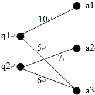
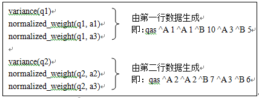
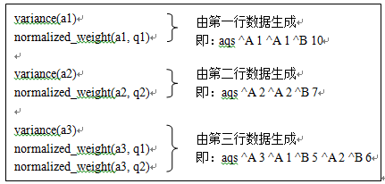

本文主要针对广告检索领域的查询重写应用，根据查询-广告点击二部图，在MapReduce框架上实现SimRank++算法，关于SimRank++算法的背景和原理请参看前一篇文章《》。关于算法迭代过程的实现请参看另一位文章《》。

SimRank++的矩阵形式的计算公式为：
$$ S^k = \begin{cases}
cP^T S^{k-1} P + I_n - Diag(diag(cP^T S^{k-1} P)), &k>0\\
I_n, & k=0
\end{cases} $$

算法主要步骤如下：

+ Step1: 计算权值矩阵，并获取最大Query编号和最大广告编号；
+ Step2: 以Step1的输出作为输入，迭代计算SimRank相似度。
+ Step3: 计算证据矩阵，并用计算结果修正Step2的输出，计算出最终的经过归一化的相似度分数。
+ Step4: 把Step3的输出转化为固定的格式，得到最终的相似度分数结果。

其中Step2迭代计算SimRank相似度分数比较复杂，由一系列的MapReduce作业组成。本文主要关注Step1，即计算权值矩阵的计算。Step2~4将在后续的文章中给出。
<!--more-->
## 1.输入文件的格式

为了简单起见，在我们的实现中，用点击次数作为边的权值。一个更好的选择是用广告点击率(Click Through Rate, CTR)作为权值，理由如下：某个广告在q1下展示10000次，点击100次（CTR为0.01）；在q2下展示1000次，点击90次（CTR为0.09）；在q3下展示1000次，点击100次（CTR为0.1）；显然q3和q2的相似度要比q3和q1的相似度要高，然而如果只考虑点击次数，那么算法会认为q3和q1的相似度比q3和q2的高。

期待的输入数据的文件格式：

1. Query和广告的点击关系数据文件（以下记为qas文件）的每一行的格式如下：
``qas ^A query_id { ^A ad_id ^B click_num}``
其中，{ }表示内部的内容可以重复1次或多次，但至少一次；“qas”的标识字符串；‘^A’是ASCII码为1的不可见字符；‘^B’是ASCII码为2的不可见字符。

2. 广告和Query的点击关系数据文件（以下记为aqs文件）的每一行的格式如下：
``aqs ^A ad_id { ^A query_id ^B click_num}``
其中，{ }表示内部的内容可以重复1次或多次，但至少一次；“aqs”的标识字符串；‘^A’是ASCII码为1的不可见字符；‘^B’是ASCII码为2的不可见字符。



上图所示的查询和广告之间的点击关系对应的文件格式如下：
```
    qas文件
    qas ^A 1 ^A 1 ^B 10 ^A 3 ^B 5
    qas ^A 2 ^A 2 ^B 7 ^A 3 ^B 6

    aqs文件
    aqs ^A 1 ^A 1 ^B 10
    aqs ^A 2 ^A 2 ^B 7
    aqs ^A 3 ^A 1 ^B 5 ^A 2 ^B 6
```

## 2. 思路分析

权值矩阵元素的计算公式为：
$$W(q,i)=spread(i) \cdot normalized\_weight(q,i) = e^{-variance(i)} \frac{w(q,i)}{\sum_{j \in E(q)}w(q,j)} \\
W(a,i)=spread(i) \cdot normalized\_weight(a,i) = e^{-variance(i)} \frac{w(a,i)}{\sum_{j \in E(a)}w(a,j)}$$

可以看出， $variance(a)$的计算需要用到aqs文件， $normalize\\_weight(q,a)$的计算需要用到qas文件； $variance(q)$的计算需要用到qas文件，$normalize\\_weight(a,q)$ 的计算需要用到aqs文件。从而，在计算$W(a,q)$和 $W(q,a)$时都要用到aqs文件和qas文件，这使得MapReduce算法的设计比较困难。

考虑前面所述的一个简单例子。Mapper任务在处理qas文件时会计算出如下所示的内容。



Mapper任务在处理aqs文件时会计算出如下所示的内容。



在计算$W(q,a)$时需要使用到$variance(a)$和$normalized\\_weight(q, a)$；相应地，在计算$W(a,q)$时需要使用到$variance(q)$和$normalized\\_weight(a, q)$。因此，根据以上分析，对于一个特定的$q$和$a$，需要把Map任务的输出中的$variance(a)$和$normalized\\_weight(q, a)$ "Shuffle"到同一个Reduce节点，由该Reduce节点计算出$W(q,a)$；同理，需要把Map任务的输出中的$variance(q)$和$normalized\\_weight(a, q)$ "Shuffle"到同一个Reduce节点，由该Reduce节点计算出$W(a,q)$。

另外，可以看出，在计算$W(q1,a), W(q2,a), \cdots$ 时都需要用到$variance(a)$，因此我们希望计算的Reduce节点接受到的值列表中$variance(a)$项排在所有$normalized\\_weight(q, a)$项之前。

MapReduce框架在记录到达Reducer之前按键对记录排序，但键所对应的值并没有被排序。由于值来自不同的map任务，所以在多次运行程序时，值的出现顺序并不固定，导致每次运行作业的时间会各有不同。一般来说，大多数MapReduce程序无需考虑值在Reduce函数中出现的顺序。但是，像我们这里碰到的情况一样，有时确实需要通过对键进行排序和分组等以实现对值的排序。通过MapReduce框架辅助对记录值排序的方法总结如下：

(1)	定义包括自然键和自然值的组合键。
(2)	键的comparator根据组合键对记录进行排序，即同时利用自然键和自然值进行排序。
(3)	针对组合键partitioner和分组comparator在进行分区和分组时均只考虑自然键。

基于以上分析，计算权值矩阵的MapReduce任务需要小心地设计Map任务输出的Key和Value的数据结构以及Partitioner函数。

## 3. 算法实现

### (1)	Map任务输出的键(Key)的数据结构

键(Key)由一个三元组构成：$< type, index1, index2 >$
type用于标识index1是广告的编号(0)，还是Query的编号(1)；当$type = 0$时，对应的值(value)表示$normalized\\_weight(q,a)$，其中$q$等于index1，$a$等于index2；当$type = 1$时，value表示$normalized\\_weight(a,q)$，其中$a$等于index1，$q$等于index2；
另外，当$index2 = -1$时，表示对应的值为方差（$variance(index1)$）。设为-1是为了保证同一组Key对应的值列表中方差项排在第一个。

键(Key)的三个元素都参与comparator的比较。

### (2)	Map任务输出的值(Value)的数据结构

值(Value)有一个二元组构成：$< index, value >$，其中index总是等于对应的键的第三个元素index2。这里看似冗余，其实不然。因为我们在利用MapReduce框架辅助排序时，分组函数(GroupComparator)只比较Key的前两个元素，忽略Key的第三个元素，这样只有Key的前两个元素的值相同，那么他们的值将合并到同一个列表中，有唯一的一个“Reduce”函数处理。MapReduce框架在默认情况下只会把key完全相同值合并到同一个列表中。因此我们需要设置OutputValueGroupingComparator为我们自定义的GroupComparator。可以利用如下的语句设置：

```
conf.setOutputValueGroupingComparator(GroupComparator.class);
```

### (3)	分区函数

分区函数控制Map任务的每个输出记录由哪一个Reduce节点处理。在权值矩阵的计算作业中该函数的地位特别重要。根据上一小节的分析和辅助排序的要求，分区函数只考虑键的前两个元素。Partition函数的代码如下:
```
public int getPartition(Key key, Value value, int numPartitions)
{
    int offset = numPartitions / 2;
    if (key.type == 0)
    {
        int base = numPartitions - offset;
        return key.index1 % base + offset;
    }
    return key.index1 % offset;
}
```

### (4)	Map函数和Reduce函数

Map函数和Reduce函数并行地处理主要的工作。其中Map函数读入qas文件，计算出$variance(q)$和$normalized\\_weight(a, q)$；读入aqs文件，输出$variance(a)$和$normalized\\_weight(q, a)$。

同时为了以后的计算方便，Map函数还记录下最大的Query编号和最大的Ad编号(目的是计算出Query-AD矩阵的大小)。由于多个Map函数之间不能相互通信，为了得到全局的最大Query编号和Ad编号，每个Map函数结束的时候在一个指定的HDFS目录下新建一个以本函数统计出的当前最大编号为文件名的空文件，前提条件是此时该指定目录下还没有更大编号的文件存在。

Reduce函数比较简单，直接根据公式计算出最终的权值就可以了。Reduce输出的Key是一个二元组<row, col>，表示权值矩阵的行号和列号。输出的值为相应的权值。由于我们在同一个作业中同时计算了Query-Ad的权值矩阵和Ad-Query的权值矩阵，这两个矩阵在后面的SimRank实现过程中需要单独使用，因此必须要把两种的输出区分开来。我们使用MultipleOutputs类定义了两个数据收集对象，这两个数据收集对象输出的文件名有不同的前缀。

Mapper和Reducer的伪代码如下:

计算权值矩阵的Map函数:
```
Setup() {
    currMaxQueryId ← 0
    currMaxAdId ← 0
    dir ← “hdfs://namenode/…/XXX”
}
Map(line_no, line_txt) {
    content ← Parser(line_txt)
    if (content.type == 1)
        currMaxQueryId ← max(currMaxQueryId, content. id)
    else
        currMaxAdId ← max(currMaxAdId, content. id)

    weight_sum ← sum(content.weights)
    variance ← var(content.weights)
    emit <content.type, content.id, -1>, <-1, variance>
    for e in content.elements {
        normalized_weight ← e.weight / seight_sum
        emit <content.type, content.id, e.id>, <e.id, variance>
    }
}
Close() {
    Query_id ← getCurrentQueryId(dir)
    Ad_id ← getCurrentAdId(dir)
    if (currMaxQueryId > Query_id)
        touch dir/ currMaxQueryId
    if (currMaxAdId > Ad_id)
        touch dir/ currMaxAdId
}
```
计算权值矩阵的Reduce函数:
```
Reduce(key, valueList) {
    variance ← valueList[0]
    spread ← exp(-variance)
    for v in valueList[1]…valueList[N]
        emit <key.index1, v.index>, spread * v.value
}
```

## 系列文章

- 
- 
- 
- 
