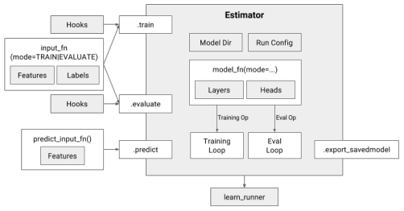
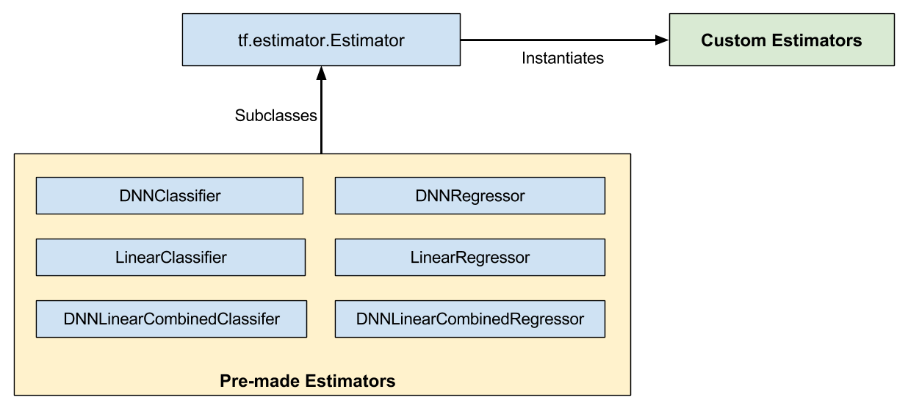

## Tensorflow高阶API简介

在tensorflow高阶API（Estimator、Dataset、Layer、FeatureColumn等）问世之前，用tensorflow开发、训练、评估、部署深度学习模型，并没有统一的规范和高效的标准流程。Tensorflow的实践者们基于低阶API开发的代码在可移植性方面可能会遇到各种困难。例如，单机可以运行的模型希望改成能够分布式环境下运行需要对代码做额外的改动，如果在一个异构的环境中训练模型，则还需要额外花精力处理哪些部分跑在CPU上，哪些部分跑在GPU上。当不同的机器有不同数量的GPU数量时，问题更加复杂。

为了能够快速支持新的网络架构的实验测试，深度学习框架都很重视网络架构搭建的灵活性需求，因此能让用户随心所欲地自定义代码实现是很重要的一块功能。

模型构建的灵活性与简洁性需求看似是矛盾的。从开发者的视角，简洁性意味着当模型架构确定时实现不应该需要太多额外的技能要求，不必对深度学习框架有很深刻的洞察，就能够实验不同的模型特性。在内置简洁性属性的框架下开发者能够较轻松地开发出高质量的鲁棒性较好的模型软件，不会一不小心就踩到坑里。另一方面，灵活性意味着开发者能够实现任意的想要的模型结构，这需要框架能够提供一些相对低价的API。类似于Caffe这样的深度学习框架提供了DSL（domain specific language）来描述模型的结构，虽然搭建已知的成熟的模型架构比较方便，但却不能轻松搭建任意想要的模型结构。这就好比用积木搭建房子，如果现在需要一个特殊的以前没有出现过的积木块以便搭建一个特殊的房子，那就无计可施了。

Tensorflow高阶API正是为了同时满足模型构建的灵活性与简洁性需求应运而生的，它能够让开发者快速搭建出高质量的模型，又能够使用结合低阶API实现不受限制的模型结构。
<!--more-->
下面就来看看tensorflow中有哪些常用的高阶API吧。


### Estimator（估算器）
Estimator类是机器学习模型的抽象，其设计灵感来自于典典大名的Python机器学习库Scikit-learn。Estimator允许开发者自定义任意的模型结构、损失函数、优化方法以及如何对这个模型进行训练、评估和导出等内容，同时屏蔽了与底层硬件设备、分布式网络数据传输等相关的细节。



```
tf.estimator.Estimator(
    model_fn=model_fn,  # First-class function
    params=params,  # HParams
    config=run_config  # RunConfig
)
```
要创建Estimator，需要传入一个模型函数、一组参数和一些配置。

- 传入的参数应该是模型超参数的一个集合，可以是一个dictionary。
- 传入的配置用于指定模型如何运行训练和评估，以及在哪里存储结果。这个配置是一个RunConfig对象，该对象会把模型运行环境相关的信息告诉Estimator。
- 模型函数是一个Python函数，它根据给定的输入构建模型。

Estimator类有三个主要的方法：train/fit、evaluate、predict，分别表示模型的训练、评估和预测。三个方法都接受一个用户自定义的输入函数input_fn，执行input_fn获取输入数据。Estimator的这三个方法最终都会调用模型函数（model_fn）执行具体的操作，不同方法被调用时，传递给model_fn的mode参数也是不同的，如下一小节中描述的那样，mode参数是让用户在编写模型函数时知道当前定义的操作是用在模型生命周期的哪一个阶段。

Tensorflow本身还提供了很多内置的开箱即用的Estimator，内置的 Estimator 是 tf.estimator.Estimator 基类的子类，而自定义 Estimator 是 tf.estimator.Estimator 的实例，如下图所示。


### 模型函数

模型函数是用户自定义的一个python函数，它定义了模型训练、评估和预测所需的计算图节点（op）。

模型函数接受输入特征和标签作为参数，同时用mode参数来告知用户模型是在训练、评估或是在执行推理。mode是tf.estimator.ModeKeys对象，它有三个可取的值：TRAIN、EVAL、PREDICT。模型函数的最后一个参数是超参数集合，它们与传递给Estimator的超参数集合相同。模型函数返回一个EstimatorSpec对象，该对象定义了一个完整的模型。EstimatorSpec对象用于对操作进行预测、损失、训练和评估，因此，它定义了一个用于训练、评估和推理的完整的模型图。

一个简单的模型函数示例如下：

```
def model_fn(features, target, mode, params)
  predictions = tf.stack(tf.fully_connected, [50, 50, 1])
  loss = tf.losses.mean_squared_error(target, predictions)
  train_op = tf.train.create_train_op(
    loss, tf.train.get_global_step(),
    params[’learning_rate’], params[’optimizer’])
  return EstimatorSpec(mode=mode,
                       predictions=predictions,
                       loss=loss,
                       train_op=train_op)
```

### Dataset（数据集）

在tensorflow中，构建模型输入流水线的最佳实践就是使用Dataset API。Dataset API底层使用C++实现，能够绕过python的一些性能限制，性能很好。

Dataset是对训练、评估、预测阶段所用的数据的抽象表示，其提供了数据读取、解析、打乱（shuffle）、过滤、分批（batch）等操作，是构建模型输入管道的利器，我将会在另外一篇文章《[基于Tensorflow高阶API构建大规模分布式深度学习模型系列：基于Dataset API处理Input pipeline](https://zhuanlan.zhihu.com/p/38421397)》中详细介绍。

### Feature Columns（特征列）

Feature Columns是特征工程的利器，其能够方便地把原始数据转换为模型的输入数据，并提供了一些常用的数据变换操作，如特征交叉、one-hot编码、embedding编码等。关于Feature Column，也将会在另外一篇文章中详细介绍。

### Layers

Layer是一组简单的可重复利用的代码，表示神经网络模型中的“层”这个概率。Tensorflow中的layer可以认为是一系列操作（op）的集合，与op一样也是输入tensor并输出tensor的（tensor-in-tensor-out)。Tensorflow中即内置了全连接这样的简单layer，也有像inception网络那样的复杂layer。使用layers来搭建网络模型会更加方便。

### Head

Head API对网络最后一个隐藏层之后的部分进行了抽象，它的主要设计目标是简化模型函数（model_fn）的编写。Head知道如何计算损失（loss）、评估度量标准（metric)、预测结果（prediction）。为了支持不同的模型，Head接受logits和labels作为参数，并生成表示loss、metric和prediction的张量。有时为了避免计算完整的logit张量，Head也接受最后一个隐藏的激活值作为输入。

一个使用Head简化model_fn编写的例子如下：
```
def model_fn(features, target, mode, params):
  last_layer = tf.stack(tf.fully_connected, [50, 50])
  head = tf.multi_class_head(n_classes=10)
  return head.create_estimator_spec(
    features, mode, last_layer,
    label=target,
    train_op_fn=lambda loss: my_optimizer.minimize(loss, tf.train.get_global_step())
```

我们也可以用一个Heads列表来创建一个特殊类型的Head，来完成多目标学习的任务，如下面的例子那样。
```
def model_fn(features, target, mode, params):
  last_layer = tf.stack(tf.fully_connected, [50, 50])
  head1 = tf.multi_class_head(n_classes=2,label_name=’y’, head_name=’h1’)
  head2 = tf.multi_class_head(n_classes=10,label_name=’z’, head_name=’h2’)
  head = tf.multi_head([head1, head2])
  return head.create_model_fn_ops(features,
    features, mode, last_layer,
    label=target,
    train_op_fn=lambda loss: my_optimizer.minimize(loss, tf.train.get_global_step())
```

### 总结

Tensorflow高阶API简化了模型代码的编写过程，大大降价了新手的入门门槛，使我们能够用一种标准化的方法开发出实验与生产环境部署的代码。使用Tensorflow高阶API能够使我们避免走很多弯路，提高深度学习的实践效率，我们应该尽可能使用高阶API来开发模型。

### 参考资料

- [TensorFlow Estimators: Managing Simplicity vs. Flexibility in High-Level Machine Learning Frameworks](https://arxiv.org/abs/1708.02637)
- [自定义estimators](https://www.tensorflow.org/get_started/custom_estimators)
- [Feature columns](https://www.tensorflow.org/get_started/feature_columns)
