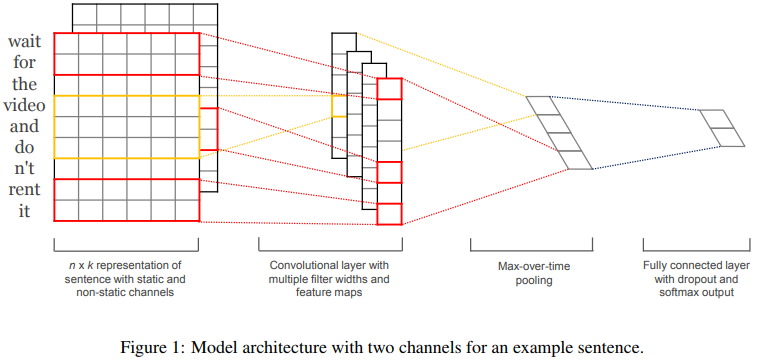
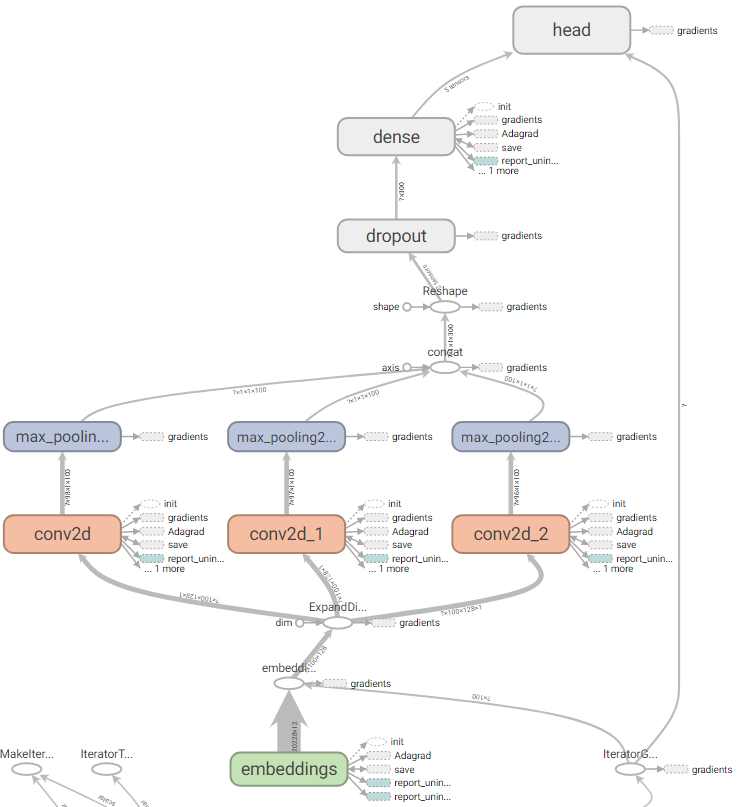

Tensorflow在1.4版本中引入了`tf.estimator.train_and_evaluate`函数，用来替换老版中Experiment类提供的功能。`tf.estimator.train_and_evaluate`简化了训练、评估和导出Estimator模型的过程，抽象了模型分布式训练和评估的细节，使得同样的代码在本地与分布式集群上的行为一致。

这意味着使用`train_and_evaluate` API，我们可以在本地和分布式集群上、不同的设备和硬件上跑同样的代码，而不需要修改代码已适应不同的部署环境。而且训练之后的模型可以很方便地导出以便在打分服务（tensorflow serving）中使用。

本文简要介绍如何自定义Estimator模型并通过使用`tf.estimator.train_and_evaluate`完成训练和评估。

主要步骤：

1. 构建自己的Estimator模型
2. 定义在训练和测试过程中数据如何输入给模型
3. 定义传递给`tf.estimator.train_and_evaluate`函数的训练、评估和导出的详述参数(TrainSpec and EvalSpec)
4. 使用`tf.estimator.train_and_evaluate`训练并评估模型

<!--more-->

## 文本分类任务

在介绍详细的模型开发步骤之前，先看一下我们要完成的作品的目标：文本分类。文本分类在很多场景都有应用，这里就不详述了。

我们使用的数据集是《[DBPedia Ontology Classification Dataset](https://github.com/le-scientifique/torchDatasets/raw/master/dbpedia_csv.tar.gz)》(可点击下载)，是从数据集DBpedia 2014中挑选的14个类别的互不重叠的本体（Company, EducationalInstitution, Artist, Athlete, OfficeHolder, MeanOfTransportation, Building, NaturalPlace, Village, Animal, Plant, Album, Film, WrittenWork），每个本体类别随机选择了40,000 个训练样本和5,000个测试样本。因此，总共有560,000个训练样本和70,000个测试样本。

>The files train.csv and test.csv contain all the training samples as comma-sparated values. There are 3 columns in them, corresponding to class index (1 to 14), title and content. The title and content are escaped using double quotes ("), and any internal double quote is escaped by 2 double quotes (""). There are no new lines in title or content.

在训练过程了，我们丢弃了title字段，仅使用content字段的内容去拟合类标签。

## 网络结构

文本实现一种基于CNN网络的文本分类模型，该模型由Yoon Kim在论文《[Convolutional Neural Networks for Sentence Classification](https://arxiv.org/abs/1408.5882)》中提出，网络结构如下图所示。



具体地，网络的输入层为一个定长为$n$的句子（不定长的句子用固定的tokenerm填充），句子中的每个词经过embedding层映射为一个$m$维的实数向量，这样每个句子就转换为一个二维的$n \times m$的矩阵。

然后在此矩阵上应用多个不同大小的卷积操作，得到多个特征映射（feature map）。例如，一个窗口大小为$h \times m$的卷积过滤器$w \in R^{hm}$作用在包含$h$个词向量的窗口上，得到一个新的特征$c_i=f(w \cdot x_{i:i+h-1} + b)$，其中$b$是偏重，$f$是一个非线性函数，比如tanh函数。该卷积过滤器作用在当前句子对应的每一个可能的词向量窗口$\{x_{1:h},x_{2:h+1}, \cdots, x_{n-h+1:n} \}$上，得到一个特征映射${\bf {c}}=[ c_1, c_2, \cdots, c_{n-h+1} ]$ 。

网络会同时应用多个不同size $h$的卷积操作，这样就能得到多组特征映射，每组特征的维数为$R^{n-h+1}$。假设一共有$k$组特征映射。接着在每组特征映射上执行一个最大池化操作（max-overtime
pooling operation），即$\hat{c}=max\{ {\bf {c}} \}$。最大池化操作用来捕捉每一组特征映射中最重要的特征，同时使得不同size的特征映射塌陷到一个固定维数为1的特征上。这样$k$组特征映射就映射到一个$k$维的特征表示向量上。

最后，经过了前面的embedding层，卷积层，池化层之后，再接几个全连接层，这样网络结构就完整了。



## 构建Estimator

Tensorflow的Estimator类提供了分布式模型训练和评估的内置支持，屏蔽了不同底层硬件平台（CPU、GPU、TPU）的差异。因此，建议大家总是使用Estimator来封装自己的模型。Tensorflow还提供了一些“Pre-made”的Estimator的子类可以用来高效地创建一些常用的标准模型，比如常用的“wide and deep”模型就可以用`DNNLinearCombinedClassifier`来创建。

Estimator的核心是模型函数（model function），模型函数构建训练、评估和预测用的计算图。当使用pre-made的Estimator时，模型函数已经为我们实现好了。当我们使用自定义的Estimator来创建自己的模型时，最重要的工作就是编写自己的模型函数。

模型函数的签名如下：
```
def my_model_fn(
   features, # This is batch_features from input_fn
   labels,   # This is batch_labels from input_fn
   mode,     # An instance of tf.estimator.ModeKeys
   params):  # Additional configuration
```

前两个参数是输入函数(input_fn)返回的特性和标签，mode参数表明调用者是在训练、预测还是评估，params是其他一些自定义参数，通常是一个dict。

|Estimator method |	Estimator Mode|
|---|---|
|train()	| ModeKeys.TRAIN|
|evaluate()	| ModeKeys.EVAL|
|predict()	| ModeKeys.PREDICT|

在模型函数内部，需要定义网络对应的计算图（graph)，并为模型在三个不同的阶段（训练、评估、预测）指定额外的操作，通过EstimatorSpec对象返回。

在训练阶段返回的EstimatorSpec对象需要包含计算loss和最小化loss的操作（op）；在评估阶段返回的EstimatorSpec对象需要包含计算metrics的操作，已经跟模型导出有个的操作；在预测阶段返回的EstimatorSpec对象需要包含跟获取预测结果有个的操作。具体如何定义这些EstimatorSpec对象可以参考[官方文档](https://www.tensorflow.org/guide/custom_estimators?hl=zh-cn)。

通常情况下，自己定义不同阶段的EstimatorSpec对象比较麻烦，这时可以用到另一个高阶API Head来帮忙简化开发任务。

我们的整个模型函数的代码如下：
```
def my_model(features, labels, mode, params):
  sentence = features['sentence']
  # Get word embeddings for each token in the sentence
  embeddings = tf.get_variable(name="embeddings", dtype=tf.float32,
                               shape=[params["vocab_size"], FLAGS.embedding_size])
  sentence = tf.nn.embedding_lookup(embeddings, sentence) # shape:(batch, sentence_len, embedding_size)
  # add a channel dim, required by the conv2d and max_pooling2d method
  sentence = tf.expand_dims(sentence, -1) # shape:(batch, sentence_len/height, embedding_size/width, channels=1)

  pooled_outputs = []
  for filter_size in params["filter_sizes"]:
      conv = tf.layers.conv2d(
          sentence,
          filters=FLAGS.num_filters,
          kernel_size=[filter_size, FLAGS.embedding_size],
          strides=(1, 1),
          padding="VALID",
          activation=tf.nn.relu)
      pool = tf.layers.max_pooling2d(
          conv,
          pool_size=[FLAGS.sentence_max_len - filter_size + 1, 1],
          strides=(1, 1),
          padding="VALID")
      pooled_outputs.append(pool)
  h_pool = tf.concat(pooled_outputs, 3) # shape: (batch, 1, len(filter_size) * embedding_size, 1)
  h_pool_flat = tf.reshape(h_pool, [-1, FLAGS.num_filters * len(params["filter_sizes"])]) # shape: (batch, len(filter_size) * embedding_size)
  if 'dropout_rate' in params and params['dropout_rate'] > 0.0:
    h_pool_flat = tf.layers.dropout(h_pool_flat, params['dropout_rate'], training=(mode == tf.estimator.ModeKeys.TRAIN))
  logits = tf.layers.dense(h_pool_flat, FLAGS.num_classes, activation=None)

  optimizer = tf.train.AdagradOptimizer(learning_rate=params['learning_rate'])
  def _train_op_fn(loss):
    return optimizer.minimize(loss, global_step=tf.train.get_global_step())

  my_head = tf.contrib.estimator.multi_class_head(n_classes=FLAGS.num_classes)
  return my_head.create_estimator_spec(
    features=features,
    mode=mode,
    labels=labels,
    logits=logits,
    train_op_fn=_train_op_fn
  )
```

## 定义输入流 input pipeline

在Tensorflow中定义网络输入推荐使用[Dataset API](https://zhuanlan.zhihu.com/p/38421397)。

在本文的文本分类任务中，原始训练数据的格式在前面已经介绍过，每一行是逗号分隔的3列的csv格式的数据。第一列是类标签，第三列是我们用来作为输入的句子。首先我们需要做一下预处理，把特殊符号和一些非字母类的其他文本内容去掉，然后构建完整的词汇表。词汇表用来把词映射到唯一的一个数字ID。在处理输入的过程中，我们需要依赖词到ID的映射来处理原始输入。最终构建的训练样本的形式为<[word_id list], class_label>。

输入函数的代码如下，完整的代码请访问github。输入函数中，我们使用了`tf.contrib.lookup.index_table_from_file`函数来负责把词汇表映射到唯一的ID。

```
def input_fn(path_csv, path_vocab, shuffle_buffer_size, num_oov_buckets):
  vocab = tf.contrib.lookup.index_table_from_file(path_vocab, num_oov_buckets=num_oov_buckets)
  # Load csv file, one example per line
  dataset = tf.data.TextLineDataset(path_csv)
  # Convert line into list of tokens, splitting by white space; then convert each token to an unique id
  dataset = dataset.map(lambda line: parse_line(line, vocab))
  if shuffle_buffer_size > 0:
    dataset = dataset.shuffle(shuffle_buffer_size).repeat()
  dataset = dataset.batch(FLAGS.batch_size).prefetch(1)
  return dataset
```

## 模型的训练

定义好模型函数与输入函数之后，就可以用Estimator封装好分类器。同时需要定义estimator需要的TrainSpec和EvalSpec，把训练数据和评估数据喂给模型，这样就万事俱备了，最后只需要调用`tf.estimator.train_and_evaluate`就可以开始训练和评估模型了。

```
  classifier = tf.estimator.Estimator(
    model_fn=my_model,
    params={
      'vocab_size': config["vocab_size"],
      'filter_sizes': map(int, FLAGS.filter_sizes.split(',')),
      'learning_rate': FLAGS.learning_rate,
      'dropout_rate': FLAGS.dropout_rate
    },
    config=tf.estimator.RunConfig(model_dir=FLAGS.model_dir, save_checkpoints_steps=FLAGS.save_checkpoints_steps)
  )

  train_spec = tf.estimator.TrainSpec(
    input_fn=lambda: input_fn(path_train, path_words, FLAGS.shuffle_buffer_size, config["num_oov_buckets"]),
    max_steps=FLAGS.train_steps
  )
  input_fn_for_eval = lambda: input_fn(path_eval, path_words, 0, config["num_oov_buckets"])
  eval_spec = tf.estimator.EvalSpec(input_fn=input_fn_for_eval, throttle_secs=300)


  tf.estimator.train_and_evaluate(classifier, train_spec, eval_spec)
```

## 总结

本文以文本分类任务为例，详细介绍了如何创建一个基于Estimator接口的tensorflow模型，并使用`tf.estimator.train_and_evaluate`来完成模型训练和评估的完整过程。

完整源代码链接：[yangxudong/deeplearning](https://github.com/yangxudong/deeplearning/tree/master/word_cnn)

论文《Convolutional Neural Networks for Sentence Classification》下载地址：[https://arxiv.org/abs/1408.5882](https://arxiv.org/abs/1408.5882)

## 参考资料

1. [Easy distributed training with TensorFlow using tf.estimator.train_and_evaluate on Cloud ML Engine](https://cloud.google.com/blog/products/gcp/easy-distributed-training-with-tensorflow-using-tfestimatortrain-and-evaluate-on-cloud-ml-engine)
2. [Tensorflow官方文档： Creating Custom Estimators](https://www.tensorflow.org/guide/custom_estimators?hl=zh-cn)

## 推荐阅读

1. [基于Tensorflow高阶API构建大规模分布式深度学习模型系列: 开篇](https://zhuanlan.zhihu.com/p/38470806)
2. [基于Tensorflow高阶API构建大规模分布式深度学习模型系列：基于Dataset API处理Input pipeline](https://zhuanlan.zhihu.com/p/38421397)
3. [基于Tensorflow高阶API构建大规模分布式深度学习模型系列: 自定义Estimator（以文本分类CNN模型为例）](https://zhuanlan.zhihu.com/p/41473323)


