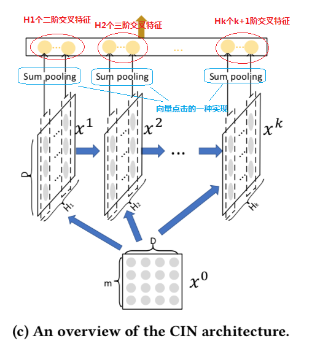
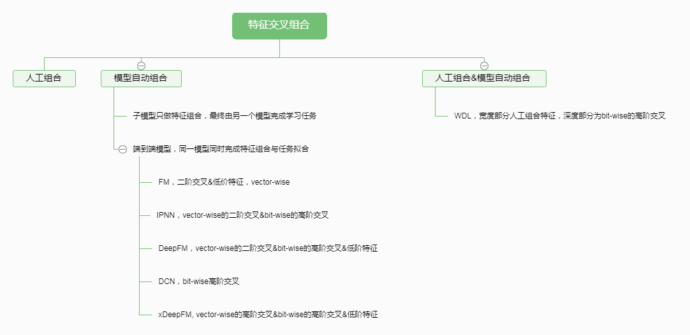

众所周知，深度学习在计算机视觉、语音识别、自然语言处理等领域最先取得突破并成为主流方法。但是，深度学习为什么是在这些领域而不是其他领域最先成功呢？我想一个原因就是图像、语音、文本数据在空间和时间上具有一定的内在关联性。比如，图像中会有大量的像素与周围的像素比较类似；文本数据中语言会受到语法规则的限制。CNN对于空间特征有很好的学习能力，正如RNN对于时序特征有强大的表示能力一样，因此CNN和RNN在上述领域各领风骚好多年。

在Web-scale的搜索、推荐和广告系统中，特征数据具有高维、稀疏、多类别的特点，一般情况下缺少类图像、语音、文本领域的时空关联性。因此，如何构建合适的网络结构以便在信息检索、推荐系统和计算广告领域取得良好的特征表示能力，进一步提升最终的业务效果成了学术界和工业界共同关注的问题。

本文在跟踪了最近主流的互联网业务中大量使用的排序模型的基础上，总结出了深度CTR、CVR预估模型发展演化的三条主线，跟大家分享。

1. 第一条主脉络是以FM家族为代表的深度模型，它们的共同特点是自动学习从原始特征交叉组合新的高阶特征。
2. 第二条主脉络是一类使用attention机制处理时序特征的深度模型，以DIN、DIEN等模型为代表。
3. 第三条主脉络是以迁移学习、多任务学习为基础的联合训练模型或pre-train机制，以[ESMM](https://zhuanlan.zhihu.com/p/37562283)、DUPN等模型为代表。

其中前两条主脉络虽然出发点不同，但个人认为也有一些共通之处，比如attention机制是不是可以在某种程度上理解为一种特殊形式的组合特征。第三条主脉络属于流程或框架层面的创建。本文的主要目标是理清楚第一条主线中各个经典的深度模型的发展演化脉络，包括它们的优缺点和共通之处。
<!--more-->
## 背景

构建好的特征对于机器学习任务来说至关重要，它关系到模型的学习难易程度及泛化性能。好的特征是相互独立的有区分性且易于理解的特征，具体地可以参考《[何为优秀的机器学习特征](https://yangxudong.github.io/good-feature/)》。

交叉组合原始特征构成新的特征是一种常用且有效的特征构建方法。哪些特征需要被交叉组合以便生成新的有效特征？需要多少阶的交叉组合？这些问题在深度学习流行之前需要算法工程师依靠经验来解决。人工构建组合特征特别耗时耗力，在样本数据生成的速度和数量巨大的互联网时代，依靠人的经验和技能识别出所有潜在有效的特征组合模式几乎是不可能的。一些有效的组合特征甚至没有在样本数据中出现过。

那么，能否自动构建有效的交叉组合特征？答案是肯定的。在深度学习之前，一些有益的尝试是把特征组合的任务交给子模型来学习，最经典的方法就是Facebook在2014年的论文中介绍的通过GBDT（Gradient Boost Decision Tree）模型解决LR模型的特征组合问题。该方法思路很简单，特征工程分为两部分，一部分特征用于训练一个GBDT模型，把GBDT模型每颗树的叶子节点编号作为新的特征，加入到原始特征集中，再训练最终的LR模型。详细介绍可以查看我之前的一篇博文：《[主流CTR预估模型的演化及对比](https://zhuanlan.zhihu.com/p/35465875)》。此类解决方案在特征工程阶段就引入了机器学习模型，虽然可以部分解决问题，但还是过于麻烦，不够灵活。

要避免上述麻烦，自然而然就是要引入端到端学习的思路，即用一个统一的模型同时完成特征组合和目标拟合的任务。因子分解机(Factorization Machines, FM)模型是第一个从原始特征出发，端到端学习的例子。然而，FM毕竟还是一个浅层模型，经典的FM模型只能做二阶的特征交叉，模型学习复杂组合特征的能力偏弱。尽管如此，FM提出了一种很好的自动学习交叉组合特征的思路，随后融入FM模型思路的深度学习模型便如雨后春笋般应运而生，典型的代表有FNN、PNN、DeepFM、DCN、xDeepFM等。关于这些模型的介绍和对比，在我之前的两篇博文中也有详细介绍，感兴趣的读者可以查阅《[主流CTR预估模型的演化及对比](https://zhuanlan.zhihu.com/p/35465875)》、《[玩转企业级Deep&Cross Network模型你只差一步](https://zhuanlan.zhihu.com/p/43364598)》。

本文的其余内容将会对这些模型做一个详细的复盘，同时对该主线的集大成者xDeepFM模型做一个详细的介绍，其中包括一些自己对模型的理解，实际的使用心得，以及某些模型实现时的一些trick。文章的最后还会提供某些模型的源代码链接。

## 特征组合的演化路线

从**FM**模型说起，FM通过特征对之间的隐变量内积来提取特征组合，其函数形式如下：

$$y=w_0 + \sum_{i=1}^{n}w_i x_i + \sum_{i=1}^{n}\sum_{j=i+1}^n \langle v_i,v_j \rangle x_i x_j$$

对于每个原始特征，FM都会学习一个隐向量。模型通过穷举所有的特征对（pair）并逐一检测特征对的效用值的方法来自动识别出有效的特征组合。特征对的效用值通过该特征对涉及的两个原始特征的隐向量的内积来计算。

可以看出FM最多只能识别出二阶的特征组合，模型有一定的局限性。**FNN**模型最先提出了一种增强FM模型的思路，就是用FM模型学习到的隐向量初始化深度神经网络模型（MLP），再由MLP完成最终学习。

MLP（plain-DNN）因其特殊的结构天然就具有学习高阶特征组合的能力，它可以在一定的条件下以任意精度逼近任意函数。然而，plain-DNN以一种隐式的方式建模特征之间的交互关系，我们无法确定它学习到了多少阶的交叉关系。高维稀疏的原始特征在输入给DNN之前一般都会经过embedding处理，每一个域（类别）的原始特征都会被映射到一个低维稠密的实数向量，称之为embedding向量。FM模型中的隐向量也可以理解为embedding向量。Embedding向量中的元素用术语bit表示，可以看出plain-DNN的高阶特征交互建模是元素级的（bit-wise），也就是说同一个域对应的embedding向量中的元素也会相互影响。这与FM显式构建特征交叉关系的方式是不一样的，FM类方法是以向量级（vector-wise）的方式来构建高阶交叉关系。经验上，vector-wise的方式构建的特征交叉关系比bit-wise的方式更容易学习。

虽然两种建模交叉特征的方式有一些区别，但两者并不是相互排斥的，如果能把两者集合起来，便会相得益彰。**PNN**模型最先提出了一种融合bit-wise和vector-wise交叉特征的方法，其通过在网络的embedding层与全连接层之间加了一层Product Layer来完成特征组合。PNN与FM相比，舍弃了低阶特征，也就是线性的部分，这在一定程度上使得模型不太容易记住一些数据中的规律。**WDL（Wide & Deep Learning）**模型混合了宽度模型与深度模型，其宽度部分保留了低价特征，偏重记忆；深度部分引入了bit-wise的特征交叉能力。WDL模型的一大缺点是宽度部分的输入依旧依赖于大量的人工特征工程。

能不能在融合bit-wise和vector-wise交叉特征的基础上，同时还能保留低阶特征(linear part)呢？当然是可以的。**DeepFM**模型融合了FM和WDL模型，其FM部分实现了低阶特征和vector-wise的二阶交叉特征建模，其Deep部分使模型具有了bit-wise的高阶交叉特征建模的能力。具体地，DeepFM包含两部分：神经网络部分与因子分解机部分，这两部分共享同样的输入。对于给定特征$i$，向量$w_i$用于表征一阶特征的重要性，隐变量$V_i$用于表示该特征与其他特征的相互影响。在FM部分，$V_i$用于表征二阶特征，同时在神经网络部分用于构建高阶特征。所有的参数共同参与训练。DeepFM的预测结果可以写为
$$\hat{y}=sigmoid(y_{FM}+y_{DNN})$$
其中$\hat{y}∈(0,1)$是预测的点击率，$y_{FM}$与$y_{DNN}$分是FM部分与DNN部分。
$$y_{FM}=\langle w,x \rangle + \sum_{i=1}^d \sum_{j=i+1}^d \langle V_i,V_j \rangle x_i x_j$$
其中$w∈R^d,V_i∈R^k$ 。加法部分反映了一阶特征的重要性，而内积部分反应了二阶特征的影响。
$$y_{DNN}=\sigma(W^{H+1} \cdot a^H + b^{H+1})$$ 
其中H是隐层的层数。

FM、DeepFM和Inner-PNN都是通过原始特征隐向量的内积来构建vector-wise的二阶交叉特征，这种方式有两个主要的缺点：

1. 必须要穷举出所有的特征对，即任意两个field之间都会形成特征组合关系，而过多的组合关系可能会引入无效的交叉特征，给模型引入过多的噪音，从而导致性能下降。
2. 二阶交叉特征有时候是不够的，好的特征可能需要更高阶的组合。虽然DNN部分可以部分弥补这个不足，但bit-wise的交叉关系是晦涩难懂、不确定并且不容易学习的。

那么，**有没有可能引入更高阶的vector-wise的交叉特征，同时又能控制模型的复杂度，避免产生过多的无效交叉特征呢？**让我们先来思考一个问题。二阶交叉特征通过穷举所有的原始特征对得到，那么通过穷举的方法得到更高阶的交叉特征，必然会产生组合爆炸的维数灾难，导致网络参数过于庞大而无法学习，同时也会产生很多的无效交叉特征。让我们把这个问题称之为**维数灾难挑战**。

解决维数灾难挑战不可避免的就是要引入某种“压缩”机制，就是要把高阶的组合特征向量的维数降到一个合理的范围，同时在这个过程中尽量多的保留有效的交叉特征，去除无效的交叉特征。让我们谨记，所有构建高阶交叉特征的模型必然要引入特定的“压缩”机制，在学习建模高阶交叉特征的模型时我们脑中要始终绷紧一根弦，那就是这种压缩机制是如何实现的？这种压缩机制的效率和效果如何？

解决维数灾难挑战，[Deep & Cross Network(DCN)](https://zhuanlan.zhihu.com/p/43364598)模型交出一份让人比较满意的答卷，让我们来看看它是如何做到的。

**DCN**模型以一个嵌入和堆叠层(embedding and stacking layer)开始，接着并列连一个cross network和一个deep network，接着通过一个combination layer将两个network的输出进行组合。交叉网络（cross network）的核心思想是以有效的方式应用显式特征交叉。交叉网络由交叉层组成，每个层具有以下公式：
$$x_{l+1} = x_0 x_l^T w_l + b_l + x_l = f(x_l, w_l, b_l) + x_l$$

其中:

- $x_l,x_{l+1}$是列向量（column vectors），分别表示来自第$l$层和第($l+1$)层cross layers的输出；
- $w_l, b_l \in R^d$是第$l$层layer的weight和bias参数。

在完成一个特征交叉f后，每个cross layer会将它的输入加回去，对应的mapping function $f：R^d \rightarrow R^d$，刚好等于残差$x_{l+1} - x_l$，这里借鉴了残差网络的思想。

**特征的高阶交叉（high-degree interaction）**：cross network的独特结构使得交叉特征的阶（the degress of cross features）随着layer的深度而增长。对于第$l$层layer，它的最高多项式阶（在输入$x_0$上）是$l+1$。 实际上，cross network由这些交叉项$x_1^{\alpha_1} x_2^{\alpha_2} ... x_d^{\alpha_d}$组成，对应的阶从$1$到$l+1$。

**复杂度分析**：假设$L_c$表示cross layers的数目，$d$表示输入$x_0$的维度。那么，在该cross network中涉及的参数数目为：$d \times L_c \times 2$。

一个cross network的时间和空间复杂度对于输入维度是线性关系。因而，比起它的deep部分，一个cross network引入的复杂度微不足道，DCN的整体复杂度与传统的DNN在同一水平线上。如此高效（efficiency）是受益于$x_0 x_l^T$的rank-one特性(两个向量的叉积)，它可以使我们生成所有的交叉项，无需计算或存储整个matrix。

关于DCN模型的实现，有一个重要的技巧可以节省大量的内存空间和训练时间，就是在计算cross layer的时候需要利用矩阵乘法的结合律，优先计算$x_l^T w$，而不是$x_0 x_l^T$，这是因为$x_l^T w$的计算结果是一个标量，几乎不占用存储空间，具体请参考《[玩转企业级Deep&Cross Network模型你只差一步](https://zhuanlan.zhihu.com/p/43364598)》。

亲爱的读者们，你们脑中的那根弦还在吗？DCN是如何有效压缩高维特征空间的呢？其实，对于cross layer可以换一种理解方式：假设$\tilde{x} \in R^d$是一个cross layer的输入，cross layer首先构建$d^2$个关于$x_i \tilde{x}_j$的pairwise交叉，接着以一种内存高效的方式将它们投影到维度$d$上。如果采用全连接Layer那样直接投影的方式会带来3次方的开销。Cross layer提供了一种有效的解决方式，将开销减小到维度$d$的量级上：考虑到$x_p = x_0 \tilde{x}^T w$等价于：
$$ x_p^T = [x_1\tilde{x}_1 ... x_1\tilde{x}_d ... x_d\tilde{x}_1 ... x_d\tilde{x}_d] \left[
\begin{array}{ccc}
  w&0&...&0\\
  0&w&...&0\\
  \vdots&\vdots&\ddots&\vdots\\
  0&0&...&w
\end{array}
\right] $$ 
其中，行向量包含了所有$d^2$个关于$x_i \tilde{x}_j$的pairwise交叉，投影矩阵具有一个块对角化结构，其中$w \in R^d$是一个列向量。现在我们了解了DCN模型的“压缩”机制，即每个cross layer都把$d^2$维度的特征空间投影到$d$维的空间上。

DCN模型中使用的这种“压缩”机制是完美的吗，有没有什么局限性？实际上这种“压缩”方式把特征交互关系限定在一种特殊的形式上。我们再来看看cross layer的计算公式，为了简化，以便说明问题，下面去掉偏置项。
$$x_k = x_0x_{k-1}^Tw_k+x_{k-1}$$ 
对于$x_1$，有如下公式:
$$x_1 = x_0x_0^Tw_k+x_0$$
合并可得到：
$$x_1 = x_0（x_0^Tw_k+1）= \alpha^1x_0$$
其中$\alpha^1=x_0^Tw_k+1$ 是一个关于$x_0$的线性回归函数，也就是一个标量。

根据数学归纳法，当$k=i$ 时，上式成立；当$k=i+1$ 时，我们可以得到
$$x_{i+1}=x_0x_i^Tw_{i+1}=x_0((\alpha^ix_0)w_{i+1})+\alpha^ix_0=\alpha^{i+1}x_0$$
实际上，$\alpha^{i+1}$又是一个标量。因此Cross Network的输出就相当于$x_0$不断乘以一个数，当然这个数是和$x_0$高度相关的。

因此，我们可以总结出DCN模型的两个主要的不足：

1. CrossNet的输出被限定在一种特殊的形式上
2. 特征交叉还是以bit-wise的方式构建的

让我们回到最初的那个问题，**有没有可能引入更高阶的vector-wise的交叉特征，同时又能控制模型的复杂度，避免产生过多的无效交叉特征呢？**

## 极深因子分解机模型（xDeepFM）

[xDeepFM](https://arxiv.org/abs/1803.05170)模型是自动构建交叉特征且能够端到端学习的集大成者，它很好的回答了上一小节末提出的问题。让我们来看看它是如何做到的。

为了实现自动学习显式的高阶特征交互，同时使得交互发生在向量级上，xDeepFM首先提出了一种新的名为**压缩交互网络**（Compressed Interaction Network，简称CIN）的模型。

CIN的输入是所有field的embedding向量构成的矩阵$X^0 \in R^{m \times  D}$，该矩阵的第$i$行对应第$i$个field的embedding向量，假设共有$m$个field，每个field的embedding向量的维度为$D$。CIN网络也是一个多层的网络，它的第$k$层的输出也是一个矩阵，记为$X^k \in R^{H_k \times  D}$，该矩阵的行数为 $H_k$，表示第$k$层共有$H_k$个特征（embedding）向量，其中$H_0=m$。

CIN中第$k$层的输出$X^k$由第$k-1$层的输出$X^{k-1}$和输入$X^0$经过一个比较复杂的运算得到，具体地，矩阵$X^k$中的第$h$行的计算公式如下：
$$X_{h,*}^k = \sum_{i=1}^{H_{k-1}}\sum_{j=1}^m{W_{ij}^{k,h}(X_{i,*}^{k-1} \circ X_{j,*}^0)}$$ 
其中，$\circ$ 表示哈达玛积，即两个矩阵或向量对应元素相乘得到相同大小的矩阵或向量，示例如：$\langle a_1,a_2,a_3 \rangle \circ \langle b_1,b_2,b_3\rangle =\langle a_1b_1,a_2b_2,a_3b_3 \rangle$。

上述计算公式可能不是很好理解，论文作者给出了另一种更加方便理解的视角。在计算$X^{k+1}$时，定义一个中间变量$Z^{k+1} \in R^{H_k \times m \times D}$，$Z^{k+1}$是一个数据立方体，由D个数据矩阵堆叠而成，其中每个数据矩阵是由$X^k$的一个列向量与$X^0$的一个列向量的外积运算（Outer product）而得，如下图所示。$Z^{k+1}$的生成过程实际上是由$X^k$与$X^0$沿着各自embedding向量的方向计算外积的过程。

$Z^{k+1}$可以被看作是一个宽度为$m$、高度为$H_k$、通道数为D的图像，在这个虚拟的图像上施加一些卷积操作即得到$X^{k+1}$。$W^{k,h}$是其中一个卷积核，总共有$H_{k+1}$个不同的卷积核，因而借用CNN网络中的概念，$X^{k+1}$可以看作是由$H_{k+1}$个feature map堆叠而成，如下图所示。

正是通过卷积操作，CIN把第$k+1$层由$H_k \times m$个向量压缩到了$H_{k+1}$个向量，起到了防止维数灾难的效果。

CIN的宏观框架如下图所示，它的特点是，最终学习出的特征交互的阶数是由网络的层数决定的，每一层隐层都通过一个池化操作连接到输出层，从而保证了输出单元可以见到不同阶数的特征交互模式。同时不难看出，CIN的结构与循环神经网络RNN是很类似的，即每一层的状态是由前一层隐层的值与一个额外的输入数据计算所得。不同的是，CIN中不同层的参数是不一样的，而在RNN中是相同的；RNN中每次额外的输入数据是不一样的，而CIN中额外的输入数据是固定的，始终是$X^0$。

有了基础结构CIN之后，借鉴Wide&Deep和DeepFM等模型的设计，将CIN与线性回归单元、全连接神经网络单元组合在一起，得到最终的模型并命名为极深因子分解机xDeepFM，其结构如下图所示。同时包含多种不同的结构成分可以提升模型的表达能力。

集成的CIN和DNN两个模块能够帮助模型同时以显式和隐式的方式学习高阶的特征交互，而集成的线性模块和深度神经模块也让模型兼具记忆与泛化的学习能力。值得一提的是，为了提高模型的通用性，xDeepFM中不同的模块共享相同的输入数据。而在具体的应用场景下，不同的模块也可以接入各自不同的输入数据，例如，线性模块中依旧可以接入很多根据先验知识提取的交叉特征来提高记忆能力，而在CIN或者DNN中，为了减少模型的计算复杂度，可以只导入一部分稀疏的特征子集。

## 总结

特征交叉组合作为一种常用的特征工程方法，可以有效地提升模型的效果。特征交叉组合从人工方式开始，经历了模型辅助的阶段，最后发展到各种端到端模型的阶段。端到端模型从建模二阶交叉关系向构建高阶交叉关系的方向发展，同时建模方式也从bit-wise向vector-wise发展。

本文总结了FM家族的一系列深度学习模型，这些模型有一个共同的强制要求：所有field的embedding向量的维数是相同的。这个要求是合理的吗？我们知道不同的field对应的值空间大小是不一样的，比如淘宝商品ID的量级在十亿级，类目的量级在万级，用户年龄段的量级在十级，在如此巨大的差异的情况下，embedding向量的维数只能取得尽可能的大，这大大增加了模型的参数量级和网络的收敛时间。所以我认为本文提及的FM家族模型有两个主要缺点：

1. 强制要求所有field的embedding向量的维数，增加了网络复杂度；
2. 对连续值特征不友好。

大家对此有什么看法呢？欢迎在评论区留言。

部分模型的tensorflow源代码[可以在此找到](https://github.com/yangxudong/deeplearning)，实现不一定完全正确，欢迎批评指正。

## 推荐阅读

[主流CTR预估模型的演化及对比](https://zhuanlan.zhihu.com/p/35465875)
[玩转企业级Deep&Cross Network模型你只差一步](https://zhuanlan.zhihu.com/p/43364598)

